# HelloDev.io 开发者日报 - 第 1 期 | 2025 年 08 月 17 日

👋 Hi，这里是 HelloDev.io 开发者日报，今天是第 1 期，即将为你介绍今天的精彩发现：

📊 **本期内容**：
- 🚀 开源趋势：8 条
- 🛠️ 产品观察：6 条  
- 📰 行业动态：3 条
- 💡 经验讨论：1 条
- 📸 每日一图：1 条

---

## 🚀 开源趋势

### 🚀 让生产力提升 100 倍的开源 AI 平台：Magic

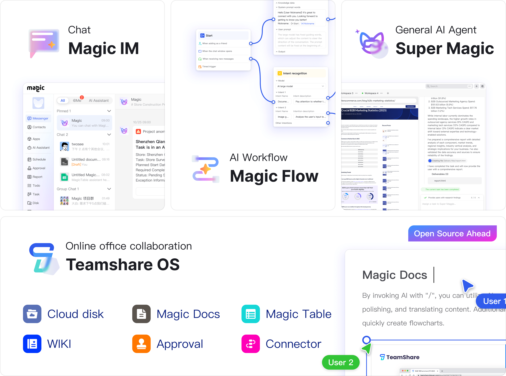

Magic 是首个开源的全能 AI 生产力平台，旨在帮助各类企业快速构建和部署 AI 应用，从而实现生产力的百倍提升。它涵盖了从通用 AI Agent 到企业级即时通讯、可视化 AI 工作流编排，再到协同办公系统的一整套产品矩阵。这个平台不仅提供了一站式的 AI 工具，还包含了如 Agentlang、Magic Lens 等基础设施组件，甚至规划了 Magic Use、Magic Space 和 Sandbox OS 等未来产品。Magic 支持通过 Docker 进行自托管部署，也提供了基于邀请制的云服务试用。

对于希望快速落地 AI 应用的企业来说，Magic 提供了极大的灵活性和完整的生态系统。它不仅适合技术团队，也适合需要高效协作的业务团队。

> 🔗 **项目链接**
> 
> https://github.com/dtyq/magic

---

### 🧠 为 AI 编程助手打造的知识中枢：Archon OS

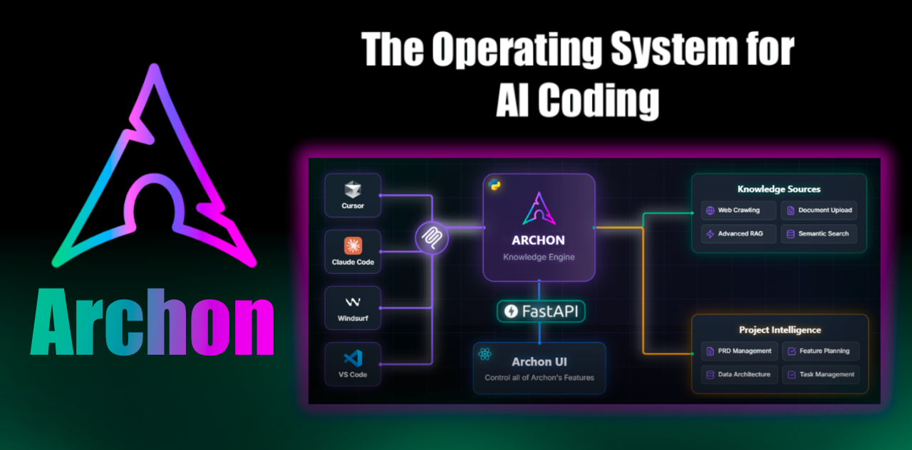

Archon OS 是一个专为 AI 编程助手设计的知识与任务管理系统，目前处于 Beta 阶段。它通过 Model Context Protocol (MCP) 服务器，让 Claude Code、Kiro、Cursor 等 AI 助手能够访问共享的知识库和任务上下文。Archon 的核心功能包括智能网页爬取、文档处理、高级 RAG 策略的向量搜索，以及集成的项目与任务管理。其微服务架构确保了轻量、可扩展和灵活的部署，同时支持多种 LLM（如 OpenAI、Ollama、Google Gemini）和实时协作。配置简单，只需 Docker 和 Supabase 数据库即可运行。

对于使用 AI 编程助手的开发者来说，Archon 是一个强大的中枢系统，能够显著提升 AI 助手的上下文理解和任务执行能力。特别适合需要在多个项目间共享知识和任务状态的团队。

> 🔗 **项目链接**
> 
> https://github.com/coleam00/Archon

---

### ⚡ 降低 LLM 延迟的利器：LMCache

LMCache 是一个专为 LLM 服务引擎设计的扩展工具，特别擅长在长上下文场景中减少首次 Token 的响应时间（TTFT）并提升吞吐量。它通过在 GPU、CPU 内存和本地磁盘中存储可重用文本的 KV 缓存，并在不同服务实例间复用，从而节省 GPU 资源并降低用户响应延迟。与 vLLM 结合使用时，LMCache 能在多轮问答和 RAG 等场景中实现 3-10 倍的延迟节省和 GPU 周期减少。

如果你在处理长上下文的 LLM 应用时遇到性能瓶颈，LMCache 是一个值得尝试的优化方案。它特别适合需要高并发和低延迟的生产环境。

> 🔗 **项目链接**
> 
> https://github.com/LMCache/LMCache

---

### 🛠️ 专为控制打造的 LLM Agents 平台：Parlant

Parlant 是一个专为控制而构建的 LLM agents 平台，旨在用于现实世界的应用，并且可以快速部署。它为用户提供了一种高效的方式来管理和操作大型语言模型代理。虽然项目信息较为简洁，但从其定位来看，Parlant 更像是一个面向实际应用的 LLM 控制平台，适合需要快速部署和管理多个 LLM 代理的开发者。

对于希望将 LLM 代理应用于实际业务场景的开发者来说，Parlant 提供了一个简洁而高效的解决方案。

> 🔗 **项目链接**
> 
> https://github.com/emcie-co/parlant

---

### 📚 LLM 应用的宝库：awesome-llm-apps

awesome-llm-apps 是一个精心策划的 LLM 应用集合，涵盖了 AI Agents、RAG、多代理团队、MCP、语音代理等多个领域。它收录了使用 OpenAI、Anthropic、Google 以及开源模型（如 DeepSeek、Qwen、Llama）的项目，这些项目都可以在本地运行。该仓库按类别组织，包括入门级 AI Agents、高级 AI Agents、多代理团队、语音 AI Agents、MCP AI Agents、RAG 教程等，每个项目都有详细的文档，帮助用户学习和构建自己的 LLM 驱动应用。

对于想要深入了解 LLM 应用开发的开发者来说，这个仓库是一个不可多得的学习资源。它不仅提供了丰富的示例，还展示了 LLM 在不同场景下的实际应用。

> 🔗 **项目链接**
> 
> https://github.com/Shubhamsaboo/awesome-llm-apps

---

### 🔧 下一代构建系统：nob.h

nob.h 是一个仅头文件的 C 库，代表了 NoBuild 概念的下一代演进。它允许开发者仅使用 C 编译器来编写构建配方，从而摆脱对 make 或 CMake 等传统工具的依赖。该库是实验性的，主要适用于 C/C++ 项目，通过最小化依赖来实现跨平台的可移植性。它还支持在项目和构建系统之间复用代码。仓库中包含了示例，并且作者已在多个 C 项目中积极使用。

对于追求极致可移植性和简洁构建流程的 C/C++ 开发者来说，nob.h 提供了一种全新的思路。不过，由于其仍处于实验阶段，可能不适合复杂的项目。

> 🔗 **项目链接**
> 
> https://github.com/tsoding/nob.h

---

### 🎨 全能 2D 图形编辑器：PixiEditor

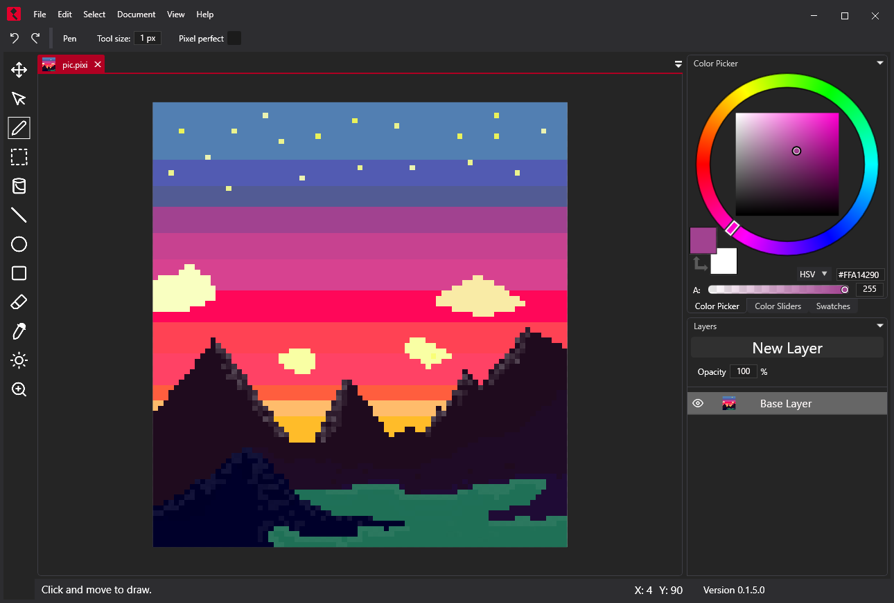

PixiEditor 是一个通用的 2D 图形编辑器，能够满足你所有的 2D 图形需求。它支持创建精灵、动画、图像编辑和标志设计，界面直观且熟悉。编辑器提供了三种默认工具集：像素艺术、绘画和矢量工具，可以在同一画布上同时使用。它还具备动画功能（带时间轴）和基于节点的渲染系统，支持导出为 PNG、JPG、SVG、GIF 和 MP4 等多种格式。

对于游戏开发者、设计师和任何需要处理 2D 图形的人来说，PixiEditor 是一个功能强大且易于使用的工具。它的多工具集支持和节点系统为创意工作提供了极大的灵活性。

> 🔗 **项目链接**
> 
> https://github.com/PixiEditor/PixiEditor

---

### 🔐 为安全测试而生的 AI 框架：Cybersecurity AI (CAI)

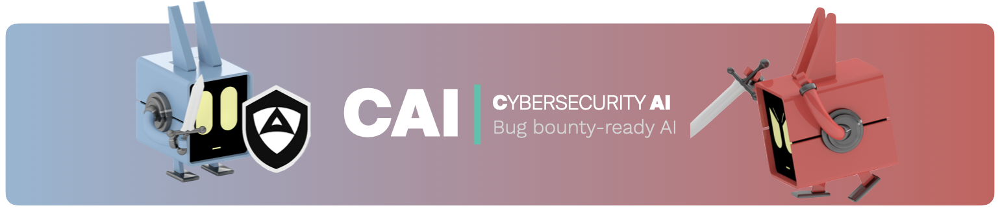

Cybersecurity AI (CAI) 是一个开源的、为漏洞赏金而设计的 AI 框架，旨在协助渗透测试和漏洞发现等网络安全任务。它为构建能够执行安全评估的 AI 代理提供了一个轻量级且符合人体工程学的环境。CAI 支持多模型 AI 集成，并提供了侦察、利用和权限提升等工具。该框架强调伦理原则、透明度和网络安全 AI 工具的民主化。它适用于半自动和全自动的攻防安全任务，并支持详细的分析追踪和日志记录。

对于希望将 AI 应用于网络安全领域的开发者和安全研究人员来说，CAI 提供了一个强大的起点。它不仅支持多种 AI 模型，还注重伦理和透明度。

> 🔗 **项目链接**
> 
> https://github.com/aliasrobotics/cai

---

## 🛠️ 产品观察

### 🕵️ 竞争对手监控的 AI 代理：HeadsUp

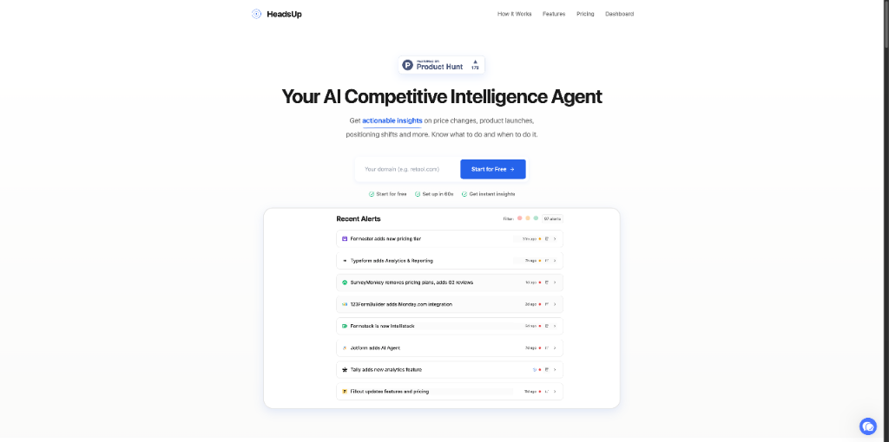

HeadsUp 是首款 AI 竞争对手监控代理，它不仅能够提醒用户竞争对手的动态，还能解释变化的原因并提供可操作的见解。该工具提供实时警报和即时洞察，设置仅需 60 秒，且可以自动运行，让竞争对手监控变得轻松高效。

对于需要时刻关注市场动态的产品经理和市场人员来说，HeadsUp 是一个高效的自动化工具。它不仅能告诉你“发生了什么”，还能告诉你“为什么重要”。

> 🔗 **产品链接**
> 
> https://www.producthunt.com/products/headsup-2

---

### 📱 在设备上运行 LLM 的 Swift 包：Kuzco

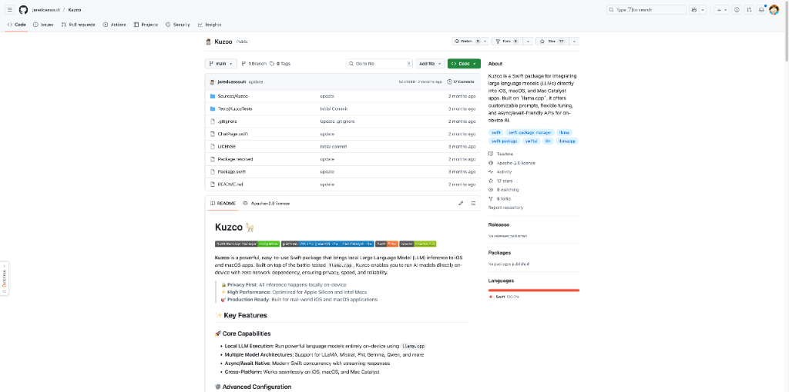

Kuzco 是一个开源的 Swift 包，允许开发者将大型语言模型（LLMs）直接集成到 iOS、macOS 和 Mac Catalyst 应用中。它基于 `llama.cpp` 构建，支持本地 LLM 执行，无需网络依赖，确保隐私和性能。Kuzco 支持多种模型架构（如 LLaMA、Mistral、Phi、Gemma、Qwen 等），提供原生的 async/await API、跨平台兼容性和高级配置选项。

对于希望在苹果设备上实现本地 AI 功能的开发者来说，Kuzco 提供了一个简单而强大的解决方案。它特别适合需要保护用户隐私的应用场景。

> 🔗 **产品链接**
> 
> https://github.com/jaredcassoutt/Kuzco

---

### 🧾 自动化发票收集工具：Well Extension

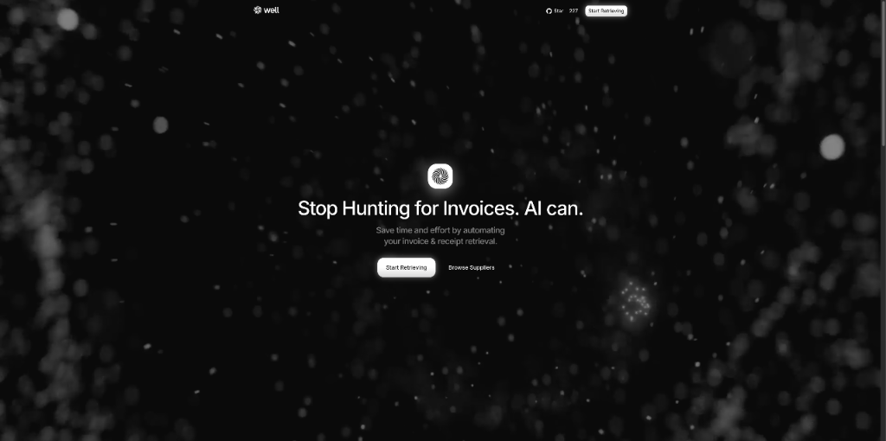

Well Extension 是一款 Chrome 扩展，旨在自动化收集供应商发票和收据，为创始人、独立运营者和小型团队节省时间和精力。它直接在浏览器中工作，无需任何设置，能够检测供应商网站上的发票并允许用户一键收集。该工具支持批量收集、邮件发送、WhatsApp 转发，并能实时适应供应商门户的变化。它还与 Drive、Slack、ERP 和会计软件等现有工具集成。

对于需要频繁处理发票的小团队和独立开发者来说，Well Extension 是一个省时省力的神器。它彻底解决了手动收集发票的烦恼。

> 🔗 **产品链接**
> 
> https://www.producthunt.com/products/well-let-robots-chase-receipts-invoices

---

### 🤖 用自然语言自动化的生产力工具：Slashy

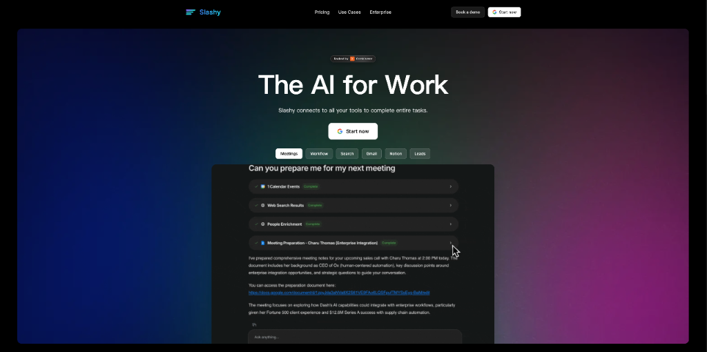

Slashy 是一款 AI 驱动的生产力工具，旨在通过自然语言命令连接你的应用并自动化工作流，从而减少重复性任务。用户只需描述想要完成的任务，Slashy 就会在各个平台上执行，无需手动切换工具或设置复杂的自动化规则。它专为希望简化日常任务、提高效率的专业人士设计。

对于每天需要处理大量重复性任务的用户来说，Slashy 是一个直观且高效的自动化助手。它让复杂的工作流变得简单。

> 🔗 **产品链接**
> 
> https://www.producthunt.com/products/slashy-2

---

### 🔍 发现高购买意图搜索词的工具：ChatGPT Query Gold

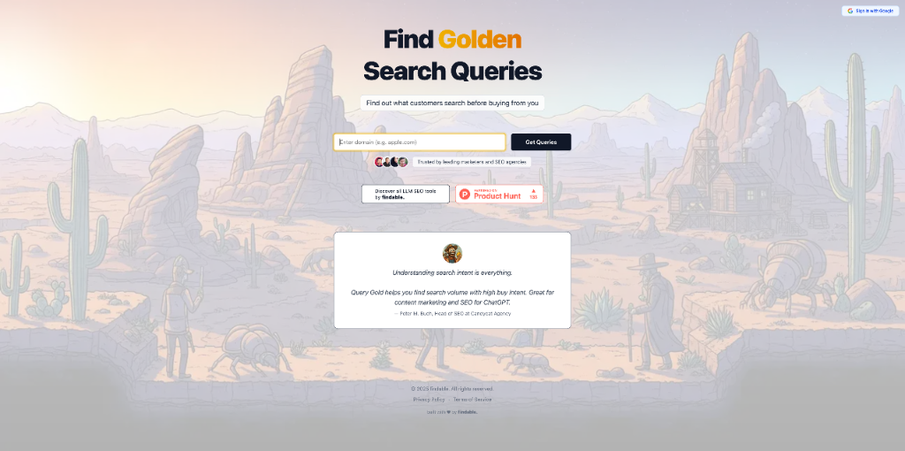

ChatGPT Query Gold 是一款专为内容营销人员和 SEO 专业人士设计的工具，帮助他们发现与 ChatGPT 相关的高购买意图搜索词。通过输入域名（如自己的、竞争对手的或客户的），用户可以快速获取品牌、非品牌和长尾搜索词列表，了解潜在客户在 Google、YouTube 和 ChatGPT 上的搜索行为，从而创建更有针对性的内容。该工具免费使用，只需快速登录即可开始生成查询列表。

对于需要优化内容策略的营销人员来说，ChatGPT Query Gold 提供了宝贵的搜索数据支持。它能帮助你更好地理解用户需求。

> 🔗 **产品链接**
> 
> https://www.producthunt.com/products/chatgpt-query-gold

---

### 🎥 将产品图片转为动态视频的 AI 工具：Higgsfield Product-to-Video

Higgsfield Product-to-Video 是一款 AI 驱动的工具，允许用户将静态产品图片转换为动态、引人入胜的视频。其核心功能包括无需提示即可将产品放入场景、完美的产品放置，以及与所有 Higgsfield 模型的兼容性。该工具专为希望快速高效生成吸引眼球视频的创作者设计，无需复杂的编辑过程。

对于电商和内容创作者来说，Higgsfield Product-to-Video 是一个快速生成高质量产品视频的利器。它大大简化了视频制作流程。

> 🔗 **产品链接**
> 
> https://www.producthunt.com/products/higgsfield

---

## 📰 行业动态

### 🧠 全球领先的 ADHD 管理平台：Shimmer

Shimmer 是全球排名第一的 ADHD 管理平台，面向全球超过 3.5 亿的 ADHD 成年人。通过匹配 ADHD 教练，帮助用户学习技能、建立习惯并实施个性化的系统。Shimmer 教练已进行了超过 60,000 次辅导课程，83% 的会员在仅仅 6 周后就能更好地管理 ADHD 症状。新产品 Shimmer Community Membership 是一个一体化平台，用于管理和发展 ADHD，提供日常陪伴、专家主导的活动、学习中心和社区连接等功能。

对于 ADHD 患者来说，Shimmer 提供了一个全面且易于访问的支持系统。它不仅是工具，更是一个理解你的社区。

> 🔗 **相关链接**
> 
> https://www.producthunt.com/products/shimmer-care

---

### 🛒 产品搜索与联盟营销 API：Channel3

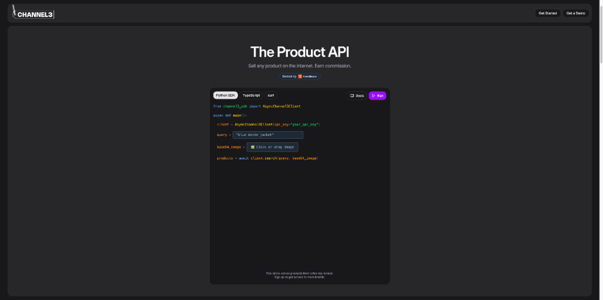

Channel3 是一个在 Product Hunt 上发布的产品，它提供了一个 API 服务，允许用户查找任何产品并从销售中赚取佣金。这听起来像是一个联盟营销或者产品搜索 API 服务，可能对开发者、内容创作者或在线商家有价值，可以帮助他们轻松地在其应用、网站或内容中集成产品搜索功能，并通过推荐销售获得收入。然而，由于无法访问详细页面，我们无法获取更具体的功能特性、使用案例或技术细节。

对于希望通过产品推荐获得收入的开发者和内容创作者来说，Channel3 提供了一个潜在的变现渠道。它简化了产品搜索和佣金获取的流程。

> 🔗 **相关链接**
> 
> https://www.producthunt.com/products/channel3

---

### ⚡ 消除 JavaScript 冷启动的编译器：Porffor

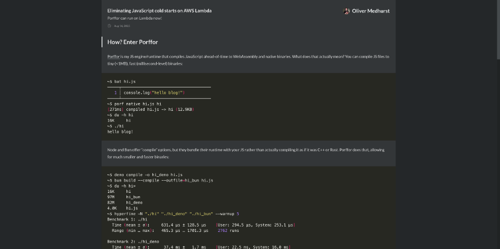

这篇文章探讨了如何通过使用 Porffor 这一将 JavaScript 编译为 WebAssembly 和原生二进制文件的引擎来显著减少 AWS Lambda 上的 JavaScript 冷启动时间。作者通过对比 Node.js、LLRT 和 Porffor 的冷启动性能和成本，展示了 Porffor 在启动速度和成本效益上的巨大优势。尽管 Porffor 目前仍处于早期阶段，但其在测试中表现出了远超传统运行时的性能，为未来在无服务器架构中的应用提供了可能性。

对于在无服务器环境中运行 JavaScript 应用的开发者来说，Porffor 提供了一种全新的优化思路。它不仅能显著提升启动速度，还能降低成本。

> 🔗 **相关链接**
> 
> https://goose.icu/lambda/

---

## 💡 经验讨论

### 💰 如何将 Reddit 增长问题转化为 $8.9k 的副业项目：Me_diaFast

这篇 Indie Hackers 的文章详细介绍了创始人如何发现并解决了一个 Reddit 增长问题，并将其转化为一个成功的副业项目，月收入达到 $8,900。文章涵盖了从问题识别、解决方案开发到实现产品市场契合和货币化策略的整个过程。对于希望通过在线社区寻找商业机会的企业家来说，这是一个鼓舞人心的案例研究。

对于希望利用在线社区创造收入的独立开发者来说，Me_diaFast 的经验提供了宝贵的参考。它展示了如何将一个看似简单的问题转化为可持续的商业模式。

> 🔗 **参考资料**
> 
> https://www.indiehackers.com/product/me-diafast?post=yZafoNWy3v2J0wHeHHLU

---

## 📸 每日一图

---

## 📝 结语

明天见。Bye 👋

---

💌 **互动时间**：
- 你对开发者日报有什么建议？
- 有什么想了解的话题？
- 欢迎在评论区分享你的想法！

🔗 **关注 HelloDev.io**：每日精选最有价值的内容，5 分钟了解互联网的最新想法

📱 **多平台发布**：微信公众号 | 掘金 | 知乎 | GitHub
