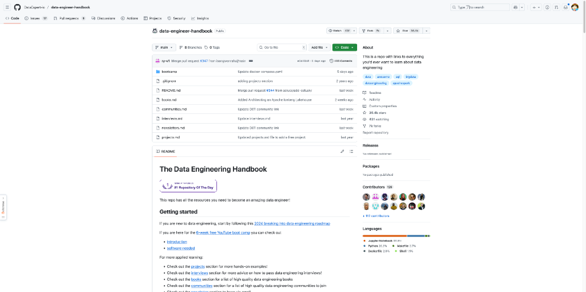
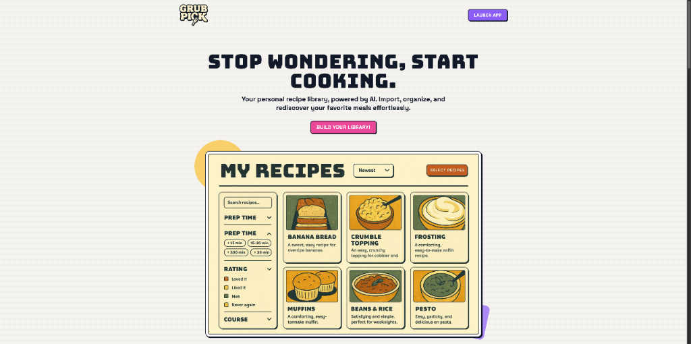
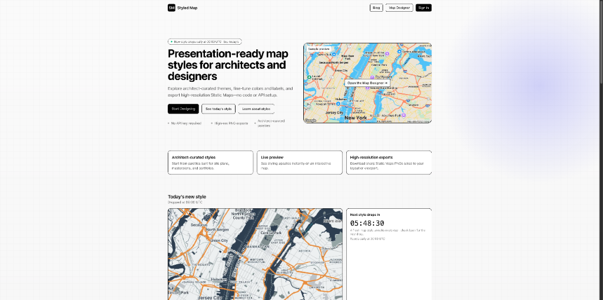
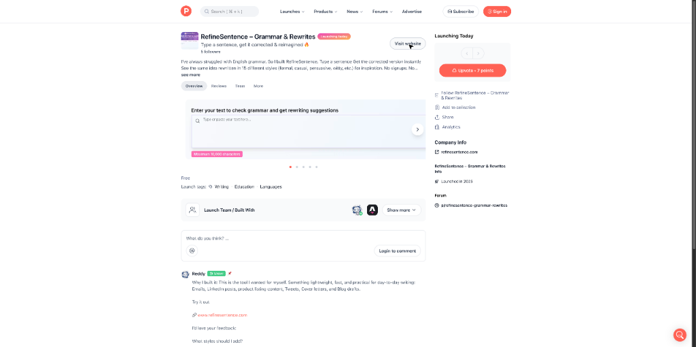
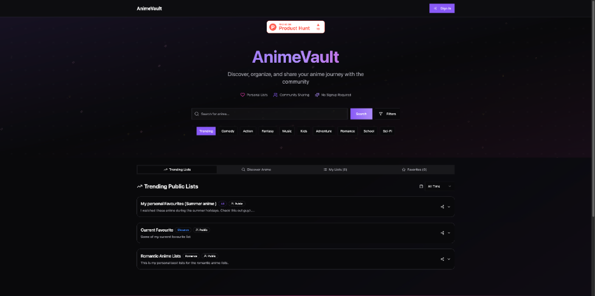

# HelloDev.io 开发者日报 - 第 2 期 | 2025 年 08 月 18 日

👋 Hi，这里是 HelloDev.io 开发者日报，今天是第 2 期，即将为你介绍今天的精彩发现：

📊 **本期内容**：
- 🚀 开源趋势：5 条
- 🛠️ 产品观察：6 条  
- 📰 行业动态：3 条
- 💡 经验讨论：1 条
- 📸 每日一图：1 条

---

## 🚀 开源趋势

### 49k+ stars 的金融数据聚合器：OpenBB-finance / OpenBB

OpenBB 是一个开源的金融数据聚合平台，同时面向人类用户和 AI 代理。它整合了股票、期权、加密货币、外汇、宏观经济和固定收益等多种金融数据，通过单一接口提供访问。平台支持扩展插件以增强用户体验，并可与多个数据供应商集成。用户可以通过 Python 或命令行界面进行交互，还提供了名为 OpenBB Workspace 的企业级 UI，用于数据可视化和 AI 代理操作。

对于金融从业者或爱好者来说，OpenBB 提供了极大的便利，它不仅简化了数据获取流程，还通过 AI 集成和可视化工具增强了分析能力。特别是对于需要处理多种金融数据源的开发者而言，这是一个值得尝试的工具。

> 🔗 **项目链接**
> 
> https://github.com/OpenBB-finance/OpenBB

---

### 计算机视觉必备：COLMAP 三维重建工具

COLMAP 是一个通用的运动结构 (Structure-from-Motion, SfM) 和多视角立体 (Multi-View Stereo, MVS) 流水线，具有图形界面和命令行界面。它支持对有序和无序图像集合进行三维重建，广泛应用于计算机视觉和摄影测量领域。软件基于新 BSD 许可证发布，并提供跨平台支持。

COLMAP 是进行三维重建研究和应用的首选开源工具之一，其强大的功能和良好的社区支持使其成为学术界和工业界的常用选择。对于需要从图像生成 3D 模型的开发者来说，COLMAP 是一个不可或缺的工具。

> 🔗 **项目链接**
> 
> https://github.com/colmap/colmap

---

### 数据工程师的百科全书：DataExpert-io / data-engineer-handbook

这个 GitHub 仓库是一个全面的数据工程学习资源集合，涵盖了从入门到精通所需的各种资料，包括书籍、社区、课程、认证、工具等。无论是初学者还是经验丰富的专业人士，都能在这里找到有价值的内容。

对于想要系统学习数据工程或希望扩展知识面的开发者来说，这个手册是一个极佳的起点。它不仅提供了学习路径，还连接了相关社区和专家，帮助学习者更好地融入数据工程生态。

> 🔗 **项目链接**
> 
> https://github.com/DataExpert-io/data-engineer-handbook

---

### 跨平台代理利器：clash-verge-rev / clash-verge-rev

Clash Verge Rev 是一个基于 Tauri 构建的现代图形界面代理客户端，支持 Windows、macOS 和 Linux。它内置了 Clash.Meta(mihomo) 内核，具备简洁美观的用户界面、配置文件管理、系统代理、TUN 模式、可视化节点编辑等功能。

对于需要在不同操作系统上进行代理设置的用户来说，Clash Verge Rev 提供了高性能且易于使用的解决方案。其基于 Rust 和 Tauri 的架构确保了应用程序的体积小、速度快且安全。

> 🔗 **项目链接**
> 
> https://github.com/clash-verge-rev/clash-verge-rev

---

### 后端开发新范式：MotiaDev / motia

Motia 是一个现代化的后端框架，将 API、后台任务、工作流和 AI 代理统一到一个连贯的系统中。开发者可以使用 JavaScript、TypeScript 或 Python 编写业务逻辑，并享受内置的状态管理和可观察性。通过核心原语 "Step"，可以创建事件驱动的工作流。

对于希望简化后端架构、减少技术栈复杂性的开发者来说，Motia 提供了一个有吸引力的选择。它不仅支持多语言开发，还提供了实时的 Workbench UI 用于构建、测试和观察后端服务。

> 🔗 **项目链接**
> 
> https://github.com/MotiaDev/motia

---

## 🛠️ 产品观察

### ADHD 人群的福音：Shimmer Community Membership

Shimmer 是专为 ADHD（注意力缺陷多动障碍）成年人设计的平台，提供个性化的教练匹配服务。经过 60,000 多次辅导课程验证，83% 的会员在 6 周后能更好地管理症状。最新推出的社区会员平台整合了科学知识、责任感和理解你的社群，起价仅为每月 34 美元。

对于 ADHD 患者来说，Shimmer 提供了一个科学支持且价格合理的解决方案，帮助他们建立习惯、提高专注力。其社区驱动的模式也增强了用户之间的连接和支持。

> 🔗 **产品链接**
> 
> https://www.producthunt.com/products/shimmer-care

---

### AI 助力的个人食谱库：GrubPick

GrubPick 是一个 AI 增强的个人食谱库，允许用户从各种来源导入食谱、高效组织并创建购物清单。它旨在通过消除书签和截图的混乱来简化膳食规划。用户可以通过家庭工作区与家人和朋友分享食谱和膳食计划。

对于经常做饭但苦于管理食谱的用户来说，GrubPick 提供了一个简洁而强大的解决方案。其 AI 功能进一步提升了用户体验，使食谱管理变得更加智能。

> 🔗 **产品链接**
> 
> https://www.producthunt.com/products/grubpick

---

### 快速定制 Google 地图：Styled Map

Styled Map 是一款专为建筑师、设计师和规划师设计的工具，可快速创建演示就绪的 Google Maps 样式。它提供了社区策划的主题库、交互式编辑器和高分辨率静态地图导出功能，无需 API 设置。

对于需要在报告、演示文稿或场地规划中使用定制地图的专业人士来说，Styled Map 极大地简化了工作流程，消除了手动编辑或编码的需求。

> 🔗 **产品链接**
> 
> https://www.producthunt.com/products/styled-map

---

### 免费交易日志应用：Logify

Logify 是一款免费的交易日志应用，帮助交易者建立纪律、跟踪表现并加速成长。它提供仪表板指标、PNL 进展图表、盈利能力日历和 AI 驱动的洞察，如信心水平、风险回报比率和胜率。数据直接保存在用户浏览器中，无需账户。

对于预算有限但希望获得专业交易分析工具的交易者来说，Logify 是一个极具价值的选择。其简洁的设计和 AI 功能使其成为提升交易技能的有效工具。

> 🔗 **产品链接**
> 
> https://www.producthunt.com/products/logify-4

---

### 产品管理框架宝库：PM Guide

PM Guide 是一个交互式平台，为产品经理及相关专业人士提供超过 20 个实用框架、模拟器和真实案例研究。它旨在将分散和理论化的资源整合到一个易于访问的位置。

对于希望提升产品开发流程的产品经理、产品所有者、初创公司创始人和业务分析师来说，PM Guide 提供了实践性的学习资源，有助于将理论知识转化为实际应用。

> 🔗 **产品链接**
> 
> https://www.producthunt.com/products/pm-guide-product-management-frameworks

---

### 英语写作助手：RefineSentence

RefineSentence 是一个帮助用户改进英语语法和写作风格的工具。通过输入句子，用户可以立即获得纠正版本，并看到用 15 种不同风格（正式、随意、有说服力、机智等）重写的相同想法。该工具轻量、快速，适用于日常写作任务。

对于需要频繁进行英语写作的用户来说，RefineSentence 是一个实用的工具，可以帮助提升写作质量和效率，无需注册即可使用。

> 🔗 **产品链接**
> 
> https://www.producthunt.com/products/refinesentence-grammar-rewrites

---

## 📰 行业动态

### 新手友好的关键词研究工具：OnlyKeywordLab

OnlyKeywordLab 是一款专为 SEO 新手设计的关键词研究工具，提供直观的界面和彩色编码指标（绿色表示有利，红色表示竞争激烈）。它能在 60 秒内提供即时结果，只关注搜索量和竞争等基本数据，并内置指标解释指南。

对于刚开始接触 SEO 的内容创作者和营销人员来说，OnlyKeywordLab 通过简化复杂数据和提供指导，降低了学习门槛，使关键词研究变得更加容易上手。

> 🔗 **相关链接**
> 
> https://www.producthunt.com/products/onlykeywordlab

---

### 动漫爱好者的社区平台：Anime Vault

Anime Vault 是一个为动漫爱好者设计的平台，允许用户发现、跟踪和分享他们喜爱的动漫作品。它提供了浏览热门和经典动漫、维护观看列表以及与社区分享动漫库的功能。平台注重隐私和安全，采用 HTTPS 加密，不分享或出售个人数据。

对于动漫爱好者来说，Anime Vault 提供了一个安全、私密且功能丰富的平台来管理他们的动漫收藏，并与志同道合的人交流。

> 🔗 **相关链接**
> 
> https://www.producthunt.com/products/anime-vault

---

### 免费的 AI 投资研究平台：Sirius Investors

Sirius Investors 是一个免费的 AI 驱动投资研究平台，整合了股票、ETF 和加密货币分析。它结合了来自 Reddit 和 Twitter 等平台的实时社交情绪分析与技术和基本面数据，通过微调的 AI 模型提供准确、可操作的智能。

对于希望获得专业级投资分析但预算有限的投资者来说，Sirius Investors 通过 AI 技术和免费访问模式，民主化了投资研究工具，使更多人能够做出明智的投资决策。

> 🔗 **相关链接**
> 
> https://www.siriusinvestors.com/

---

## 💡 经验讨论

### 从个人痛点到 macOS 应用：Ghost Text 开发全记录

Anandsahni57 详细记录了他在 macOS 系统中发现重复输入问题并开发 Ghost Text 应用的全过程，包括技术选型、开发挑战和最终解决方案。这为独立开发者提供了从问题识别到产品实现的完整案例。

这个案例展示了独立开发者如何从个人需求出发，通过技术手段解决日常问题，并最终将其转化为可用产品。对于希望从零开始构建应用的开发者来说，这是一个极具参考价值的经验分享。

> 🔗 **参考资料**
> 
> https://www.indiehackers.com/product/ghost-text?post=lRsYA6KPQ4ZsehXiSr9J

---

## 📸 每日一图

---

## 📝 结语

明天见。Bye 👋

---

💌 **互动时间**：
- 你对开发者日报有什么建议？
- 有什么想了解的话题？
- 欢迎在评论区分享你的想法！

🔗 **关注 HelloDev.io**：每日精选最有价值的内容，5 分钟了解互联网的最新想法

📱 **多平台发布**：微信公众号 | 掘金 | 知乎 | GitHub