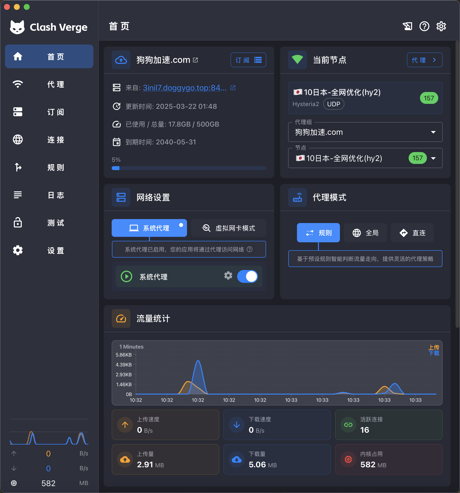
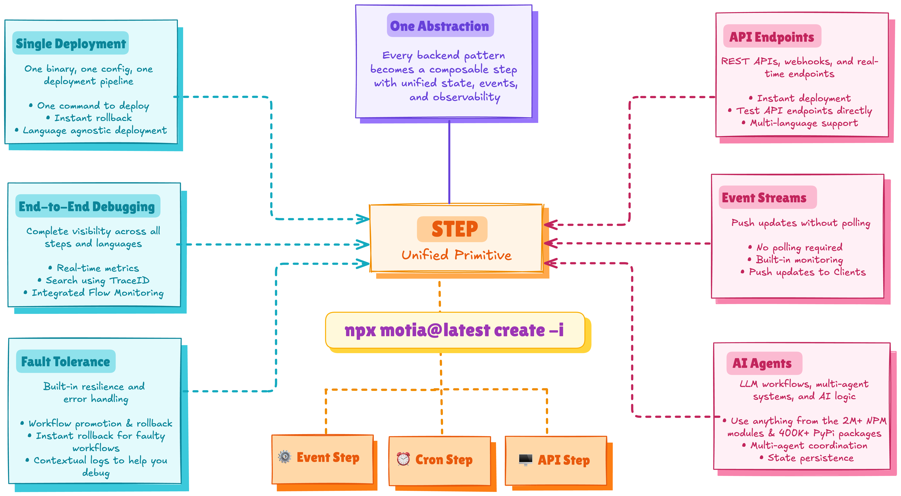
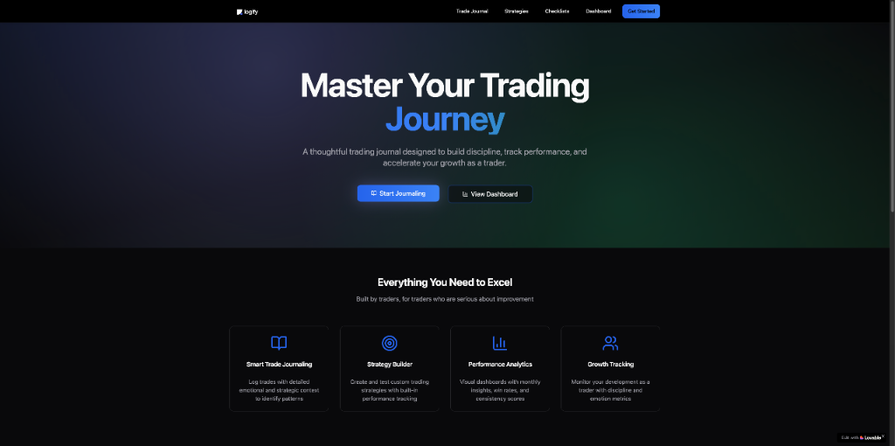
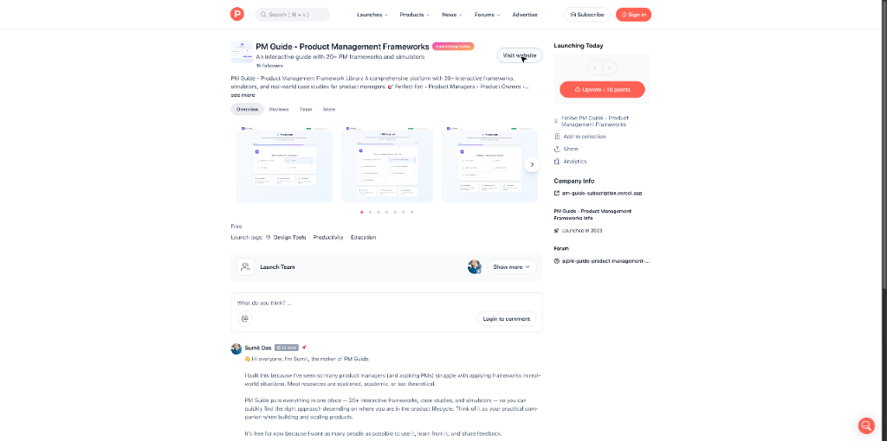
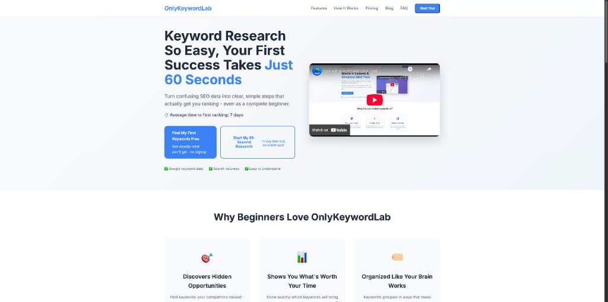
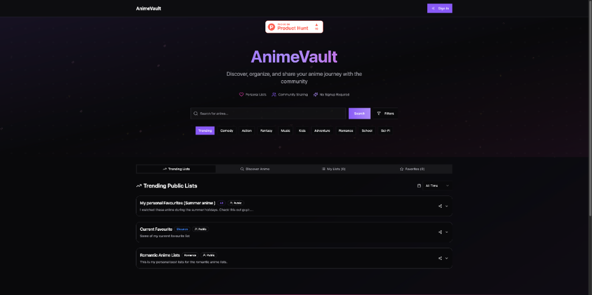
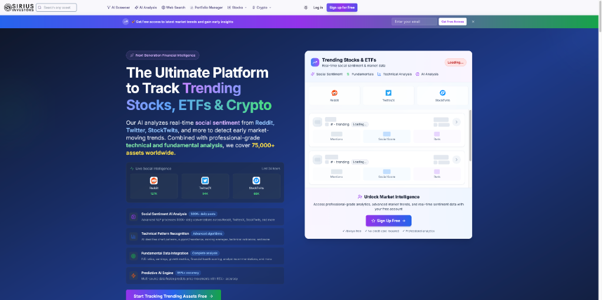

# HelloDev.io 开发者日报 - 第 2 期 | 2025 年 08 月 18 日

👋 Hi，这里是 HelloDev.io 开发者日报，今天是第 2 期，即将为你介绍今天的精彩发现：

📊 **本期内容**：
- 🚀 开源趋势：5 条
- 🛠️ 产品观察：6 条  
- 📰 行业动态：3 条
- 💡 经验讨论：1 条

---

## 🚀 开源趋势

### GitHub 49k+ stars 的金融数据聚合器：OpenBB-finance / OpenBB

OpenBB 是一个开源的金融数据聚合平台，它为人类和 AI 代理提供了统一的访问接口。该平台支持多种金融数据类型，包括股票、期权、加密货币、外汇、宏观经济和固定收益等。通过 Python 或 CLI 接口，用户可以轻松获取和处理这些数据。OpenBB 还支持扩展插件，以增强用户体验，并集成了多个数据供应商。此外，OpenBB 提供了一个企业级 UI（OpenBB Workspace），用于可视化数据集和使用 AI 代理。这个项目拥有超过 49,000 颗星标和 4,600 个复刻，社区活跃，持续更新。

对于金融分析师、量化交易员和数据科学家来说，OpenBB 是一个强大的工具，可以帮助他们快速获取和分析各种金融数据。特别是其对 AI 代理的支持，使得自动化数据分析变得更加容易。

> 🔗 **项目链接**
> 
> https://github.com/OpenBB-finance/OpenBB

---

### 3D 重建利器：colmap / colmap

COLMAP 是一个通用的 Structure-from-Motion (SfM) 和 Multi-View Stereo (MVS) 流水线，具有图形和命令行界面。它提供了丰富的功能，用于重建有序和无序的图像集合。COLMAP 支持多种平台，并提供预编译的二进制文件和 Python 绑定，方便用户安装和使用。该项目由 Johannes Schönberger、Paul-Edouard Sarlin 和 Shaohui Liu 等人积极维护和发展，拥有超过 9,400 颗星标和 1,700 个复刻，社区活跃，与其他计算机视觉库集成良好。

对于需要进行 3D 重建的研究人员和工程师来说，COLMAP 是一个非常有价值的工具。它不仅支持多种图像集合类型，还提供了图像检索和词汇树引擎等功能，使得重建过程更加高效。

> 🔗 **项目链接**
> 
> https://github.com/colmap/colmap

---

### 数据工程师的必备手册：DataExpert-io / data-engineer-handbook

Data Engineering Handbook 是一个全面的 GitHub 仓库，包含了大量的数据工程学习资源。它涵盖了书籍、社区、课程、认证、工具等多个方面，为初学者和经验丰富的专业人士提供了一站式的学习资源。该仓库整理了数据工程书籍、社区、教育课程、认证路径以及相关工具和技术的列表，按主题进行了分类，方便用户查找和学习。

对于想要进入或提升数据工程技能的人来说，这个手册是一个宝贵的资源。它不仅提供了结构化的学习路径，还连接了相关的社区和专家，帮助学习者获得最新的行业知识和实践经验。

> 🔗 **项目链接**
> 
> https://github.com/DataExpert-io/data-engineer-handbook

---

### 跨平台代理客户端新选择：clash-verge-rev / clash-verge-rev

Clash Verge Rev 是一个基于 Tauri 构建的现代图形界面客户端，专为在 Windows、macOS 和 Linux 上提供定制化的代理体验而设计。它内置了 Clash.Meta(mihomo) 内核，支持切换 Alpha 版本内核，具备简洁美观的用户界面、配置文件管理与增强、系统代理和守卫、TUN 模式、可视化节点和规则编辑以及 WebDav 配置备份同步等功能。该工具旨在为用户提供高性能且易于使用的代理解决方案。

对于需要在不同操作系统上进行代理设置的用户来说，Clash Verge Rev 是一个很好的选择。它不仅支持多种高级功能，还拥有活跃的社区支持和持续更新，确保软件的稳定性和新功能的快速迭代。

> 🔗 **项目链接**
> 
> https://github.com/clash-verge-rev/clash-verge-rev

---

### 统一后端开发框架：MotiaDev / motia

Motia 是一个现代后端框架，它将 API、后台任务、工作流和 AI 代理统一到一个单一的系统中。开发者可以使用 JavaScript、TypeScript 和 Python 等多种语言编写业务逻辑，并获得内置的状态管理和可观察性。通过使用名为 "Step" 的核心原语，开发者可以创建事件驱动的工作流，无缝连接应用程序的不同部分。该框架还包括一个 Workbench UI，用于实时构建、测试和观察后端。

对于希望简化后端开发复杂性的开发者来说，Motia 是一个非常有吸引力的选择。它不仅支持多种编程语言，还提供了零配置的可观察性和简化的部署流程，减少了开发者在不同框架之间切换的认知负担。

> 🔗 **项目链接**
> 
> https://github.com/MotiaDev/motia

---

## 🛠️ 产品观察

### ADHD 人群的专属社区：Shimmer Community Membership

Shimmer 是排名第一的 ADHD 平台，专为全球 3.5 亿多患有 ADHD 的成年人打造。该平台提供个性化的 ADHD 教练匹配服务，帮助用户学习技能、建立习惯并实施个性化系统。经过 60,000 多次辅导课程的验证，83% 的会员在仅仅 6 周后就能更好地管理 ADHD 症状。最新推出的社区会员平台更加易于访问，将基于科学的知识、责任感和理解你的社群整合在一个地方。会员可以享受每日双倍身体陪伴、专家主导的每周活动、不断增长的学习中心、社区连接等服务，起价仅为每月 34 美元。

对于 ADHD 患者来说，Shimmer 提供了一个全面的支持系统，不仅有专业的教练指导，还有社区的支持和理解。这种结合科学支持和社群互动的方式，使得用户能够更好地管理自己的症状。

> 🔗 **产品链接**
> 
> https://www.producthunt.com/products/shimmer-care

---

### AI 增强的个人食谱库：GrubPick

GrubPick 是一个 AI 增强的个人食谱库，允许用户从各种来源导入食谱，高效地组织它们，并创建购物清单。它旨在通过消除书签和截图的混乱来简化 meal planning。用户可以通过家庭工作区与家人和朋友分享食谱和 meal plan。该服务是免费的，专注于提供简单直接的食谱和 meal planning 体验，没有不必要的功能。

对于喜欢烹饪的家庭来说，GrubPick 是一个非常实用的工具。它可以集中管理所有的食谱，并通过 AI 技术提高用户体验，同时支持家庭成员之间的协作。

> 🔗 **产品链接**
> 
> https://www.producthunt.com/products/grubpick

---

### 快速创建专业地图：Styled Map

Styled Map 是一个工具，允许建筑师、设计师和规划师快速轻松地创建演示就绪的 Google Maps 样式。它提供了一个社区策划的主题库、一个交互式编辑器来设计自定义地图样式，并且能够在无需任何 API 设置的情况下导出高分辨率的静态地图。该工具旨在消除手动编辑或编码来自定义地图的需求，非常适合需要为报告、演示文稿或场地平面图制作精美地图的专业人士。

对于需要频繁制作地图的专业人士来说，Styled Map 可以极大地提高工作效率。它不仅提供了丰富的主题库，还支持自定义设计，使得地图制作变得更加简单和快捷。

> 🔗 **产品链接**
> 
> https://www.producthunt.com/products/styled-map

---

### 免费的交易日志应用：Logify

Logify 是一个免费的交易日志应用程序，旨在帮助交易者建立纪律、跟踪表现并加速成长。它提供了仪表板指标、PNL 进展图表、盈利日历和 AI 驱动的洞察，包括信心水平、风险回报比率和胜率。该应用完全免费，无需账户，数据直接保存在用户的浏览器中。目前正在进行移动端响应式设计。

对于预算有限但又需要专业交易日志功能的交易者来说，Logify 是一个非常好的选择。它不仅提供了丰富的分析功能，还通过 AI 技术提供可操作的见解和交易建议。

> 🔗 **产品链接**
> 
> https://www.producthunt.com/products/logify-4

---

### 产品管理框架指南：PM Guide - Product Management Frameworks

PM Guide 是一个交互式平台，旨在帮助产品经理和相关专业人士访问超过 20 个实用的框架、模拟器和真实案例研究。它旨在将分散和理论的资源整合到一个易于访问的位置。该工具特别适用于产品经理、产品负责人、初创公司创始人和业务分析师，帮助他们通过动手方法增强产品开发生命周期。目前免费使用，创建者正在寻求用户反馈以进一步改进。

对于产品经理来说，PM Guide 提供了一个全面的学习和实践平台。它不仅包含了丰富的框架和案例研究，还提供了模拟器，帮助用户更好地理解和应用这些知识。

> 🔗 **产品链接**
> 
> https://www.producthunt.com/products/pm-guide-product-management-frameworks

---

### 英语语法和写作风格改进工具：RefineSentence – Grammar & Rewrites

RefineSentence 是一个工具，旨在帮助用户改进英语语法和写作风格。通过输入一个句子，用户可以立即获得纠正版本，并看到相同想法以 15 种不同风格（正式、随意、有说服力、机智等）重写的版本以获得灵感。该工具轻量、快速且实用，适用于日常写作任务，如电子邮件、LinkedIn 帖子、产品列表内容、推文、求职信和博客草稿。无需注册，无杂乱。

对于需要频繁写作的用户来说，RefineSentence 是一个非常实用的工具。它不仅可以纠正语法错误，还可以提供多种风格的重写建议，帮助用户找到最合适的表达方式。

> 🔗 **产品链接**
> 
> https://www.producthunt.com/products/refinesentence-grammar-rewrites

---

## 📰 行业动态

### 简化 SEO 关键词研究：OnlyKeywordLab

OnlyKeywordLab 是一个面向初学者的关键词研究工具，旨在简化 SEO 入门。它提供了一个直观的界面，带有颜色编码的指标（绿色表示有利，红色表示竞争激烈的关键词），可在 60 秒内获得即时结果，并且只关注搜索量和竞争等基本数据。该工具内置了理解指标的指导，并提供慷慨的免费层，使刚开始接触 SEO 的人也能轻松使用。

对于 SEO 初学者来说，OnlyKeywordLab 提供了一个友好的入门体验。它通过简化复杂的数据和提供内置指导，帮助用户快速上手关键词研究。

> 🔗 **相关链接**
> 
> https://www.producthunt.com/products/onlykeywordlab

---

### 动漫爱好者的社区平台：Anime Vault

Anime Vault 是一个动漫爱好者发现、跟踪和分享他们喜爱的节目和电影的平台。它允许用户探索热门和经典动漫，维护观看列表，并与社区分享他们的动漫库。该平台注重隐私和安全，确保通过 HTTPS 进行安全浏览，并且不共享或出售个人数据。该产品目前已上线，并邀请用户反馈以持续改进。

对于动漫爱好者来说，Anime Vault 提供了一个整洁有序的数据库平台。它不仅支持个人收藏管理，还鼓励社区分享，让用户能够发现更多有趣的内容。

> 🔗 **相关链接**
> 
> https://www.producthunt.com/products/anime-vault

---

### 免费的 AI 驱动投资研究平台：Sirius Investors

Sirius Investors 是一个免费的 AI 驱动平台，旨在通过将股票、ETF 和加密货币分析集成到单一界面来简化投资研究。创始人因现有工具的碎片化和昂贵而感到沮丧，因此创建了 Sirius Investors，以提供全面的市场洞察，而无需付费墙或试用。该平台结合了来自 Reddit 和 Twitter 等平台的实时社交情绪分析与技术和基本面数据，通过微调的 AI 模型处理，提供准确、可操作的情报。主要功能包括基于自然语言的 AI 筛选器、实时市场动向、预测分析（准确率超过 95%）和 AI 驱动的市场分析。它旨在为新手和有经验的交易者提供专业级投资工具的民主化访问。

对于投资者来说，Sirius Investors 提供了一个全面且免费的投资研究平台。它通过 AI 技术整合了多种数据源，帮助用户做出更明智的投资决策。

> 🔗 **相关链接**
> 
> https://www.siriusinvestors.com/

---

## 💡 经验讨论

### 从个人需求到产品实现：Ghost Text 的开发历程

Anandsahni57 详细记录了他发现 macOS 系统中重复输入问题并开发 Ghost Text 应用的全过程，包括技术选型、开发挑战和最终解决方案，为独立开发者提供了从问题识别到产品实现的完整案例。

对于独立开发者来说，这个案例提供了一个很好的参考。它展示了如何从个人需求出发，通过技术手段解决问题，并最终将其转化为一个可用的产品。

> 🔗 **参考资料**
> 
> https://www.indiehackers.com/product/ghost-text?post=lRsYA6KPQ4ZsehXiSr9J

---

## 📝 结语

明天见。Bye 👋

---

💌 **互动时间**：
- 你对开发者日报有什么建议？
- 有什么想了解的话题？
- 欢迎在评论区分享你的想法！

🔗 **关注 HelloDev.io**：每日精选最有价值的内容，5 分钟了解互联网的最新想法

📱 **多平台发布**：微信公众号 | 掘金 | 知乎 | GitHub