# HelloDev.io 开发者日报 - 第 3 期 | 2025 年 08 月 19 日

👋 Hi，这里是 HelloDev.io 开发者日报，今天是第 3 期，即将为你介绍今天的精彩发现：

📊 **本期内容**：
- 🚀 开源趋势：5 条
- 🛠️ 产品观察：6 条  
- 📰 行业动态：3 条
- 💡 经验讨论：0 条
- 📸 每日一图：1 条

---

## 🚀 开源趋势

### 🧠 GitHub 64k+ stars 的学习宝藏：LLMs-from-scratch

这个项目是 Sebastian Raschka 新书《Build a Large Language Model (From Scratch)》的官方代码仓库，用 PyTorch 从零开始构建一个 ChatGPT 类似的大型语言模型。它一步步引导用户完成模型开发、预训练和微调，涵盖了注意力机制等核心概念，非常适合想要深入理解 LLM 原理的开发者。代码设计得可以在普通笔记本上运行，还包含了练习和解决方案，非常适合动手学习。如果你对 AI 和深度学习感兴趣，这个项目绝对值得深入研究。

对于 AI 初学者和教育者来说，这是一个非常宝贵的资源，能帮助从基础概念过渡到实际应用。项目不仅提供了理论知识，还通过实践练习加深理解，是构建 AI 知识体系的绝佳起点。

> 🔗 **项目链接**
> 
> https://github.com/rasbt/LLMs-from-scratch

---

### 🖼️ 自建照片管理的完美方案：Immich

Immich 是一个高性能、自托管的照片和视频管理解决方案，可以看作是 Google Photos 的开源替代品。它支持自动备份、防重复、多用户、高级搜索（包括人脸识别和 CLIP 搜索）等功能，界面现代，支持移动端和网页端。项目使用 TypeScript、Svelte 和 Flutter 等现代技术构建，完全开源免费，让你对自己的数据拥有完全的控制权。

对于注重隐私、不想依赖云服务的用户，或者需要为家庭或小团队搭建媒体库的开发者来说，Immich 是一个非常值得考虑的选择。它活跃的社区和持续的更新也确保了功能的不断完善。

> 🔗 **项目链接**
> 
> https://github.com/immich-app/immich

---

### 🤖 本地 AI 桌面助手：Bytebot

Bytebot 是一个开源、自托管的 AI 桌面代理，它在一个容器化的 Linux 桌面环境中运行，能够像人一样通过自然语言命令自动化复杂的计算机任务。它支持 Anthropic Claude、OpenAI GPT 和 Google Gemini 等多种 AI 提供商，具备文件上传、实时桌面视图、接管模式和持久化环境等功能。你可以用它来自动化业务流程、进行开发测试或研究分析。

对于需要在本地环境中运行 AI 代理、处理跨应用复杂工作流，同时又关心数据隐私的开发者和企业来说，Bytebot 提供了一个强大而灵活的解决方案。它比仅限浏览器的代理能处理更复杂的任务。

> 🔗 **项目链接**
> 
> https://github.com/bytebot-ai/bytebot

---

### 📄 安全文档分享新选择：Papermark
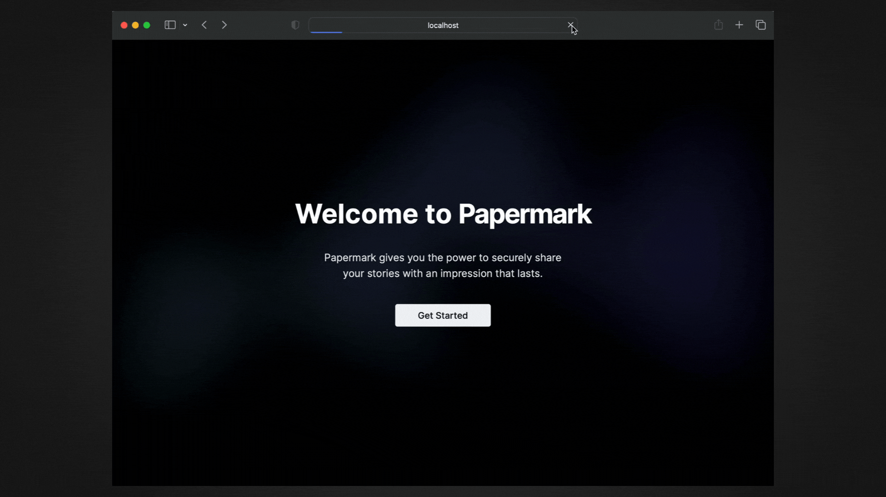

Papermark 是一个开源的 DocSend 替代品，专注于安全的文档分享，并内置了分析功能和自定义域名支持。用户可以通过自定义链接分享文档，添加自己的品牌标识，并追踪文档的访问数据。它使用 Next.js、TypeScript、Prisma 和 PostgreSQL 等现代技术栈构建，专为自托管设计，提供了极大的灵活性和控制权。

如果你是一个团队，需要分享机密文件并希望获得详细的访问分析，同时又不想依赖第三方商业服务，那么 Papermark 是一个非常合适的选择。它的开源特性也意味着你可以根据自己的需求进行定制。

> 🔗 **项目链接**
> 
> https://github.com/mfts/papermark

---

### ⚙️ 工作流自动化模板库：awesome-n8n-templates
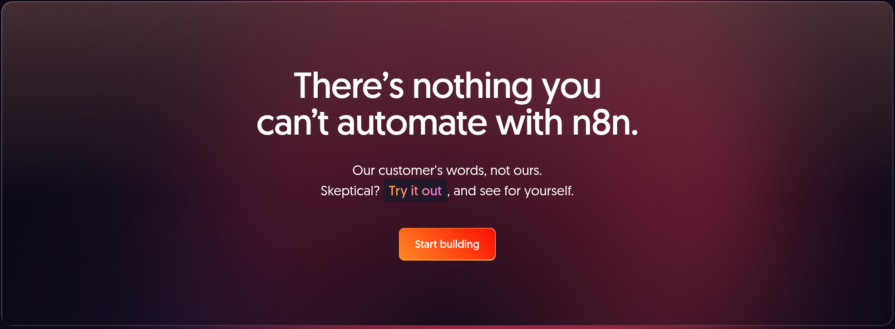

这个仓库收集了一系列为 n8n 平台准备的自动化模板，涵盖了 Gmail、Telegram、Google Drive、Slack、Notion、Airtable 等众多流行应用。这些模板按类别组织，包括邮件自动化、社交媒体、文档处理等，可以帮助用户快速搭建自动化流程，节省大量时间和精力。

对于使用 n8n 进行工作流自动化的用户来说，这个仓库是一个巨大的资源宝库。它可以让你避免从零开始构建流程，快速找到适合自己需求的解决方案，尤其适合那些希望通过低代码/无代码方式提升效率的团队和个人。

> 🔗 **项目链接**
> 
> https://github.com/enescingoz/awesome-n8n-templates

---

## 🛠️ 产品观察

### ⚡ 统一 LLM 应用开发栈：TensorZero
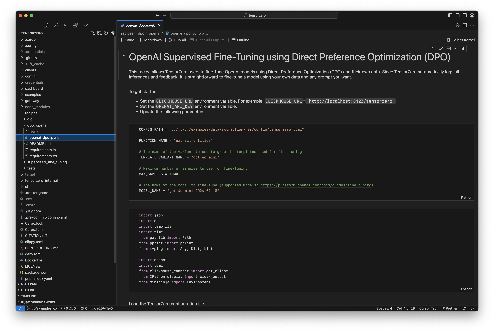

TensorZero 是一个专为工业级 LLM 应用设计的开源栈。它提供了一个统一的 API 来访问所有主流 LLM 提供商，确保低延迟和高吞吐量。核心功能包括 LLM 网关、可观测性（存储推理和反馈）、优化（基于指标和人工反馈）、评估（基准测试）和实验（A/B 测试）。它用 Rust 构建，性能优异，支持多种编程语言。

对于希望构建、监控、优化和评估 LLM 应用的开发者和企业来说，TensorZero 提供了一个完整的工具链。它特别适合需要处理大规模、低延迟场景的应用，例如客户服务、内容生成和数据分析。

> 🔗 **产品链接**
> 
> https://github.com/tensorzero/tensorzero

---

### 🪞 一站式人格探索平台：Mirror
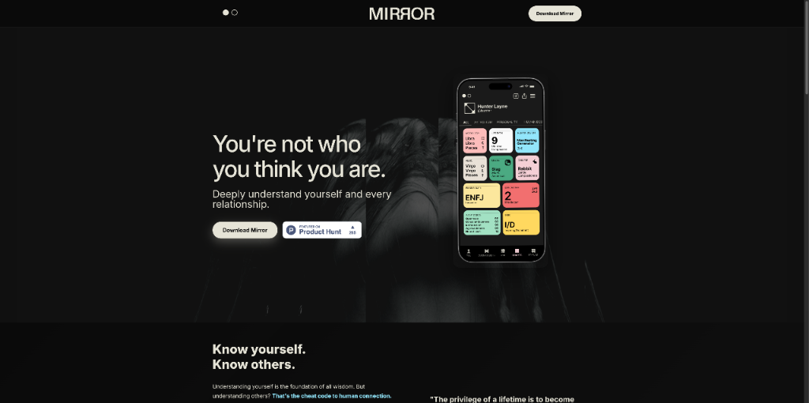

Mirror 是一个将占星术、人类设计、MBTI、九型人格等自我探索系统整合到一个统一平台的 App。它利用社交 AI 提供极其精准的人际关系兼容性报告和洞察。你可以通过简单的聊天添加他人，立刻获得关于你们关系动态的精准答案。它还提供每日个人成长洞察，帮助你深入理解自己并与他人建立更有意义的联系。

如果你对自我认知和人际关系充满好奇，Mirror 提供了一个前所未有的整合视角。它消除了在多个 App 之间切换的麻烦，通过 AI 的力量提供深度洞察，非常适合那些希望更深入了解自己和他人的人。

> 🔗 **产品链接**
> 
> https://www.producthunt.com/products/mirror-11

---

### 📁 本地文件生成器：FileFaker
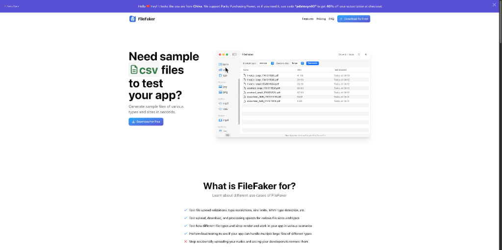

FileFaker 是一款原生 macOS 应用，可以即时在你的本地机器上生成各种类型和大小的示例文件。它支持超过 14 种文件格式，包括 PDF、Office 文档、图片、视频和压缩包。应用完全离线工作，确保 100% 的隐私，因为文件是通过原生 API 生成的，不与任何服务器交互。对于需要频繁生成测试文件的开发者和 QA 工程师来说，这是一个非常实用的工具。

它解决了测试中获取样本文件的常见痛点，提供了精确的文件大小控制和便捷的拖放功能。如果你经常需要为上传验证、负载测试或边缘案例准备文件，FileFaker 可以极大地提升你的工作效率。

> 🔗 **产品链接**
> 
> https://www.producthunt.com/products/filefaker

---

### 💬 Slack 里的 AI 编程伙伴：Blink
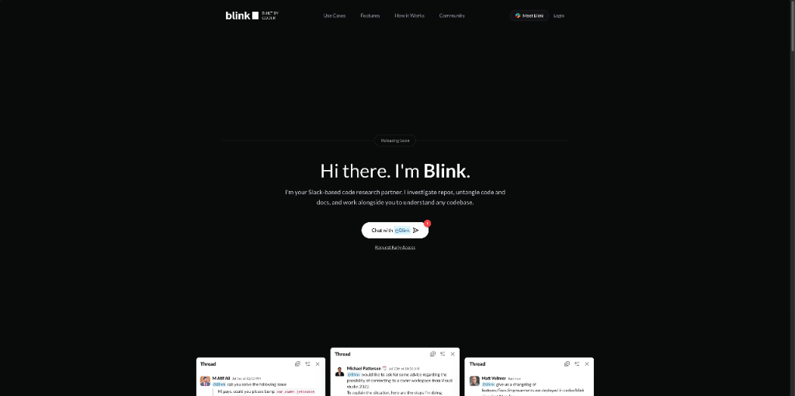

Blink 是一个旨在无缝集成到 Slack（未来将支持浏览器）的 AI 编程伙伴。它允许开发者通过对话方式调查代码库、起草 Pull Request、在临时环境中运行测试。Blink 的核心是自然地融入开发者的日常工作流程，感觉像一个乐于助人的伙伴，而不是一个累赘的工具。它理解代码上下文，尊重开发者的时间。

对于希望在熟悉的协作平台中获得智能编程辅助的团队来说，Blink 是一个很有吸引力的选择。它减少了上下文切换，提供了代码感知的智能支持，有望显著提升开发效率。

> 🔗 **产品链接**
> 
> https://www.producthunt.com/products/blink-a-deep-research-agent-for-devs

---

### 💌 AI 驱动的 macOS 邮件客户端：Filo Mail
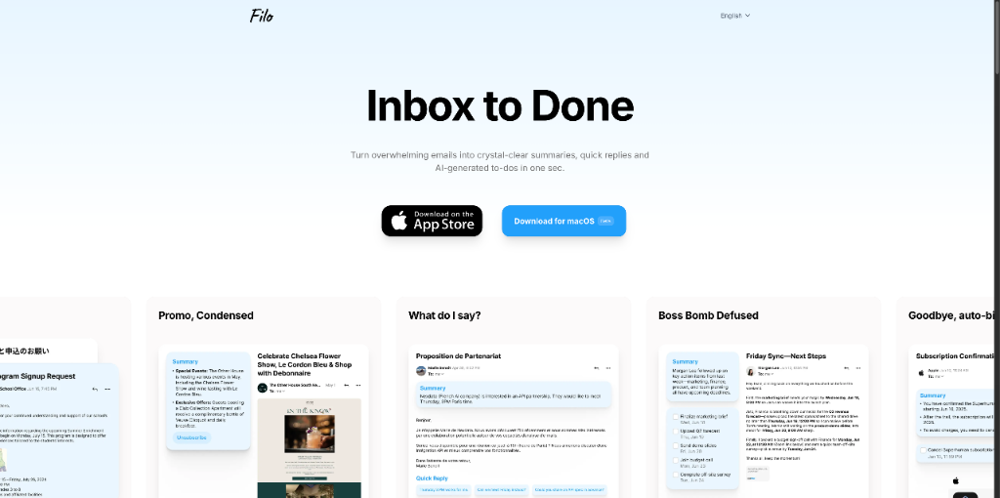

Filo Mail for macOS 是一款 AI 原生的邮件客户端，旨在将你的收件箱变成一个高效的工作区。它能自动总结邮件线程、提取可操作的待办事项，并使用智能过滤器来整理邮件。其 AI 功能包括快速回复、可学习的智能标签和以键盘为先的导航，帮助用户减少邮件混乱，专注于重要的事情。

对于被邮件淹没的 macOS 用户，特别是开发者和知识工作者，Filo Mail 提供了一套强大的 AI 工具来重新掌控收件箱。目前处于公开测试阶段且免费，值得一试。

> 🔗 **产品链接**
> 
> https://www.producthunt.com/products/filo-mail

---

### 📈 全流程网红营销 AI 代理：Stormy
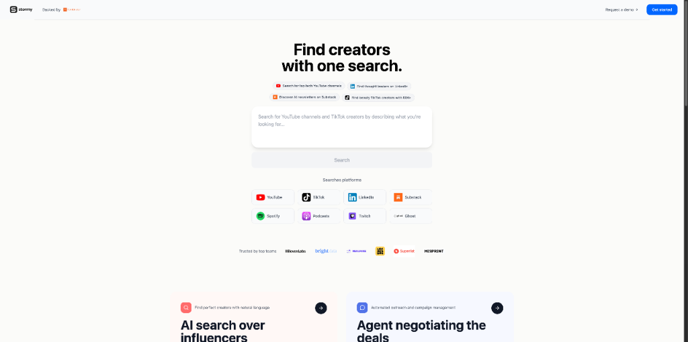

Stormy 是一个专为网红营销设计的 AI 代理，旨在自动化从寻找合适的 YouTube/TikTok 创作者、评估匹配度、起草个性化联系信息、发送私信/邮件、跟踪回复到协助谈判的整个流程。它旨在用快速、端到端的解决方案取代传统缓慢且低效的网红营销方法。

对于需要频繁进行网红合作的营销团队来说，Stormy 可以极大地简化工作流程，快速生成高质量的候选人名单，并确保联系信息听起来人性化且个性化，从而提高合作成功率。

> 🔗 **产品链接**
> 
> https://www.producthunt.com/products/stormy-influencer-marketing-ai-agent

---

## 📰 行业动态

### 🧱 本地优先的全栈应用构建器：Dualite x Supabase
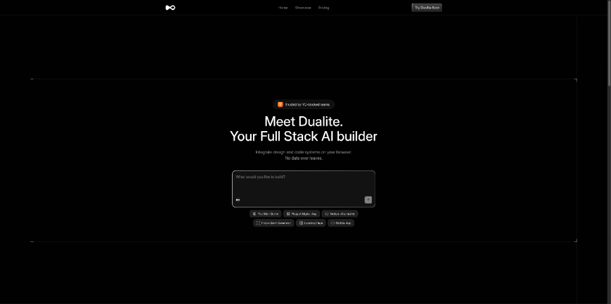

Dualite 是一个强调数据隐私和安全的全栈应用构建平台，它将数据和提示保留在浏览器本地。最近，它宣布与 Supabase 集成，为用户提供了构建具备后端能力的全栈应用的能力。该平台支持 React、Angular、Vue 等主流框架，并集成了 Figma 设计导入、GitHub 同步和实时 API 连接等功能，通过 AI 驱动实现快速开发。

这一集成对于开发者来说是一个好消息，它结合了本地优先的安全性和云端后端的便利性。对于初创公司、独立开发者和需要快速原型验证的团队，Dualite 提供了一个兼顾安全与效率的现代开发方案。

> 🔗 **相关链接**
> 
> https://www.producthunt.com/products/dualite-2

---

### 🗣️ 语音驱动的邮件管理工具：Extra Thursday
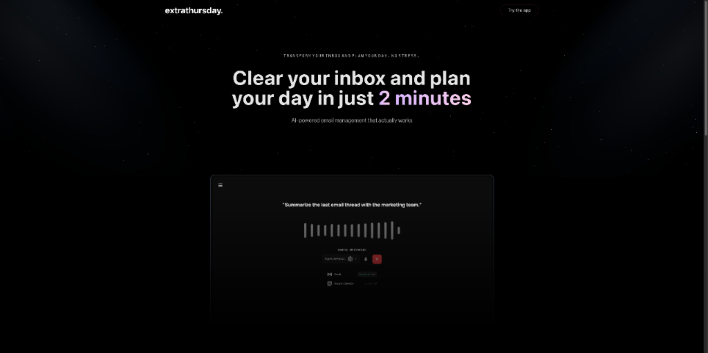

Extra Thursday 是一款语音驱动的邮件管理工具，旨在帮助用户通过说话而非打字来高效处理收件箱。它可以对邮件进行分类、起草回复，并通过语音命令跟进重要邮件线程。该工具连接 Gmail，适用于任何设备，特别适合需要快速处理线索和紧急沟通的专业人士。

随着语音交互技术的成熟，像 Extra Thursday 这样的工具代表了未来邮件管理的一个方向。它可以帮助用户节省大量时间，将精力集中在核心任务上，对于邮件密集型工作者来说具有很高的实用价值。

> 🔗 **相关链接**
> 
> https://www.producthunt.com/products/extra-thursday

---

### ⌚ 为 Apple Watch 构建的极简 Hacker News 阅读器
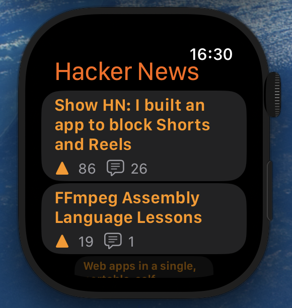

HackerNewsWatch 是一个使用 SwiftUI 为 Apple Watch 开发的极简 Hacker News 阅读器。它提供了滚动的热门新闻列表，用户可以点击查看评论树，并通过手表浏览器打开文章。该应用注重隐私，不收集用户数据，是一个开源项目，遵循 MIT 许可证。

对于 Apple Watch 用户和 SwiftUI 开发者来说，这是一个值得关注的项目。它展示了如何在受限的设备上构建高效的信息获取工具，同时也为开发者提供了一个学习 watchOS 开发的优秀案例。

> 🔗 **相关链接**
> 
> https://github.com/wieslawsoltes/HackerNewsWatch

---

## 📸 每日一图

---

## 📝 结语

明天见。Bye 👋

---

💌 **互动时间**：
- 你对开发者日报有什么建议？
- 有什么想了解的话题？
- 欢迎在评论区分享你的想法！

🔗 **关注 HelloDev.io**：每日精选最有价值的内容，5 分钟了解互联网的最新想法

📱 **多平台发布**：微信公众号 | 掘金 | 知乎 | GitHub