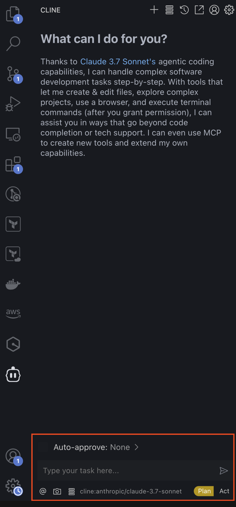

# HelloDev.io 开发者日报 - 第 4 期 | 2025 年 08 月 20 日

👋 Hi，这里是 HelloDev.io 开发者日报，今天是第 4 期，即将为你介绍今天的精彩发现：

📊 **本期内容**：
- 🚀 开源趋势：8 条
- 🛠️ 产品观察：6 条  
- 📰 行业动态：3 条
- 💡 经验讨论：1 条
- 📸 每日一图：1 条

---

## 🚀 开源趋势

### 字节跳动开源的多模态 GUI 智能体：UI-TARS

UI-TARS-1.5 是由字节跳动推出的一款开源多模态智能体，基于强大的视觉-语言模型构建，能够高效地在虚拟世界中执行各种任务。该模型在多种标准基准测试中表现出色，具有强大的推理能力和显著的性能提升。UI-TARS-1.5 不仅在计算机使用任务（如桌面和浏览器操作）中表现优异，还在手机使用和图形用户界面（GUI）定位任务中取得了领先的成绩。此外，项目提供了详细的部署和使用指南，支持多种平台和环境，方便开发者快速上手和集成。

如果你在寻找一个能理解和操作 GUI 的智能体，这个项目值得一试。它特别适合需要自动化测试、智能交互或跨平台操作的开发者。

> 🔗 **项目链接**
> 
> https://github.com/bytedance/UI-TARS

---

### 自主邮件营销平台：BillionMail

BillionMail 是一个开源、自托管的邮件营销平台，旨在帮助企业和个人轻松管理邮件活动。它提供了完整的控制权，包括高级分析、客户管理和可定制模板等功能。无月费、完全隐私，用户可以发送无限邮件并跟踪送达率、打开率和点击率。平台支持通过脚本或 Docker 快速安装，并集成了 RoundCube 以提供网页邮件访问。

对于需要掌控数据隐私、降低邮件营销成本的开发者和营销人员来说，这是一个非常有吸引力的选择。

> 🔗 **项目链接**
> 
> https://github.com/aaPanel/BillionMail

---

### OSINT 信息收集利器：GhostTrack

GhostTrack 是一个 OSINT（开源情报）工具，专门用于信息收集，特别是追踪位置或手机号码。它提供了 IP 跟踪、手机号码跟踪和社交媒体用户名跟踪等功能。该工具用 Python 编写，可在 Linux（deb）或 Termux 上安装。它拥有超过 2.1k 的 GitHub 星标，显示了社区的活跃度和认可度。

适合网络安全研究人员、渗透测试人员或对信息收集感兴趣的开发者使用。

> 🔗 **项目链接**
> 
> https://github.com/HunxByts/GhostTrack

---

### 全功能互联网操作系统：Puter

Puter 是一个先进的开源互联网操作系统，功能丰富、速度极快且高度可扩展。它可以作为注重隐私的个人云、构建和发布网站/网络应用的平台、传统云存储服务的替代品、远程桌面环境以及教育开源社区。项目支持自托管，并提供全面的文档，有多种部署选项，包括本地开发、Docker 和 Docker Compose。

如果你对构建一个个人云平台或替代传统云服务感兴趣，Puter 是一个非常值得探索的项目。

> 🔗 **项目链接**
> 
> https://github.com/HeyPuter/puter

---

### AWS MCP 服务器：awslabs/mcp

AWS MCP Servers 是一套专门的 Model Context Protocol (MCP) 服务器，帮助开发者通过 AI 编码助手充分利用 AWS 服务。该项目提供多个 MCP 服务器，使 AI 应用能够访问 AWS 文档、上下文指导和最佳实践，从而增强云原生开发、基础设施管理和开发工作流。

对于使用 AWS 服务并希望借助 AI 提升开发效率的开发者来说，这是一个强大的工具集。

> 🔗 **项目链接**
> 
> https://github.com/awslabs/mcp

---

### 全功能音乐播放器：SPlayer

SPlayer 是一个基于 Vue 3、TypeScript、Naïve UI 和 Electron 开发的简约音乐播放器。它支持网易云音乐，提供逐字歌词、歌曲下载、评论区展示、音乐云盘、歌单管理、音乐频谱等功能。该项目支持网页端与客户端（目前主要适配 Windows），并对移动端进行了基础适配。

如果你是一个音乐爱好者，或者想体验一个功能齐全的开源音乐播放器，SPlayer 是一个不错的选择。

> 🔗 **项目链接**
> 
> https://github.com/imsyy/SPlayer

---

## 🛠️ 产品观察

### AI 音乐生成 API：Eleven Music API

Eleven Music API 是 Eleven Labs 推出的首个音乐生成 API，专门训练于授权数据，可商业使用。该 API 允许开发者和创作者生成高质量的音乐内容，适用于游戏、视频、广告等多种商业场景。

对于需要背景音乐但缺乏音乐专业知识的内容创作者来说，这提供了一个便捷的解决方案。

> 🔗 **产品链接**
> 
> https://www.producthunt.com/products/elevenlabs

---

### 视觉探索助手：Chance AI

Chance AI 是一款视觉代理应用，通过提供实时物体识别和上下文信息，将日常体验转化为富有洞察力的发现。只需指向相机，应用就能帮助用户更深入地了解周围的世界。

适合旅行者、学生和创作者，帮助他们保持好奇心并深入探索世界。

> 🔗 **产品链接**
> 
> https://www.producthunt.com/products/chance-ai

---

### 生产级自主工程师：Fei

AutonomyAI 推出的 Fei 是一个专为生产环境设计的 AI 自主工程师。与生成原型代码的典型 AI 编码工具不同，Fei 直接在你的代码库中工作，利用现有组件并遵循你的编码标准，生成通过审查的生产就绪代码。

对于希望加速开发周期、提高输出可扩展性而不增加人手的团队来说，这是一个值得关注的工具。

> 🔗 **产品链接**
> 
> https://www.producthunt.com/products/autonomyai

---

### 语音 AI 助理：April

April 是一个语音 AI 执行助理，旨在帮助忙碌的人免提管理电子邮件和日历。它允许用户仅通过语音进行交互，实现摘要邮件、发送回复、删除促销邮件、提供日程安排等功能。

对于希望在多任务处理时保持高效而不看屏幕的用户来说，这是一个实用的工具。

> 🔗 **产品链接**
> 
> https://www.producthunt.com/products/april-yc-s25

---

### Product Hunt 过滤器：Filtro

Filtro 是一个 Chrome 扩展，帮助 Product Hunt 用户从信息流中过滤掉无关的产品。它允许用户移除不感兴趣的产品类别，如 AI 产品，从而专注于真正关心的内容。

对于经常在 Product Hunt 上寻找灵感但被无关内容干扰的用户来说，这是一个提升效率的好工具。

> 🔗 **产品链接**
> 
> https://www.producthunt.com/products/filtro

---

### ChatGPT 增强工具：GPT Burger

GPT Burger 是一个 Chrome 扩展，旨在通过提供标签系统来增强 ChatGPT 用户体验，消除无休止滚动对话以查找重要信息的需要。它支持标签保存、颜色编码、上下文跳转、拖拽排序、一键复制和笔记导出。

对于频繁与 ChatGPT 交互并需要高效管理信息的用户来说，这是一个值得尝试的工具。

> 🔗 **产品链接**
> 
> https://github.com/RickyHoHo/GPT-Burger

---

## 📰 行业动态

### iOS 照片整理神器：TinyRoll

TinyRoll 是一款 iOS 应用，旨在帮助用户轻松整理照片并释放存储空间。它提供了一个简单的滑动界面，用户可以通过向左滑动删除、向右滑动保留、向下滑动添加到相册、向上滑动分享照片。

对于希望以有趣且高效的方式整理相机胶卷的 iOS 用户来说，这是一个值得关注的应用。

> 🔗 **相关链接**
> 
> https://www.producthunt.com/products/tinyroll-clean-your-photo-album

---

### 智能语音转文字工具：AI Transcribe

AI Transcribe 是一款语音转文字应用，专为学生和专业人士设计，可轻松转录和翻译讲座和会议。它通过自定义后处理提供高精度，并扩展了基本转录功能，允许用户创建思维导图、抽认卡并与笔记聊天。

对于需要可靠笔记工具的学生和专业人士来说，这是一个经济实惠且功能丰富的选择。

> 🔗 **相关链接**
> 
> https://www.producthunt.com/products/ai-transcribe-speech-to-text

---

### 从失败到百万 ARR 的创业故事：Rosie

Jordan Gal，AI 语音公司 Rosie 的创始人，分享了他如何从一个失败的风险投资初创公司转向构建 Rosie，在短短八个月内实现 100 万美元的年经常性收入。他的成功关键包括识别 AI 语音市场的空白、专注于 SMB 的自助低成本产品、小团队快速开发、利用有效的市场进入策略（如冷邮件、广告和 SEO）以及保持低价以推动采用。

这个故事强调了速度、市场契合度和渠道实验的重要性，对于创业者来说是一个很好的借鉴。

> 🔗 **相关链接**
> 
> https://www.indiehackers.com/post/tech/from-failure-to-1m-arr-in-8-months-oA0AqL4jY25lxrQ4uGBl

---

## 💡 经验讨论

### 从周末项目到月入两万美元：Stagetimer.io 的成功之路

Lukas Hermann 分享了他如何将一个简单的周末项目 Stagetimer.io 发展成月收入 2 万美元的业务。他专注于解决实际问题，保持初始版本简单，并利用用户反馈进行增长。关键策略包括免费增值模式、基于事件的许可以减少流失，以及通过活动中的可见品牌实现产品主导增长。

这个故事强调了从简单开始、倾听用户和适应定价以适应客户行为的重要性，对于独立开发者和创业者来说是一个很好的案例。

> 🔗 **参考资料**
> 
> https://www.indiehackers.com/post/tech/from-weekend-experiment-to-20k-mo-business-aP4YP2DouOUuicCtcnCB

---

## 📸 每日一图

---

## 📝 结语

明天见。Bye 👋

---

💌 **互动时间**：
- 你对开发者日报有什么建议？
- 有什么想了解的话题？
- 欢迎在评论区分享你的想法！

🔗 **关注 HelloDev.io**：每日精选最有价值的内容，5 分钟了解互联网的最新想法

📱 **多平台发布**：微信公众号 | 掘金 | 知乎 | GitHub
