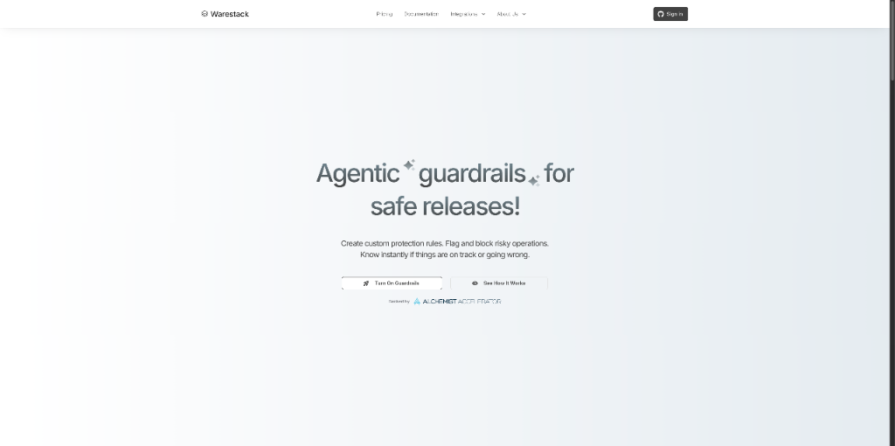
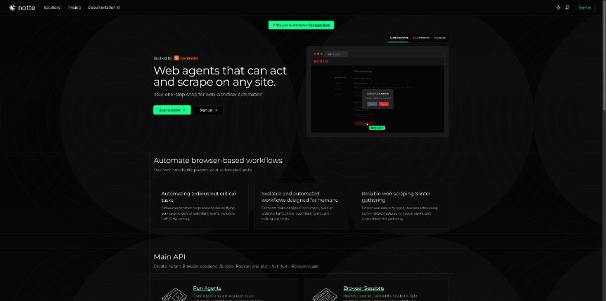
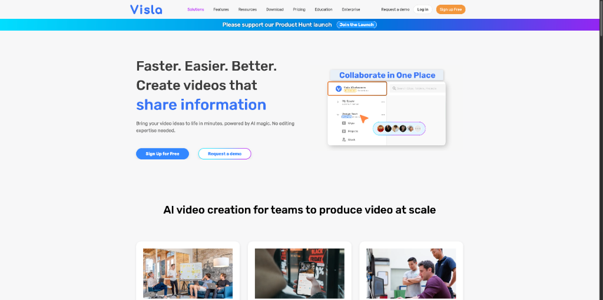
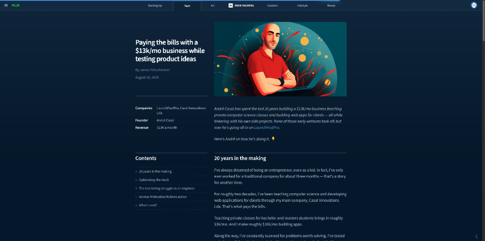

# HelloDev.io 开发者日报 - 第 5 期 | 2025 年 08 月 21 日

👋 Hi，这里是 HelloDev.io 开发者日报，今天是第 5 期，即将为你介绍今天的精彩发现：

📊 **本期内容**：
- 🚀 开源趋势：8 条
- 🛠️ 产品观察：6 条  
- 📰 行业动态：3 条
- 💡 经验讨论：1 条
- 📸 每日一图：1 条

---

## 🚀 开源趋势

### 🎮 AI 陪伴新体验：Project AIRI

Project AIRI 是一个受 Neuro-sama 启发的开源 AI 陪伴项目，让你可以在本地拥有属于自己的数字伙伴。它支持实时语音聊天，甚至能和你一起玩 Minecraft 和 Factorio 游戏。基于 Web 技术构建，AIRI 可以在浏览器或桌面平台上运行，支持 VRM 和 Live2D 模型。这个项目强调社区贡献，支持多种 LLM API 提供商，让任何人都能随时随地与自己的数字伙伴互动。

这个项目特别适合对虚拟角色、AI 陪伴或游戏互动感兴趣的开发者和用户。如果你喜欢 Neuro-sama 或者想要一个可以玩游戏的 AI 伙伴，AIRI 绝对值得一试。

> 🔗 **项目链接**
> 
> https://github.com/moeru-ai/airi

---

### 🧪 浏览器自动化利器：Puppeteer

Puppeteer 是一个 JavaScript 库，提供高级 API 来控制 Chrome 或 Firefox 浏览器。它默认以无头模式运行，但也可以配置为可见的 UI 模式。Puppeteer 主要用于自动化网页交互、测试和数据抓取。它可以通过 npm 安装，支持下载兼容的浏览器或作为库使用而不下载 Chrome。这个库兼容 Chrome 和 Firefox，并提供丰富的文档和故障排除指南。

对于需要自动化网页操作、进行端到端测试或抓取网页数据的开发者来说，Puppeteer 是一个强大的工具。它的 API 设计简洁，文档完善，是现代 Web 开发中不可或缺的一部分。

> 🔗 **项目链接**
> 
> https://github.com/puppeteer/puppeteer

---

### 🧠 神经多样性友好：Leantime

Leantime 是一个专为非项目经理设计的开源项目管理系统，特别考虑了 ADHD、阅读障碍和自闭症用户的需求。它结合了战略、规划和执行功能，提供了类似 Trello 的简洁性和 Jira 的丰富功能。Leantime 支持看板、甘特图、日历视图等多种任务管理方式，还包含了目标跟踪、里程碑管理、时间表跟踪、风险分析等功能，并集成了 Slack 和 Discord 等沟通工具。

如果你在寻找一个对神经多样性友好的项目管理工具，或者想要一个功能全面但易于使用的开源替代方案，Leantime 是一个非常值得考虑的选择。它的多语言支持和插件扩展能力也使其适用于全球团队。

> 🔗 **项目链接**
> 
> https://github.com/Leantime/leantime

---

### 🤖 本地 AI 开发环境：Self-hosted AI Starter Kit

由 n8n 提供的 Self-hosted AI Starter Kit 是一个开源的 Docker Compose 模板，用于快速搭建本地 AI 和低代码开发环境。它集成了 n8n 平台和一系列兼容的 AI 工具，包括 Ollama（本地 LLM）、Qdrant（向量存储）和 PostgreSQL（数据处理）。这个工具包支持多种 AI 应用场景，如 AI 代理、PDF 摘要、智能 Slack 机器人和私有财务文档分析。

对于希望在本地环境中快速实验 AI 工作流的开发者来说，这个 Starter Kit 提供了一个安全且功能齐全的起点。它特别适合构建概念验证项目，让你在不依赖云服务的情况下探索 AI 的可能性。

> 🔗 **项目链接**
> 
> https://github.com/n8n-io/self-hosted-ai-starter-kit

---

### 🧪 终端 AI 代理基准测试：Terminal-Bench

Terminal-Bench 是一个用于测试 AI 代理在真实终端环境中表现的基准测试工具。它评估代理在自主处理实际任务（如编译代码、训练模型、设置服务器）方面的能力。该基准测试包含一个任务数据集和一个执行框架，将语言模型连接到终端沙盒中。目前处于测试阶段，包含约 100 个任务，并欢迎社区贡献。

如果你正在开发或评估 AI 代理在系统级任务中的表现，Terminal-Bench 提供了一个真实的测试环境。它的排行榜功能还能激励社区不断改进 AI 代理的能力。

> 🔗 **项目链接**
> 
> https://github.com/laude-institute/terminal-bench

---

### 🔄 轻量级 AI 工作流构建器：Sim

Sim 是一个开源的 AI 代理工作流构建器，提供轻量级、直观的界面，用于快速构建和部署连接你喜爱工具的 LLM。它支持云端和自托管部署，并可以通过 Ollama 使用本地 AI 模型。项目采用现代化技术栈构建，包括 Next.js、Bun、PostgreSQL 和 ReactFlow。

对于希望快速构建 AI 工作流的开发者来说，Sim 提供了灵活的部署选项和直观的界面。它的开源特性也意味着你可以根据自己的需求进行定制和扩展。

> 🔗 **项目链接**
> 
> https://github.com/simstudioai/sim

---

### 🎵 音频处理新境界：CDP8

CDP8 是 Composers Desktop Project 系统软件的最新版本，包含约 80 个由 Trevor Wishart 开发的新程序和处理工具。它支持多达 8 通道的多声道制作、波形集失真和高级语音处理。一个重要增强是集成了 PVOCEX (.pvx) 分析文件支持，与 Csound 使用的标准格式对齐。CDP8 还更新了 Tabula Vigilans，修复了错误并在 Linux 上支持完整的 MIDI 设备 I/O。

如果你从事音频创作或声音处理工作，CDP8 提供了丰富的工具集和强大的处理能力。它的开源许可证也鼓励社区参与开发和贡献。

> 🔗 **项目链接**
> 
> https://github.com/ComposersDesktop/CDP8

---

### 🔐 密码管理的信赖之选：Bitwarden Clients

Bitwarden 是一个广受欢迎的开源密码管理器，提供 Web、浏览器扩展、桌面和命令行客户端。它专注于安全性和易用性，让用户能够安全地存储和管理密码、信用卡信息和其他敏感数据。

对于需要跨平台密码管理解决方案的用户来说，Bitwarden 是一个可靠的选择。它的开源特性确保了透明度和社区监督，让你可以放心使用。

> 🔗 **项目链接**
> 
> https://github.com/bitwarden/clients

---

## 🛠️ 产品观察

### 🛡️ 安全发布新范式：Warestack

Warestack 是一个创新平台，为安全的软件发布提供代理防护，允许团队用简单的英语定义自定义发布保护规则。它追踪拉取请求、问题和部署等事件，以检测工作流操作中的违规行为，并即时标记或阻止风险更改。该工具可与现有的 CI/CD 管道和 GitHub、Slack、Linear 等工具无缝集成，无需修改代码。

对于需要在不减缓交付速度的情况下维护质量的 DevOps 团队和工程经理来说，Warestack 提供了一个无摩擦的治理解决方案。它的动态规则和持续洞察功能使其能够适应团队不断变化的需求。

> 🔗 **产品链接**
> 
> https://www.producthunt.com/products/warestack

---

### 🎨 创意无界限：Kira.art

Kira.art 是一个 AI 驱动的创意工具，通过对话式交互将简单的描述转化为专业艺术作品。用户可以用自然语言描述想法并获得视觉输出，无需掌握复杂的设计工具或提示工程。该平台支持通过自然语言进行迭代优化，让初学者和经验丰富的设计师都能轻松使用。

如果你需要快速将创意可视化，或者想要一个无需设计技能就能生成高质量图像的工具，Kira.art 是一个理想的选择。它结合了多种 AI 模型，确保输出质量。

> 🔗 **产品链接**
> 
> https://www.producthunt.com/products/kira-art

---

### 📚 笔记变数据库：Obsidian Bases

Obsidian Bases 是 Obsidian 的一项新功能，允许用户将任何笔记集转换为强大的数据库。通过 bases，用户可以组织项目、旅行计划、阅读列表等。该功能支持按属性过滤笔记和创建动态公式，将纯文本的灵活性与数据库功能相结合。

对于希望在保持 Obsidian 核心 Markdown 方法的同时获得结构化数据组织能力的用户来说，Obsidian Bases 是一个重大增强。它让用户能够在不离开 Obsidian 环境的情况下创建结构化数据库。

> 🔗 **产品链接**
> 
> https://www.producthunt.com/products/obsidian

---

### 📊 数据库图表利器：ChartDB v2

ChartDB v2 是一个为团队设计的数据库图表编辑器，可以将数据库模式通过一次查询即时转换为美观且可编辑的实体关系图（ER图）。该工具无需数据库连接或手动映射，提供直观的用户界面。主要功能包括实时协作、AI 助手、自定义视图保存与嵌入、支持大型图表与更好性能、更多导入/导出源（如 PostgreSQL、MySQL 等），以及开源核心便于自托管或扩展。

对于需要简化数据库探索和设计的开发者来说，ChartDB v2 提供了一个高效且协作友好的解决方案。它的开源核心也意味着你可以根据自己的需求进行自托管或扩展。

> 🔗 **产品链接**
> 
> https://www.producthunt.com/products/chartdb

---

### 🕸️ 混合网页自动化：Notte

Notte 是一个网页自动化平台，将传统网页脚本与代理步骤结合，创建混合工作流。这种方法旨在使网页自动化更快、更可靠且更具成本效益。Notte 提供一个感知层，将复杂网站转换为清晰的 Markdown 供 LLM 使用，并包括保险库（安全凭证管理）、身份（唯一标识符）和支付（交易处理）等功能。

对于需要大规模部署网页自动化工作流的用户来说，Notte 提供了必要的工具和基础设施。它的混合方法解决了纯 AI 代理在网页自动化中的局限性。

> 🔗 **产品链接**
> 
> https://www.producthunt.com/products/notte

---

### 🎬 团队视频创作新体验：Visla

Visla 是一个面向现代团队的全能 AI 视频制作平台，旨在简化视频内容的创作流程。它通过集成人工智能技术，帮助用户快速生成高质量的视频内容，适用于营销、教育和内容创作等多种场景。该平台强调协作功能，使团队成员可以轻松共享和编辑视频项目。

对于需要快速制作高质量视频内容的团队来说，Visla 提供了一个高效且协作友好的解决方案。它的 AI 驱动功能降低了视频编辑的技术门槛。

> 🔗 **产品链接**
> 
> https://www.producthunt.com/products/visla

---

## 📰 行业动态

### 📚 屏幕时间变学习时间：Cosmo

Cosmo 是 CodeSignal 推出的一款移动应用，旨在将屏幕时间转化为技能学习时间。它提供 AI 驱动的个性化辅导，帮助用户通过动手实践在几分钟内掌握实用技能。该应用专注于构建生成式 AI、数据分析和销售技巧等现实世界技能。

对于希望利用碎片时间学习新技能的用户来说，Cosmo 提供了一个高效且个性化的学习体验。它的实践导向方法确保学习内容与实际应用紧密结合。

> 🔗 **相关链接**
> 
> https://www.producthunt.com/products/cosmo-2

---

### 📸 视觉化习惯追踪：Momentum for iOS

Momentum for iOS 是一款基于照片的习惯追踪器，帮助用户通过拍照记录每次完成习惯的时刻，从而建立日常习惯并记住自己的进步。与传统复选框不同，该应用将这些时刻转化为视觉时间线，并在每周或每月末生成回顾视频。

对于希望通过视觉化方式追踪习惯进度的用户来说，Momentum 提供了一个私密且令人满意的方式。它的 iCloud 存储确保了数据隐私，同时提供了直观的进度回顾。

> 🔗 **相关链接**
> 
> https://www.producthunt.com/products/momentum-for-ios

---

### 📈 独立产品营销实战：BlogBowl 营销策略

danshipit 详细介绍了 BlogBowl 产品的具体营销策略，包括如何获取曝光和用户关注。这篇分享对独立产品营销具有实际指导意义，为其他独立开发者提供了宝贵的经验。

对于正在寻找有效营销方法的独立开发者来说，这篇分享提供了实用的策略和见解。它强调了在竞争激烈的市场中获得用户关注的重要性。

> 🔗 **相关链接**
> 
> https://www.indiehackers.com/product/blogbowl?post=3FkbhfAMJwXRLepER0xw

---

## 💡 经验讨论

### 💼 月入 $13k 的可持续创业之路

André Casal，一位经验丰富的创业者和开发者，分享了他二十年来通过教授计算机科学和开发客户 Web 应用程序建立可持续的 $13k/月业务的历程。在维持这一收入的同时，他不断测试各种产品想法，面临执行和营销方面的挑战。他现在全力投入最新的创业项目 LaunchFastPro，这是一个帮助开发者快速启动和扩展 Web 应用程序的平台。

对于希望在保持稳定收入的同时探索创业机会的开发者来说，André 的经验提供了宝贵的见解。他的建议包括与支持性和有抱负的同行建立联系、理解动机跟随行动以及将压倒性的任务分解为小的可管理步骤。

> 🔗 **参考资料**
> 
> https://www.indiehackers.com/post/tech/paying-the-bills-with-a-13k-mo-business-while-testing-product-ideas-MladIxzuGskkXpj7eUXC

---

## 📸 每日一图

---

## 📝 结语

明天见。Bye 👋

---

## 写在最后

🐣 **帮助我们成长**:

HelloDev.io 开发者日报立志成为 **「最持久最有价值」** 面向开发者的日报，帮助大家以 **「更少时间更舒适」** 的了解所有 **「最前沿最有想法」** 的产品与技术及观点。

你的 **「转发、喜欢、点赞、评论」** 都能让更多人了解认识我们，帮助我们更好的成长，并且走得更远。感谢 🙏

📱 **多平台发布**：微信公众号 | 掘金 | 知乎 | GitHub
