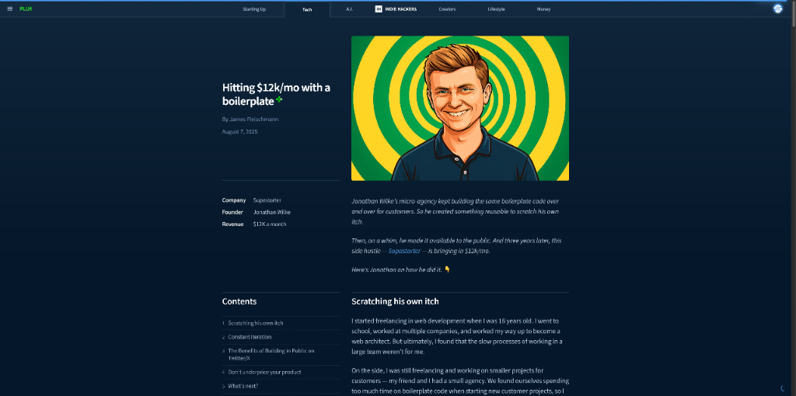
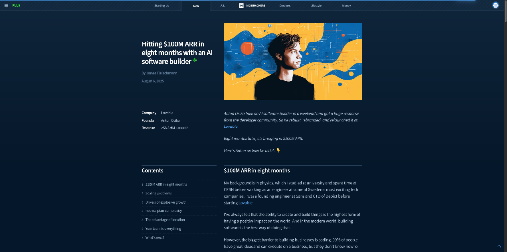

# HelloDev.io 开发者日报 - 第 6 期 | 2025 年 08 月 22 日

👋 Hi，这里是 HelloDev.io 开发者日报，今天是第 6 期，即将为你介绍今天的精彩发现：

📊 **本期内容**：
- 🚀 开源趋势：8 条
- 🛠️ 产品观察：6 条  
- 📰 行业动态：3 条
- 💡 经验讨论：1 条

---

## 🚀 开源趋势

### 🔥 GitHub 15k+ stars 背后：将网站转换为 LLM 友好数据的神器：Firecrawl

Firecrawl 是一个 API 服务，旨在通过将网站转换为干净、LLM 友好的 Markdown 或结构化数据，为 AI 应用赋能。它提供高级抓取、爬取和数据提取功能，使开发人员能够轻松地将 Web 数据集成到他们的 AI 模型中。该服务支持多种格式和功能，例如 LLM 提取、与页面交互的操作以及批量抓取。它还为 Python 和 Node.js 提供了 SDK，并与流行的 LLM 框架和低代码平台集成。Firecrawl 简化了将 Web 数据集成到 AI 应用程序的过程，支持多种数据格式，特别适合需要从 Web 获取干净、结构化数据的 LLM 开发者。

对于需要处理大量网页内容并将其用于 AI 训练或推理的项目，Firecrawl 是一个非常值得考虑的工具。

> 🔗 **项目链接**
> 
> https://github.com/firecrawl/firecrawl

---

### 🧪 谷歌官方 C++ 测试框架：GoogleTest

GoogleTest 是 Google 的 C++ 测试和模拟框架。它提供了一套丰富的断言、测试发现和各种测试类型，包括值参数化和类型参数化测试。它支持死亡测试，并提供在不同模式下运行测试的选项。该框架广泛用于 Chromium、LLVM、Protocol Buffers 和 OpenCV 等项目中。GoogleTest 需要至少 C++17 才能支持其 1.17.x 分支，并且通过持续集成进行积极维护。作为被 Chromium 和 LLVM 等大型项目广泛采用的测试框架，GoogleTest 为 C++ 开发者提供了全面的单元测试功能，包括高级断言能力和参数化测试。它通过自动发现测试和提供灵活的测试执行选项来简化测试过程。

如果你正在使用 C++ 进行开发，GoogleTest 是一个可靠且功能强大的测试框架选择。

> 🔗 **项目链接**
> 
> https://github.com/google/googletest

---

### 🧱 开源低代码平台：Budibase

Budibase 是一个开源的低代码平台，旨在帮助工程师快速构建业务应用程序，如表单、门户和审批应用。它支持各种数据源，包括 PostgreSQL、MySQL、MongoDB 和 REST API。通过拖放式 UI 构建器、工作流自动化以及自托管或云部署支持等功能，Budibase 使用户能够高效地创建响应式和可扩展的应用程序。该平台强调性能、安全性和可扩展性，允许开发人员根据需要自定义和扩展功能。Budibase 通过提供低代码方法显著减少了构建业务应用程序的时间，其开源性质（GPL v3）确保了长期的可行性和灵活性。

对于需要快速构建内部工具或业务应用的团队，Budibase 提供了一个功能丰富且灵活的解决方案。

> 🔗 **项目链接**
> 
> https://github.com/Budibase/budibase

---

### 🚀 Next.js SaaS 启动模板：Next.js SaaS Starter

Next.js SaaS Starter 是一个 GitHub 模板，用于使用 Next.js、Postgres、Stripe 和 shadcn/ui 快速构建 SaaS 应用程序。它包括身份验证、支付的 Stripe 集成、具有 CRUD 操作的仪表板页面、基于角色的访问控制和活动日志系统等功能。该模板提供了一个营销登录页面、与 Stripe Checkout 连接的定价页面以及用户/订阅管理。它旨在帮助开发人员通过一个坚实的基础来启动他们的 SaaS 项目。这个模板为使用 Next.js 构建 SaaS 应用程序提供了现成的解决方案，集成了身份验证、支付和订阅管理等核心功能。

对于想要快速启动 Next.js SaaS 项目的开发者来说，这是一个非常实用的起点。

> 🔗 **项目链接**
> 
> https://github.com/nextjs/saas-starter

---

### 🎨 开源一体化白板工具：Drawnix

Drawnix 是一个开源的一体化白板工具，支持思维导图、流程图、自由画等多种功能。它基于插件机制构建，具备无限画布、主题模式、移动端适配等特性，并支持 mermaid 语法和 markdown 文本转换。该项目采用 TypeScript 开发，支持 Docker 部署，拥有活跃的社区支持和 MIT 许可证。Drawnix 是一个基于插件架构的开源白板工具，支持多种图形编辑功能。它使用 TypeScript 开发，具备良好的扩展性和可维护性。

如果你需要一个功能丰富且可扩展的开源白板工具，Drawnix 是一个值得关注的选择。

> 🔗 **项目链接**
> 
> https://github.com/plait-board/drawnix

---

### 🐙 GitHub 入门课程：Introduction to GitHub

GitHub Skills 的 "Introduction to GitHub" 课程旨在帮助新开发者、GitHub 用户和学生在一小时内入门 GitHub。该课程涵盖了存储库、分支、提交和拉取请求的基础知识，指导用户创建分支、提交文件、打开拉取请求并合并它。用户将构建一个简短的 Markdown 文件用于他们的个人资料 README。无需先决条件，使其成为初学者的理想起点。该课程可以通过从模板创建新存储库来启动，并通过讨论板和 GitHub 状态页面获得支持。该课程专为新开发者、GitHub 用户和学生设计，提供核心 GitHub 工作流程的实践体验。

对于刚开始接触 GitHub 的开发者来说，这是一个很好的入门资源。

> 🔗 **项目链接**
> 
> https://github.com/skills/introduction-to-github

---

## 🛠️ 产品观察

### 📧 世界首个模拟冷邮件活动的 AI 代理：Mocke

Mocke 是一个 AI 代理，可以模拟冷邮件活动，在不实际发送邮件的情况下，仅用一分钟就能提供打开率、回复率和退订率等见解。它通过允许用户模拟活动并接收详细反馈（包括为什么潜在客户可能会忽略或举报垃圾邮件）来解决传统冷邮件测试缓慢、猜测性强且浪费资源的问题。这个工具帮助营销人员在启动真实活动之前优化他们的信息和策略，节省时间并保护客户关系。Mocke 通过消除两周的测试期来节省大量时间，减少猜测，并通过针对模拟潜在客户进行测试来防止浪费。

对于需要优化冷邮件营销活动的团队，Mocke 提供了一个快速且高效的测试方案。

> 🔗 **产品链接**
> 
> https://www.producthunt.com/products/mocke-mock-cold-email-campaigns

---

### 🌐 AI 驱动的网站构建平台：Macaly 2.0

Macaly 2.0 是一个由 AI 驱动的网站构建平台，专为创始人和营销人员设计，帮助他们快速将想法转化为专业且能实际转化的网站。它解决了传统 AI 网站构建工具生成的网站难以索引和排名的问题，通过输出干净的 HTML 代码，使网站对 Google 等搜索引擎友好。Macaly 2.0 提供了一站式服务，包括内置数据库、托管、CMS、分析、A/B 测试、表单等功能，无需额外插件或订阅。其核心亮点包括：内置数据库自动保存表单和用户数据、自带分析工具追踪流量和用户行为、可将任何网站作为起点进行重建、AI 图像生成、自动 SEO 优化以及内置实时网络搜索功能。Macaly 2.0 为非技术人员提供完整的网站构建平台，无需处理复杂的第三方工具集成，解决了 AI 生成网站难以被搜索引擎索引的问题。

对于希望快速构建 SEO 友好网站的创始人和营销人员，Macaly 2.0 提供了一个全面的解决方案。

> 🔗 **产品链接**
> 
> https://www.producthunt.com/products/macaly

---

### 💬 为 iMessage 设计的 AI 克隆：Daymi

Daymi 是一个为 iMessage 对话设计的 AI 克隆，感觉很真实。它会模仿你的声音、语调和短信风格，与 iMessage 集成，提供熟悉的对话体验。用户可以发短信或打电话给 Daymi，它会记住个人详细信息并支持反思和决策。AI 是主动的，每天都会签到，并提供一种独特的方式来与自己的数字版本互动。Daymi 通过克隆你的个性提供熟悉的对话体验，有助于个人反思和决策。

对于想要一个个性化 AI 助手来帮助日常反思和决策的用户，Daymi 是一个有趣的选择。

> 🔗 **产品链接**
> 
> https://www.producthunt.com/products/daymi-2

---

### 🔌 简化 MCP 服务器开发的开源平台：Disco.dev

Disco.dev 是一个开源平台，简化了模型上下文协议 (MCP) 服务器的创建、测试和自定义。它提供了一个中央枢纽，提供即插即用的 MCP 服务器，需要零设置且无需基础设施管理。该平台具有 35 多个针对流行 SaaS 工具的预构建连接器，支持具有自动重载功能的本地开发，并与各种服务器运行时兼容，包括 Bun、Node 和 Cloudflare Workers。开发人员可以轻松地将这些连接器集成到他们自己的 MCP 服务器实现中，而最终用户可以利用 disco.dev 无缝地将工具连接到 AI 应用程序。该项目由社区驱动，旨在使 AI 代理集成更加便捷高效。Disco.dev 简化了将 AI 代理连接到供应商堆栈的过程，为发现和共享 MCP 服务器提供了一个中心位置。

对于需要快速集成 AI 代理与各种 SaaS 工具的开发者，Disco.dev 是一个值得尝试的平台。

> 🔗 **产品链接**
> 
> https://www.producthunt.com/products/disco-dev

---

### 🧩 React 的开源可视化编辑器：Puck

Puck 是一个开源的、MIT 许可的 React 可视化编辑器，使开发人员能够将拖放式页面构建功能直接嵌入到他们的应用程序中。它允许用户使用自己的 React 组件创建自定义的可视化编辑体验，具有数据存储灵活性且无供应商锁定。Puck 被设计为对技术栈不持任何意见，输出干净的 JSON，并可用于创建网页、电子邮件、PDF 和其他视觉内容。该项目已获得显著关注，GitHub 星标超过 7.5k，适用于内部工具和商业产品。Puck 解决了无头 CMS 环境中对页面构建器的需求，为现有解决方案提供了替代方案。

对于需要在 React 应用中集成可视化编辑功能的开发者，Puck 是一个灵活且强大的选择。

> 🔗 **产品链接**
> 
> https://www.producthunt.com/products/puck

---

### 🤖 无代码 AI 代理创建平台：Broxi AI

Broxi AI 是一个无代码平台，使用户能够快速轻松地创建 AI 代理。通过简单地描述他们需要什么类型的 AI 代理，用户可以利用 Broxi 的自动驾驶功能在几分钟内自动构建和部署功能代理。该平台支持广泛的应用程序，从客户服务自动化到内部运营，并提供现成的模板、拖放界面和即时 API 部署。拥有 74 个合作伙伴集成和超过 203 个工具集，Broxi AI 旨在让每个人都能使用 AI 代理开发，从独立开发者到企业团队。Broxi AI 使无需编码即可快速创建 AI 代理成为可能，支持各种用例。

对于希望快速创建 AI 代理而无需编程知识的用户，Broxi AI 提供了一个便捷的解决方案。

> 🔗 **产品链接**
> 
> https://www.producthunt.com/products/broxi-ai

---

## 📰 行业动态

### 📄 AI 驱动的 PDF 生成工具：ReadyBase

ReadyBase 是一个 Product Hunt 推出的产品，允许用户在几秒钟内将任何输入转换为生产就绪的 PDF。它旨在生成引人入胜、易于消费的输出，以增强任何情报工作流程。用户可以向 ReadyBase 代理提供原始情报来源，如文本、图像和文件，AI 将快速组装一个已完成的、符合品牌风格的 PDF。该工具旨在解决 AI 输出未针对共享进行优化的常见问题，确保用户可以创建他们引以为豪的可交付成果。它提供诸如摄取混乱输入、理解结构、应用品牌风格以及导出清晰的 PDF 或屏幕截图等功能。ReadyBase 适用于创建销售单页、研究报告、高管更新和客户文档。ReadyBase 解决了 AI 输出未针对共享进行优化的常见问题，使用户能够快速创建干净、易于消化的 PDF。

对于需要快速将各种内容转换为专业 PDF 的用户，ReadyBase 是一个高效的工具。

> 🔗 **相关链接**
> 
> https://www.producthunt.com/products/readybase

---

### 🎵 专为视频时代设计的 AI 社交聆听工具：Syncly Social

Syncly Social 是一个专为视频时代设计的 AI 驱动的社交聆听工具，特别针对 TikTok。它分析 TikTok 视频中发生的对话，帮助品牌识别新兴趋势、了解竞争对手策略并发现真实的影响者，而无需手动滚动浏览内容。主要功能包括竞争分析、品牌认知度衡量和具有人口统计洞察力的创作者情报。该工具旨在通过关注视频内容（目前占社交媒体流量的 80%）来改变品牌与社交媒体的互动方式。Syncly Social 解决了传统社交聆听工具不分析视频内容的差距，通过视频分析帮助品牌更好地了解其受众。

对于希望深入了解 TikTok 视频内容并进行数据分析的品牌，Syncly Social 提供了独特的价值。

> 🔗 **相关链接**
> 
> https://www.producthunt.com/products/syncly

---

### 💼 从重复工作到月入 $12k 的样板代码：Supastarter

Jonathan Wilke，一位前自由职业者和网络架构师，创建了 Supastarter，这是一个可重用的样板代码，以解决他为客户端重复构建相同代码的问题。最初作为内部工具，后来成为公共产品，每月产生 12,000 美元的收入。Supastarter 是 Next.js、Nuxt 和 SvelteKit 的热门入门工具包，拥有超过 800 名支付 349 美元的客户。Jonathan 强调持续迭代、公开构建和不低估产品价格的重要性。产品的成功归功于其质量、社区反馈和在 X (Twitter) 上的有效营销。Supastarter 计划扩展到其他框架并添加移动应用扩展。将重复的客户工作转化为可重用的样板代码，Supastarter 现在每月产生 12,000 美元的收入。

对于开发者来说，从解决自身痛点出发，创建有价值的产品并成功商业化是一个值得借鉴的案例。

> 🔗 **相关链接**
> 
> https://www.indiehackers.com/post/j2n9ECQvdJBw9Gvf4TKA

---

## 💡 经验讨论

### 🚀 8 个月达到 $100M ARR 的 AI 软件构建器创始人：Anton Osika

Anton Osika，Lovable 的创始人，通过他的 AI 软件构建器在短短八个月内实现了 1 亿美元的年经常性收入 (ARR)。文章详细介绍了他从创建周末项目 GPT-Engineer 到重新命名并重新发布为 Lovable 的历程，Lovable 现在拥有 230 万活跃用户。这种快速增长的关键因素包括对社区的强烈关注、口碑营销、社交媒体参与和简化的定价模式。Osika 强调了团队、斯德哥尔摩生态系统中的地理位置优势以及 AI 民主化软件开发的力量的重要性。文章还涉及了扩展痛点和重大 GitHub 暂停问题等挑战，以及未来扩展到美国市场的雄心。社区驱动的增长对于 SaaS 产品来说极其强大，简化定价和减少摩擦可以带来更好的长期增长，尽管短期内会损失收入。

对于希望快速扩展 SaaS 产品的创业者来说，Anton Osika 的经验提供了宝贵的见解。

> 🔗 **参考资料**
> 
> https://www.indiehackers.com/post/ONMaxjB3rix2PnBCnrDr

---

## 📝 结语

明天见。Bye 👋

---

## 🍦 写在最后

🐣 **帮助我们成长**:

HelloDev.io 开发者日报立志成为面向开发者最持久最有价值的日报，帮助大家以 **「更少时间更舒适」** 的了解所有最前沿最有想法的产品与技术及观点。

你的 **「转发、喜欢、点赞、评论」** 都能让更多人了解认识我们，帮助我们更好的成长，并且走得更远。感谢 🙏

📱 **多平台发布**：微信公众号 | 掘金 | 知乎 | GitHub