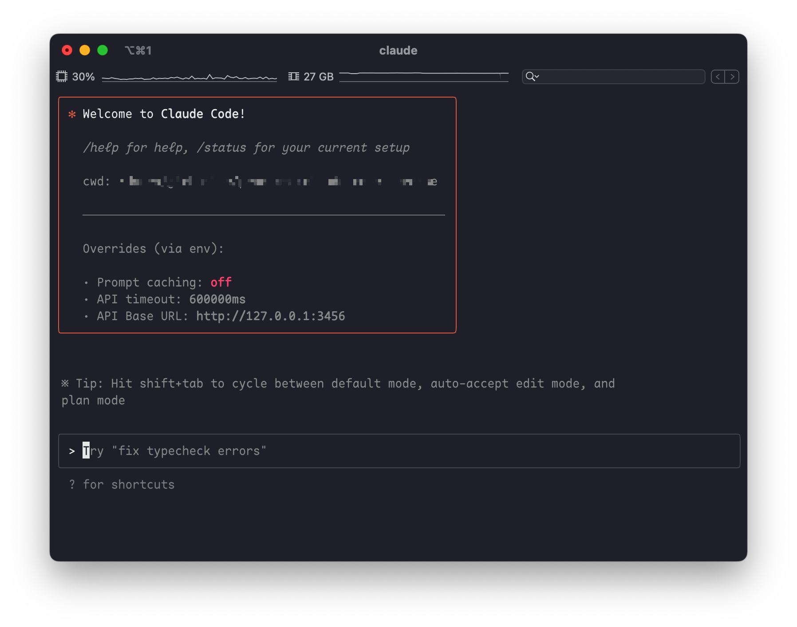

# HelloDev.io 开发者日报 - 第 7 期 | 2025 年 08 月 23 日 

👋 Hi，这里是 HelloDev.io 开发者日报，今天是第 7 期，即将为你介绍今天的精彩发现：

📊 **本期内容**：
- 🚀 开源趋势：8 条
- 🛠️ 产品观察：6 条  
- 📰 行业动态：3 条
- 💡 经验讨论：1 条
- 📸 每日一图：1 条

---

## 🚀 开源趋势

### 高性能 LLM 推理引擎：vLLM

vLLM 是一个为大语言模型（LLM）量身打造的高性能推理和服务引擎。它通过 PagedAttention 技术优化内存管理，支持连续批处理和优化的 CUDA 内核，显著提升了推理吞吐量和效率。这个项目支持 Llama、Mixtral 等主流模型，也兼容多模态模型如 LLaVA，并提供 GPTQ、AWQ、FP8 等多种量化选项。vLLM 的设计使其能够灵活部署在 NVIDIA、AMD、Intel GPU 以及 TPU、AWS Neuron 等多种硬件平台上，非常适合需要大规模、高效率部署 LLM 的场景。

对于希望降低推理延迟、提高资源利用率的开发者和企业来说，vLLM 是一个非常值得考虑的选择，特别是在构建在线服务或需要处理大量并发请求时。

> 🔗 **项目链接**
> 
> https://github.com/vllm-project/vllm

---

### 阿里通义实验室新作：Qwen3-Coder

Qwen3-Coder 是阿里巴巴通义实验室发布的 Qwen3 系列中专门针对代码的版本。它在代码生成、理解和执行方面表现出色，并支持智能代理（Agentic）能力，能够处理复杂的开发任务。该模型提供多种尺寸，包括拥有 35B 活跃参数的 Mixture-of-Experts 模型 Qwen3-Coder-480B-A35B-Instruct 和更小的 Qwen3-Coder-30B-A3B-Instruct。其核心优势在于支持高达 256K（可扩展至 1M）的上下文长度，精通 358 种编程语言，并在代理编码、浏览器使用和工具使用等任务上表现优异，可与 Claude Sonnet 媲美。

如果你正在寻找一个强大的、专为代码设计的开源大模型，无论是进行代码辅助、自动化脚本编写还是构建复杂的 AI 开发工具，Qwen3-Coder 都是一个极具竞争力的选择。

> 🔗 **项目链接**
> 
> https://github.com/QwenLM/Qwen3-Coder

---

### 高性能量化交易系统：NautilusTrader

NautilusTrader 是一个用 Rust 和 Python 构建的开源高性能算法交易系统，支持从外汇、股票、期货到加密货币和体育博彩等多种资产类别。它的一大亮点是确保回测和实盘交易环境的高度一致性，这大大降低了策略从回测到实盘的风险。平台利用 Rust 的高性能特性处理核心逻辑，同时提供 Python 绑定以便于策略开发和研究。其模块化设计允许轻松集成不同的交易场所和数据提供商。

对于专业交易员和量化开发者来说，NautilusTrader 提供了一个可靠、灵活且高性能的平台，尤其适合需要低延迟和高可靠性的交易场景。

> 🔗 **项目链接**
> 
> https://github.com/nautechsystems/nautilus_trader

---

### 全栈办公套件：Univer

Univer 是一个全栈框架，用于在 Web 和服务器端创建和编辑电子表格、文档和幻灯片。它的“同构”特性意味着可以在浏览器和 Node.js 上使用相同的 API 运行，未来还将支持移动端。Univer 设计上易于嵌入现有应用，通过插件架构实现高度可扩展性，并支持主题定制和国际化。在性能方面，它采用基于 Canvas 的高效渲染引擎和可在 Web Worker 或服务端运行的快速公式引擎。最值得一提的是，它将电子表格、文档和幻灯片集成在一起，允许它们互操作并在同一画布上渲染。

如果你正在寻找一个可以替代 Office 套件，并且希望深度定制或集成到自己产品中的开源解决方案，Univer 提供了一个非常有潜力的方向。

> 🔗 **项目链接**
> 
> https://github.com/dream-num/univer

---

### 本地化 AI 应用构建器：Dyad

Dyad 是一个免费、本地运行且开源的 AI 应用构建器，旨在成为 Lovable、v0、Bolt 等工具的替代品。它允许用户在无需编码的情况下，借助 AI 构建全栈应用程序，同时保证数据隐私并避免供应商锁定。Dyad 支持 Mac 和 Windows 平台，用户可以使用自己的 AI API 密钥或本地模型。凭借超过 13,000 的 GitHub 星标，它已经拥有一个活跃的社区。

对于希望掌控数据、避免云服务依赖，并快速构建 AI 驱动应用的开发者和创业者来说，Dyad 提供了一个强大而灵活的本地化选择。

> 🔗 **项目链接**
> 
> https://github.com/dyad-sh/dyad

---

### Claude Code 增强工具：Claude Code Router

Claude Code Router 是一个为 Claude Code 设计的强大工具，它允许开发者将请求路由到不同的模型，并自定义任何请求。这使得用户可以基于成本、性能或特定任务需求来优化模型使用。该工具支持多种模型提供商，如 OpenRouter、DeepSeek、Ollama、Gemini 等，并提供了请求/响应转换、动态模型切换（通过 `/model` 命令）、GitHub Actions 集成以及插件系统等功能。它还有一个 UI 模式用于直观的配置管理。

如果你是 Claude Code 的重度用户，并希望更精细地控制模型调用、降低成本或集成到自动化工作流中，Claude Code Router 是一个非常实用的增强工具。

> 🔗 **项目链接**
> 
> https://github.com/musistudio/claude-code-router

---

### 现代开源 HR 系统：Frappe HR

Frappe HR 是一个现代、易用且开源的 HR 和薪资管理软件。它提供了完整的 HRMS 解决方案，包含员工管理、入职、请假、薪资、税务等超过 13 个模块。该软件构建于 Frappe Framework 之上，拥有现代化的用户界面，并提供移动端应用。它支持灵活的部署方式，可以通过 Frappe Cloud 托管，也可以通过 Docker 或手动安装在本地环境运行。

对于寻求功能全面、可定制且开源的 HR 系统的中小企业或组织来说，Frappe HR 提供了一个非常有吸引力的选择，特别是如果你已经熟悉或使用 ERPNext 生态系统。

> 🔗 **项目链接**
> 
> https://github.com/frappe/hrms

---

### 智能问数系统：SQLBot

SQLBot 是一款基于大模型和 RAG 技术的智能问数系统，能够将自然语言查询转换为 SQL 语句。它的核心优势在于开箱即用，只需配置大模型和数据源即可开始使用。SQLBot 易于集成到第三方业务系统中，并支持与 n8n、MaxKB、Dify、Coze 等 AI 应用开发平台集成调用。它还通过工作空间机制提供资源隔离和细粒度的数据权限控制，保障数据安全。项目采用 Python 开发，并提供了 Docker 一键部署方案。

如果你需要快速为你的应用或业务系统添加自然语言查询数据库的能力，SQLBot 提供了一个便捷且安全的解决方案。

> 🔗 **项目链接**
> 
> https://github.com/dataease/SQLBot

---

## 🛠️ 产品观察

### 竞品广告情报平台：GoodsFox

GoodsFox 是一个由 AI 驱动的网站广告情报平台，它能帮助用户分析竞争对手的流量来源、广告策略和高绩效创意，覆盖 49 个国家和 10 个主要广告渠道（如 Meta, Google, TikTok）。它深入洞察电商、娱乐、金融、健康和旅游等多个行业的市场趋势，让营销人员能够基于数据做出决策，了解竞争对手如何获取流量和赢得客户。GoodsFox 结合了广告情报与网站和品牌分析功能，是对标 Semrush 和 Similarweb 等工具的有力补充。

对于希望深入了解竞品策略、优化自身广告投放和创意的营销人员来说，GoodsFox 提供了非常有价值的洞察。

> 🔗 **产品链接**
> 
> https://www.producthunt.com/products/goodsfox

---

### 混合推理模式 LLM：DeepSeek-V3.1

DeepSeek-V3.1 是一个开源的大语言模型，专为高级推理和代码生成而优化。它引入了混合架构，支持“思考”和“非思考”两种模式，可以根据任务复杂度动态切换。这种设计在保证解决问题能力的同时，能够显著节省成本和延迟。该模型在软件工程基准测试（如 SWE/Terminal-Bench）上表现出色，并保持 128K 的上下文窗口。它还支持严格的函数调用，并通过 Beta API 提供。

对于需要在快速响应和深度推理之间取得平衡的应用场景，例如客服或智能代理，DeepSeek-V3.1 的混合模式提供了一个非常聪明的解决方案。

> 🔗 **产品链接**
> 
> https://www.producthunt.com/products/deepseek

---

### AI 驱动的环境配置工具：GitArsenal

GitArsenal 旨在解决开发者在环境配置上浪费大量时间的问题。通过 AI 技术，它能够自动处理 GitHub 仓库的依赖安装和错误调试，让用户能够快速运行代码，避免繁琐的环境设置过程。该工具对代码库有深度理解，能够预测并解决潜在问题，特别适合需要频繁尝试新项目的开发者和研究人员。

如果你经常在克隆项目后卡在环境配置上，GitArsenal 可能是你提高开发效率的利器。

> 🔗 **产品链接**
> 
> https://www.producthunt.com/products/gitarsenal

---

### 通用个人资料抓取工具：ProfileSpider
ProfileSpider 是一款一键式通用个人资料抓取工具，旨在通过 AI 技术帮助招聘人员和销售团队节省手动数据录入的时间。它可以从任何网站提取完整的专业资料，包括姓名、职位、公司、位置、电子邮件、电话号码和社交链接等信息，并支持导出为 CSV、JSON 和 Excel 格式。该工具强调数据隐私，所有数据都存储在用户的浏览器中，不上传到外部服务器。它提供 20 次免费提取机会，并有透明的订阅计划和终身折扣优惠。

对于需要大量收集目标联系人信息的销售和招聘人员来说，ProfileSpider 提供了一个高效且注重隐私的解决方案。

> 🔗 **产品链接**
> 
> https://www.producthunt.com/products/profilespider

---

### Claude Code 移动端管理工具：Omnara

Omnara 是一个为使用 Claude Code 的开发者设计的移动端解决方案，允许他们远程管理 AI 代理。用户可以通过手机接收实时通知、查看日志和差异，并一键批准更改。它的目标是让开发者摆脱对桌面的依赖，在离开工作站时也能保持高效。Omnara 通过通用 SDK 与 Claude Code 和其他 AI 代理兼容。

对于经常需要监控和管理 AI 代理，但又不能时刻守在电脑前的开发者来说，Omnara 提供了极大的便利性。

> 🔗 **产品链接**
> 
> https://www.producthunt.com/products/omnara

---

### 轻量级 3D 模型查看器：ViewMe

ViewMe 是一款简洁的 3D 查看器桌面应用程序，可以加载和显示 Wavefront (.obj) 3D 模型，支持纹理、光照和动态阴影。它受到 Microsoft 3D Viewer 应用的启发，目前仅支持 Windows 系统。其特点包括快速加载、实时动态阴影、高级照明系统、自动旋转、文件关联、纹理支持、无需安装和稳定运行。用户可以通过右键菜单快速打开 .obj 文件，是预览 3D 模型的便捷工具。该项目是开源的，适合想要学习图形编程的开发者参考。

如果你需要一个简单、快速且无需安装的 3D 模型查看器，ViewMe 是一个不错的选择。

> 🔗 **产品链接**
> 
> https://www.producthunt.com/products/viewme

---

## 📰 行业动态

### 生活模拟游戏新星：inZOI

inZOI 是一款生活模拟游戏，玩家通过控制和观察名为“Zois”的角色来创造独特的故事。游戏提供了易用的工具来自定义角色和建造房屋，让玩家体验梦想中的生活。其深度和细致的模拟将生活中的不同情感带到台前，提供了一个沉浸式的体验，每一个选择都会塑造故事的走向。早期评论称，它融合了《模拟人生》、《侠盗猎车手》和《爱情岛》的元素。

对于喜欢高自由度生活模拟游戏的玩家来说，inZOI 提供了一个充满可能性和情感深度的新体验。

> 🔗 **相关链接**
> 
> https://www.producthunt.com/products/inzoi-2

---

### 抗议科技巨头的健身应用：Musical Drones

Musical Drones 是一款将跑步游戏化的健身应用，它模拟了一个反乌托邦的场景，用户必须 outrun AI 驱动的无人机。应用通过运动传感器追踪用户配速，当用户减速时无人机锁定，停止时则进行“狩猎”。它被创造出来作为对科技亿万富翁投资 AI 战争机器（特别是 Spotify 投资 10 亿美元于 AI 杀手机器人）的一种抗议。应用特色包括紧张刺激的音乐、支持智能眼镜的第一人称视角、无人机语音提示以及生存时间、配速和“击杀”数的统计。目前可在 App Store 下载，并需要连接 Spotify。

这款应用以一种独特而引人深思的方式，将对科技伦理的担忧与健身结合了起来。

> 🔗 **相关链接**
> 
> https://www.producthunt.com/products/musical-drones

---

### AI 创意新工具：Nano Banana 即将登陆 Textideo

Nano Banana 是一个先进的 AI 模型，能够将文本提示转换为高质量的视觉内容，具有更智能的文本到图像解释、一次性场景编辑、多样式迁移和输出连贯性等特点。它即将集成到 Textideo 平台，这是一个按需付费的平台，让创作者无需订阅即可使用 AI 创意工具。此集成旨在减少创作者的技术负担，实现更快、更高效的工作流程。该工具对独立开发者、设计师和故事讲述者特别有吸引力，因为它能保持风格一致性并简化复杂的编辑任务。

对于寻求高效、低成本且无需订阅的 AI 图像生成工具的创意工作者来说，Nano Banana 和 Textideo 的结合值得关注。

> 🔗 **相关链接**
> 
> https://www.indiehackers.com/post/from-text-to-stunning-visuals-why-nano-banana-could-redefine-ai-creativity-coming-soon-on-textideo-3b2b56f4b7

---

## 💡 经验讨论

### 从一星差评中寻找 SaaS 创业机会

这篇来自 Indie Hackers 的文章由 Aytekin Tank 撰写，提出了一个通过分析现有产品的一星差评来生成 SaaS 创意的实用框架。该方法包括：选择一个 SaaS 市场细分领域，从 G2 或 Capterra 等平台收集负面评价，使用 AI 总结痛点和识别市场空白，通过简单的落地页验证概念，借助 AI 定义 MVP 范围，并根据用户反馈进行迭代。其核心理念是，客户的挫败感（明确写在差评中）揭示了未被满足的需求和新产品的机会。这种方法利用现有的市场需求和客户反馈来降低创意风险，专注于构建人们真正想要的解决方案。

对于正在寻找 SaaS 创业方向的独立开发者来说，这个方法提供了一个非常实用且数据驱动的思路，可以有效避免闭门造车。

> 🔗 **参考资料**
> 
> https://www.indiehackers.com/post/want-a-saas-idea-that-sells-borrow-it-from-1-star-reviews-e1144022b7

---

## 📸 每日一图

---

## 📝 结语

明天见。Bye 👋

---

## 🍦 写在最后

🐣 **帮助我们成长**:

HelloDev.io 开发者日报立志成为面向开发者最持久最有价值的日报，帮助大家以 **「更少时间更舒适」** 的了解所有最前沿最有想法的产品与技术及观点。

你的 **「转发、喜欢、点赞、评论」** 都能让更多人了解认识我们，帮助我们更好的成长，并且走得更远。感谢 🙏

📱 **多平台发布**：微信公众号 | 掘金 | 知乎 | GitHub
