# HelloDev.io 开发者日报 - 第 8 期 | 2025 年 08 月 24 日

👋 Hi，这里是 HelloDev.io 开发者日报，今天是第 8 期，即将为你介绍今天的精彩发现：

📊 **本期内容**：
- 🚀 开源趋势：6 条
- 🛠️ 产品观察：6 条  
- 📰 行业动态：3 条
- 💡 经验讨论：1 条
- 📸 每日一图：0 条

---

## 🚀 开源趋势

### 🤖 GitHub 15k+ stars 背后的秘密：这个轻量级框架：HKUDS/DeepCode

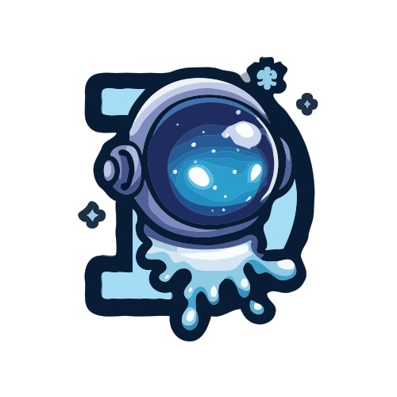

DeepCode 是一个开源的智能编码平台，它能自动将研究论文、自然语言描述和网页链接转换为生产就绪的代码。这个项目的核心亮点在于其三大功能：Paper2Code 用于算法实现，Text2Web 用于前端开发，Text2Backend 用于后端生成。通过基于模型上下文协议（MCP）的多智能体架构，DeepCode 能够智能地编排各种工具和服务，实现代码生成、测试和文档的自动化。它支持 CLI 和 Web 界面，并具备智能文档分割功能，能够处理大型技术文档。

对于需要快速将研究成果或创意转化为实际代码的开发者来说，DeepCode 是一个强大的工具。它特别适合那些希望减少重复性编码工作、提高开发效率的团队。

> 🔗 **项目链接**
> 
> https://github.com/HKUDS/DeepCode

---

### 🐧 让 Windows 应用在 Linux 上无缝运行：winapps-org / winapps

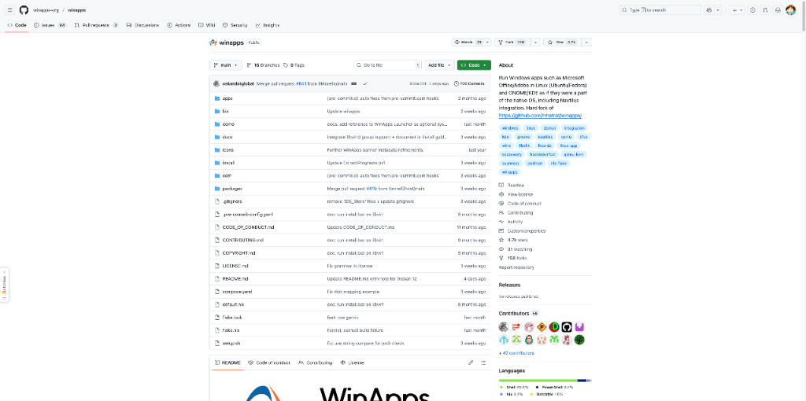

WinApps 是一个工具，允许用户在 Linux 发行版（如 Ubuntu 和 Fedora）上运行 Windows 应用程序，如 Microsoft Office 和 Adobe Creative Cloud，并将它们无缝集成到 GNOME 或 KDE 桌面环境中。它支持多种后端，包括 Docker、Podman 和 libvirt，并使用 FreeRDP 进行应用程序渲染。该工具还提供了 Nautilus 集成、从 Windows 访问 Linux 主目录以及可选的任务栏小部件等功能。

对于那些需要在 Linux 系统上使用 Windows 应用程序的用户来说，WinApps 提供了一个便捷的解决方案。它特别适合那些希望在保持 Linux 环境的同时，又能使用 Windows 软件的开发者和创意工作者。

> 🔗 **项目链接**
> 
> https://github.com/winapps-org/winapps

---

### 🎥 比 Mixamo 更灵活的 3D 动画处理工具：scottpetrovic / mesh2motion-app

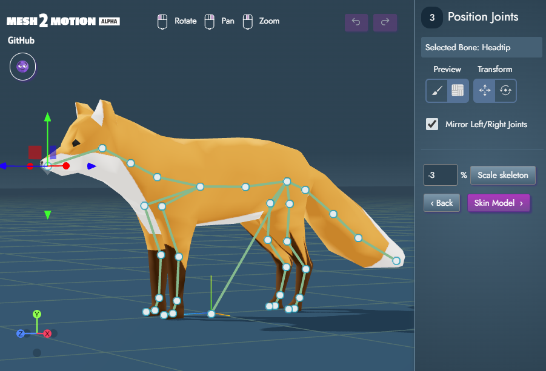

Mesh2Motion 是一个开源的 3D 模型动画处理工具，类似于 Mixamo，但更加灵活，支持多种模型和骨骼类型。用户可以导入 3D 模型（目前支持 GLB/GLTF 格式），选择或调整骨骼结构，测试并导出动画。该项目基于 Web 技术构建，使用 Node.js 和 Vite 进行开发和构建，并支持 Docker 部署。此外，项目还包含动画预览生成工具和 Blender 源文件，鼓励动画师贡献动画资源。

对于需要灵活处理 3D 动画的开发者和动画师来说，Mesh2Motion 提供了一个强大的平台。它特别适合那些希望在 Web 环境中进行动画处理，并且需要社区支持的用户。

> 🔗 **项目链接**
> 
> https://github.com/scottpetrovic/mesh2motion-app

---

### 🧩 自定义拖拽体验的 React 可视化编辑器：puckeditor / puck

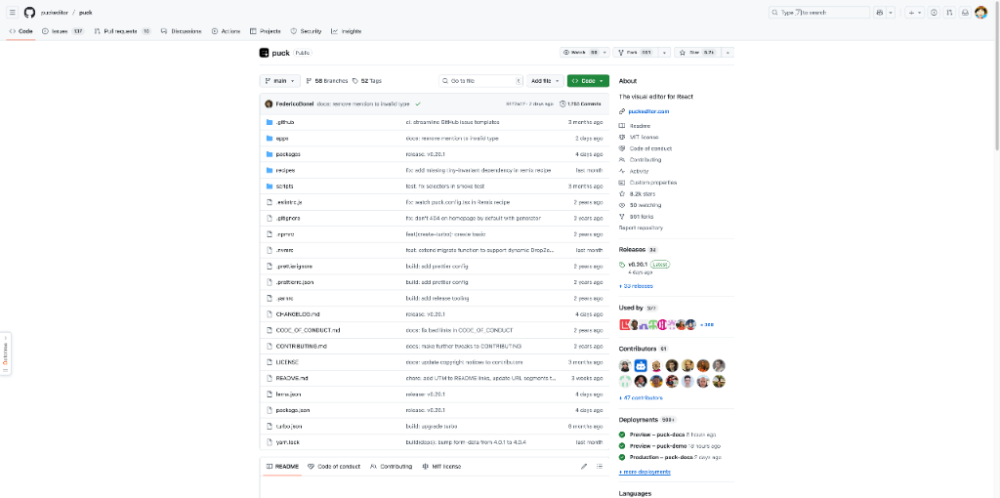

Puck 是一个模块化的开源 React.js 可视化编辑器，允许开发者使用自己的 React 组件构建自定义的拖拽体验。它与各种 React 环境（包括 Next.js）集成良好，并为用户提供对其数据的完全控制，避免供应商锁定。该项目采用 MIT 许可证，适用于内部系统和商业应用。它提供了快速入门指南和针对不同框架（如 Next.js、Remix 和 React Router）的配方。社区通过 Discord 和 awesome-puck 存储库支持插件和自定义字段。

对于希望构建自定义可视化编辑器的 React 开发者来说，Puck 是一个理想的选择。它特别适合那些需要灵活性和数据控制权的团队。

> 🔗 **项目链接**
> 
> https://github.com/puckeditor/puck

---

### 🧠 DeepSeek API 集成资源大全：deepseek-ai / awesome-deepseek-integration

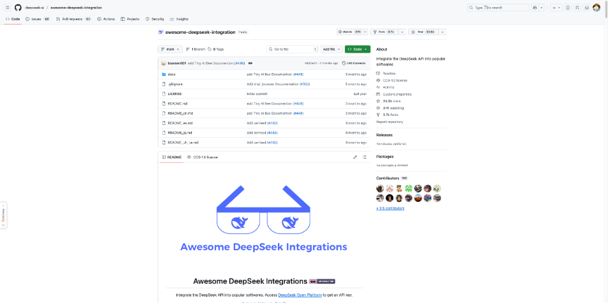

这个 GitHub 仓库是一个精心策划的 DeepSeek API 集成列表，涵盖了将 DeepSeek 大语言模型集成到各种流行软件应用中的资源和示例。它为希望在聊天机器人、生产力工具和开发环境等平台上利用 DeepSeek API 增强功能的开发者提供了文档和链接。

对于希望利用 DeepSeek 强大语言模型的开发者来说，这个仓库是一个宝贵的资源。它特别适合那些寻找 API 集成示例和最佳实践的开发者。

> 🔗 **项目链接**
> 
> https://github.com/deepseek-ai/awesome-deepseek-integration

---

### 📦 Zig 语言服务器实现：zigtools / zls

ZLS 是 Zig 编程语言的非官方语言服务器协议实现。它通过提供自动完成、转到定义、文档符号、查找引用、重命名符号、使用 zig fmt 格式化、语义标记高亮、内联提示、代码操作、选择范围和折叠区域等基本 IDE 功能来提高开发者生产力。ZLS 支持大多数语言功能，包括简单的类型函数支持、使用命名空间、有效载荷捕获类型解析、自定义包、cImport 等，并且正在进行编译时和语义分析的工作。它需要 Zig 主分支的构建来进行源代码安装。

对于使用 Zig 编程语言的开发者来说，ZLS 是一个不可或缺的工具。它特别适合那些希望在开发环境中获得更好的代码支持和提示的用户。

> 🔗 **项目链接**
> 
> https://github.com/zigtools/zls

---

## 🛠️ 产品观察

### 🌍 将地图截图转换为电影级航拍视频：DreamFlow

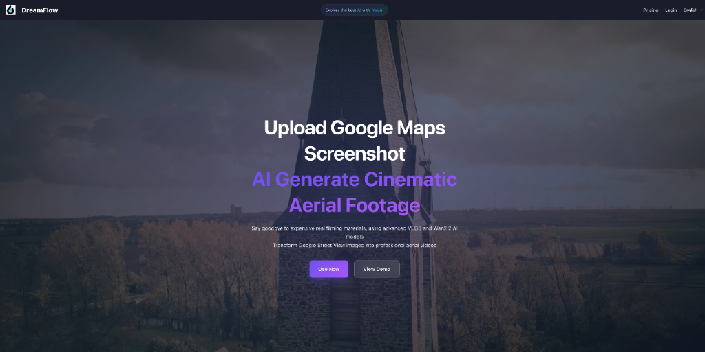

DreamFlow 是一个由 Product Hunt 推出的产品，它利用 Veo3 AI 视频生成模型将地图截图转换为电影级航拍视频。用户可以从嵌入的 Google Maps 中选择任何位置或上传自己的图像，然后自定义天气、季节、一天中的时间、航拍角度和摄像机运动，以创建逼真的无人机视频，而无需实际拍摄。该工具显著降低了制作成本，并使用户能够虚拟探索全球各地。

对于需要制作高质量航拍视频但又不想进行实际拍摄的用户来说，DreamFlow 是一个理想的解决方案。它特别适合那些希望以低成本获得专业视频效果的内容创作者。

> 🔗 **产品链接**
> 
> https://www.producthunt.com/products/dreamflow-2

---

### 🔍 优化品牌在 AI 搜索中的可见性：ReachLLM

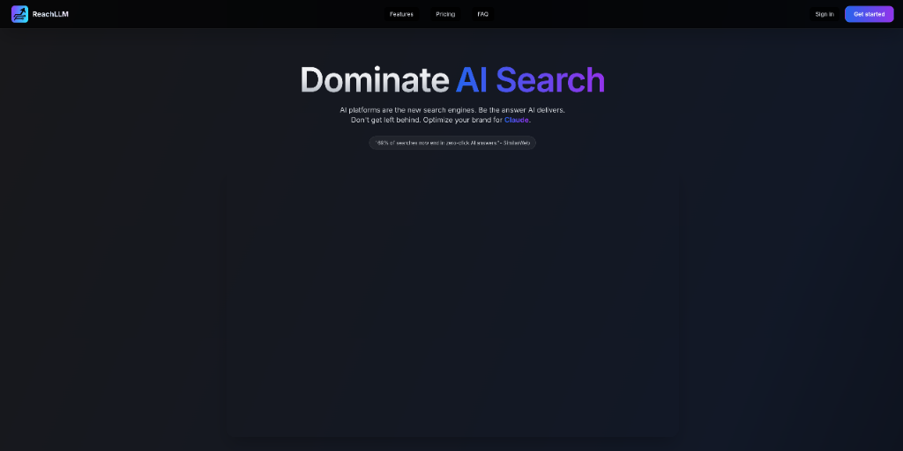

ReachLLM 是一款旨在帮助品牌在 AI 搜索时代优化其可见性的工具。它审计品牌在 ChatGPT、Gemini、Perplexity、Grok、Claude 和 DeepSeek 等主要 LLM 中的存在，提供关于这些模型如何描述品牌、其竞争对手和相关高意图提示的见解。该平台使用户能够通过识别 20 个不同参数的优势和劣势、生成 AI 内容并使用其监控功能跟踪改进来实践生成引擎优化 (GEO)。它还提供 llms.txt 文件生成和可导出报告等可操作工具。

对于希望在 AI 搜索平台上提升品牌知名度的企业来说，ReachLLM 是一个强大的工具。它特别适合那些希望了解其品牌在 AI 搜索中的表现并进行优化的营销人员。

> 🔗 **产品链接**
> 
> https://www.producthunt.com/products/reachllm

---

### 🤖 一个讽刺性的“生产力工具”：vibes.rehab

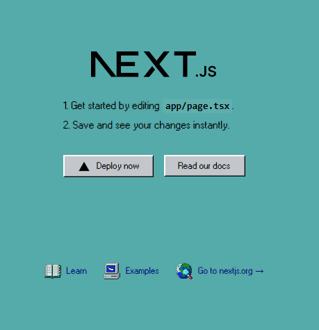

vibes.rehab 是一个讽刺性的“生产力工具”，旨在解决人们对“氛围编码”与 AI 助手的日益关注。与典型的 AI 编码工具不同，该工具故意不生成任何代码，而是提供如何自己实现功能的指导。由 Misha 创建，该工具既是对过度依赖 AI 自动完成功能的开发者可能失去编码技能的讽刺，也是对此的真诚反思。该项目鼓励开发者重新获得对基本编码原则的理解，并避免因过度依赖 AI 工具而导致的“技能侵蚀”。它具有怀旧的 Windows 95 美学，并引发了关于工作文化和在开发中正确使用 AI 的讨论。

对于那些担心过度依赖 AI 编码工具的开发者来说，vibes.rehab 提供了一个有趣的视角。它特别适合那些希望重新审视自己编码技能的开发者。

> 🔗 **产品链接**
> 
> https://www.producthunt.com/products/vibes-rehab

---

### 🧠 Canva for AI Agents：Deforge

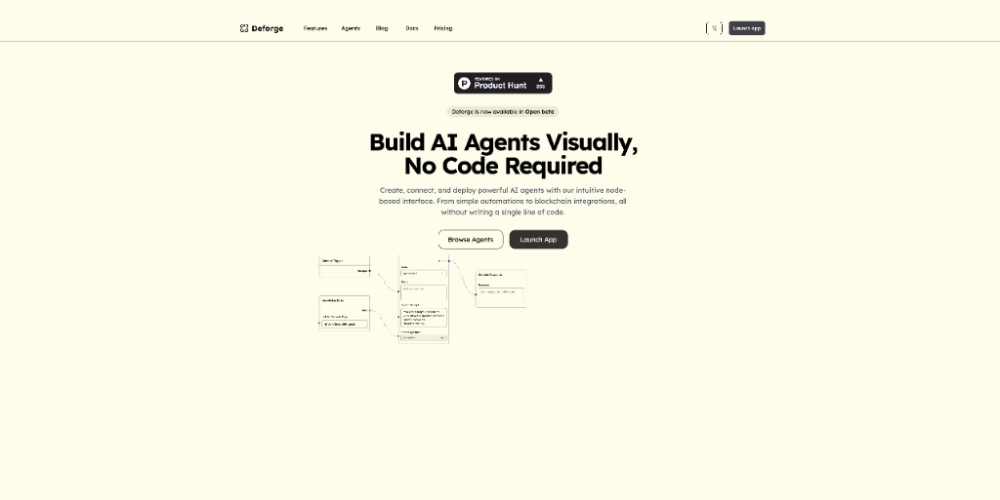

Deforge 是一个可视化、无代码平台，旨在简化 AI 代理的创建和部署。定位为“AI 代理的 Canva”，它使用户能够使用拖放界面构建强大的 AI 工作流，将复杂任务压缩为单个节点。该平台面向技术和非技术用户，提供预构建节点和直观的表单构建器，用户只需填写表单即可部署代理。早期采用者正在使用 Deforge 自动化社交媒体内容、构建研究助手、创建智能聊天机器人以及将应用程序连接到自定义工作流。该工具还支持团队协作，允许用户共享和共同改进代理。

对于希望快速创建和部署 AI 代理的用户来说，Deforge 是一个理想的选择。它特别适合那些希望简化 AI 工作流构建过程的团队。

> 🔗 **产品链接**
> 
> https://www.producthunt.com/products/deforge-open-beta

---

### ⏰ 为自由职业者设计的菜单栏时间跟踪器：Daily Grind

Daily Grind 是一款为 MacOS 设计的极简菜单栏时间跟踪应用程序，专门为需要简单高效方式来跟踪工作时间、计费时间和收入的自由职业者而设计。它无需登录或云连接即可运行，强调隐私和易用性。该应用程序允许用户将报告导出为 PDF，并专注于在提供基本时间跟踪功能的同时不干扰用户的工作流程。

对于需要简单时间跟踪解决方案的自由职业者来说，Daily Grind 是一个理想的选择。它特别适合那些重视隐私和易用性的用户。

> 🔗 **产品链接**
> 
> https://www.producthunt.com/products/breww-beta-macos-time-tracker

---

### 🏠 世界首个 AI 室内设计工作室：Madespace

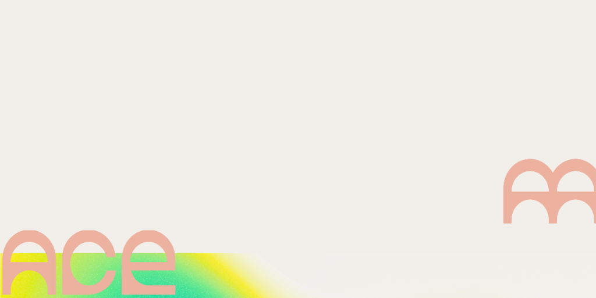

Madespace 是世界上第一个 AI 室内设计工作室，旨在让每个人都能以实惠的价格获得专业室内设计。它允许用户在一处设计空间、购买物品并获得专家帮助。该平台的 AI 由专业室内设计师训练，以生成高质量、独特的设计，同时保持空间一致性，无需文本提示。Madespace 提供免费试用，并将可购买的设计直接集成到应用程序中。在有限的时间内，年订阅用户还可以免费获得与创始人的实时视频咨询。

对于希望以实惠价格获得专业室内设计的用户来说，Madespace 是一个理想的选择。它特别适合那些希望一站式解决设计和购物需求的用户。

> 🔗 **产品链接**
> 
> https://www.producthunt.com/products/madespace

---

## 📰 行业动态

### 🔥 为 NVIDIA 5090 GPU 编写的 Speed-of-Light Flash Attention

这篇技术文章详细介绍了使用 CUDA C++ 为 NVIDIA 5090 GPU 实现 Flash Attention 以实现最大性能的过程。作者逐步介绍了开发高度优化的 Flash Attention 内核的过程，从基本实现开始，逐步应用优化，包括共享内存交织、2 阶段流水线和高效使用 ldmatrix.x4 指令。最终优化的内核实现了 197.74 TFLOPS（理论速度的 94.39%），超过了官方 Flash Attention 实现。文章深入解释了 CUDA 优化技术、内存管理和注意力机制中在线 softmax 计算的数学基础。

对于 GPU 优化和高性能计算领域的开发者来说，这篇文章提供了宝贵的见解。它特别适合那些希望了解如何优化 CUDA 内核以获得最佳性能的开发者。

> 🔗 **相关链接**
> 
> https://gau-nernst.github.io/fa-5090/

---

### ☁️ 简化 Redis 数据库管理：Redis Cloud

Redis Cloud 是一项完全托管的 Redis 服务，允许用户使用混合和多云功能部署和扩展 Redis 数据库。它专为需要可靠、高性能内存数据结构存储的应用程序开发人员而设计。该服务承诺快速设置过程，使用户能够在短短两分钟内启动实例。Redis Cloud 处理数据库管理的复杂性，包括扩展、备份和安全，让开发人员能够专注于构建应用程序。它特别适用于需要实时数据处理、缓存和会话管理的应用程序。

对于需要快速部署和管理 Redis 数据库的开发者来说，Redis Cloud 是一个理想的选择。它特别适合那些希望减少数据库管理开销的团队。

> 🔗 **相关链接**
> 
> https://www.producthunt.com/products/redis-cloud

---

### 🖼️ 免费的 AI 生成库存图片平台：Chizgi

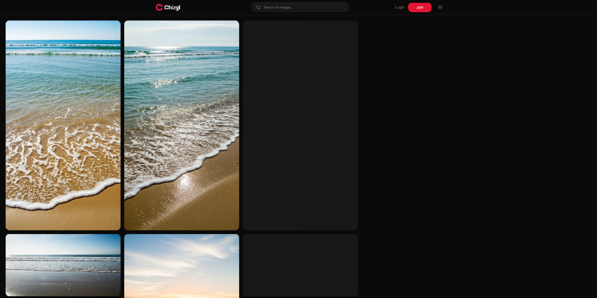

Chizgi 是一个提供无限免费 AI 生成库存照片的平台，适用于网站、演示文稿和营销材料。该服务提供高质量的图像，无水印、无需署名、无费用，非常适合预算有限的初创公司、内容创作者和企业。该平台不断更新新图像，并且在各种用例中都具有商业可行性。

对于需要高质量库存图片但预算有限的内容创作者来说，Chizgi 是一个理想的选择。它特别适合那些希望获得专业视觉效果而无需支付高昂费用的用户。

> 🔗 **相关链接**
> 
> https://www.producthunt.com/products/chizgi-free-ai-stock-images

---

## 💡 经验讨论

### 🚀 45 天内获得 500+ SaaS 注册的实战经验：如何在不花一分钱广告费的情况下实现

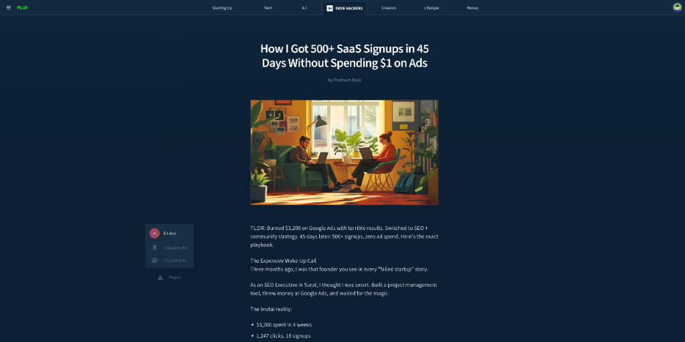

创始人 Pratham Naik 分享了其 SaaS 产品在发布初期如何通过内容营销和社区参与获取 500 多个用户注册的完整策略。他最初在 Google Ads 上花费了 3200 美元却只获得 18 个注册，于是转向 SEO 和社区驱动的有机增长策略。通过针对长尾关键词创作高价值内容、在 Reddit 等社区提供真诚帮助并适时提及产品，以及优化技术 SEO（如 Schema 标记），在 45 天内实现了零广告支出的 557 个注册。他还坦诚地分享了过程中犯下的三个关键错误以及如何纠正它们，并概述了未来的增长计划。

对于正在寻找用户增长策略的 SaaS 创业者来说，这篇文章提供了宝贵的实践经验。它特别适合那些希望了解如何通过内容营销和社区参与实现有机增长的开发者。

> 🔗 **参考资料**
> 
> https://www.indiehackers.com/post/how-i-got-500-saas-signups-in-45-days-without-spending-1-on-ads-7a4e14a3fb

---

---

## 📝 结语

明天见。Bye 👋

---

## 🍦 写在最后

🐣 **帮助我们成长**:

HelloDev.io 开发者日报立志成为面向开发者最持久最有价值的日报，帮助大家以 **「更少时间更舒适」** 的了解所有最前沿最有想法的产品与技术及观点。

你的 **「转发、喜欢、点赞、评论」** 都能让更多人了解认识我们，帮助我们更好的成长，并且走得更远。感谢 🙏

📱 **多平台发布**：微信公众号 | 掘金 | 知乎 | GitHub