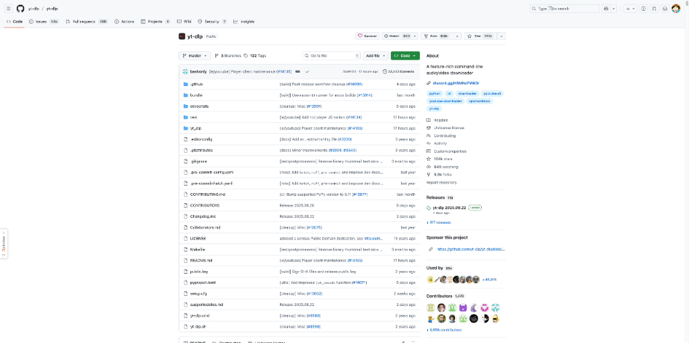
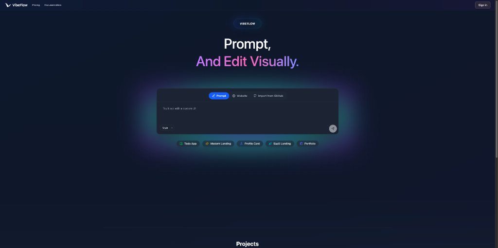
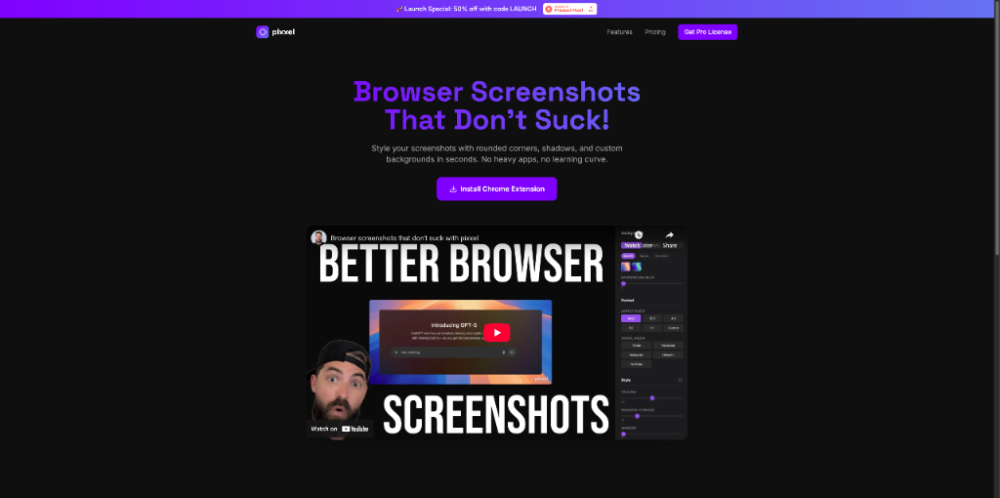
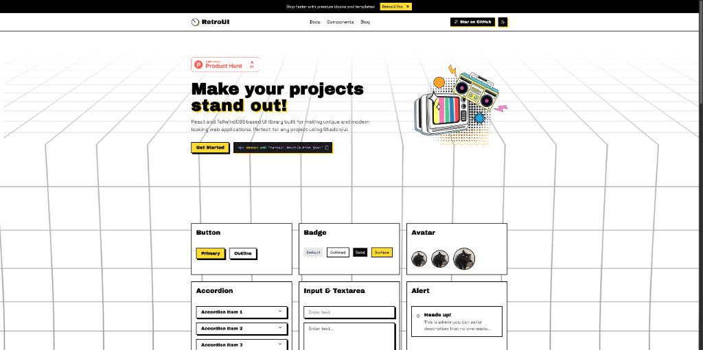
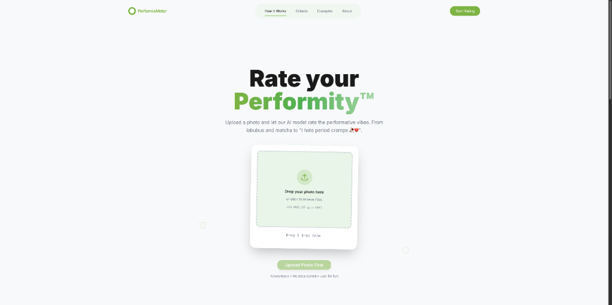
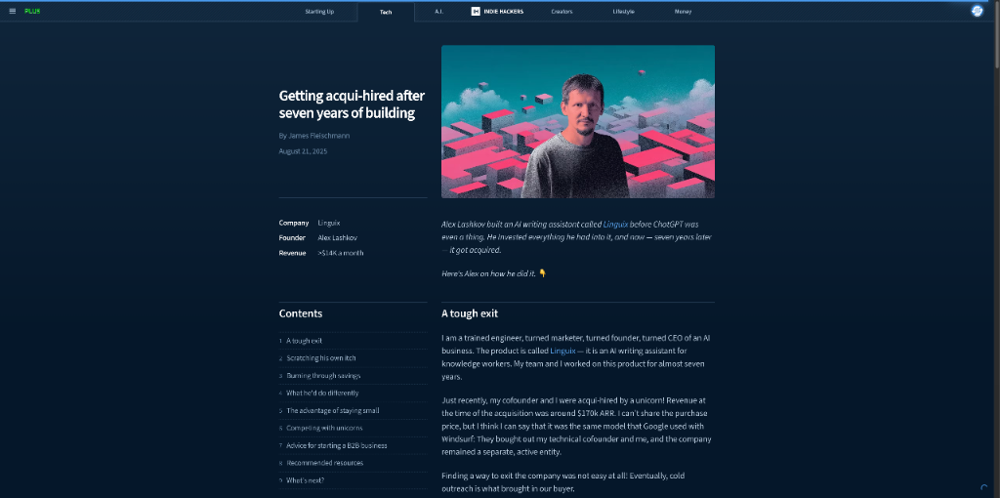
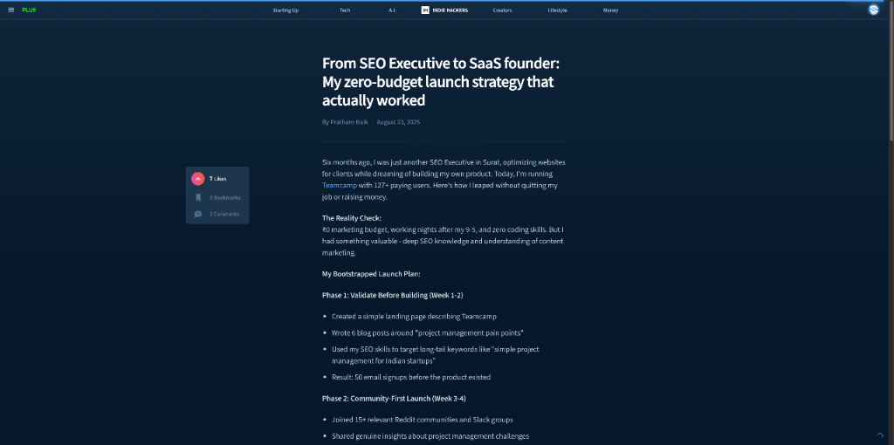

# HelloDev.io 开发者日报 - 第 9 期 | 2025 年 08 月 25 日

👋 Hi，这里是 HelloDev.io 开发者日报，今天是第 9 期，即将为你介绍今天的精彩发现：

📊 **本期内容**：
- 🚀 开源趋势：8 条
- 🛠️ 产品观察：6 条  
- 📰 行业动态：3 条
- 💡 经验讨论：1 条
- 📸 每日一图：0 条

---

## 🚀 开源趋势

### 🐍 高性能 Web 框架：django / django

Django 是一个高级 Python Web 框架，它鼓励快速开发和简洁、实用的设计。它提供了全面的文档和强大的生态系统，用于构建 Web 应用程序。该项目拥有庞大的社区和众多贡献者，积极维护，并支持 Python 3.12 及更高版本。Django 遵循模型-视图-模板 (MVT) 架构模式，内置强大的 ORM，用于数据库操作，并包含丰富的第三方包生态系统。它被广泛用于开发安全且可维护的网站，帮助开发者快速构建更好的 Web 应用程序。

对于需要快速构建功能丰富、安全可靠的 Web 应用的 Python 开发者来说，Django 是一个非常成熟且高效的选择。它特别适合需要快速迭代和拥有复杂数据模型的项目。

> 🔗 **项目链接**
> 
> https://github.com/django/django

---

### 📥 下载神器再升级：yt-dlp / yt-dlp

yt-dlp 是一个功能丰富的命令行音视频下载器，支持数千个网站。它是基于现已停止维护的 youtube-dlc 的 youtube-dl 分支，提供了增强的性能和功能，包括格式排序、SponsorBlock 集成以及从各种平台下载视频的支持。与原版 youtube-dl 相比，yt-dlp 在格式选择和排序方面有了显著改进，支持多线程下载和 SponsorBlock 功能，可以跳过视频中的赞助片段。它可以在各种操作系统上通过二进制文件、pip 或第三方包管理器安装。

对于经常需要从网络上下载音视频内容的用户，尤其是需要更高灵活性和更多功能的高级用户，yt-dlp 是目前最强大的选择之一。

> 🔗 **项目链接**
> 
> https://github.com/yt-dlp/yt-dlp

---

### 🖨️ 3D 打印固件革新：Klipper3d / klipper

Klipper 是一种先进的 3D 打印机固件，它将通用计算机（如树莓派）的强大功能与一个或多个微控制器结合起来，以实现高精度的步进电机控制。它通过将计算任务卸载到通用计算机，实现了卓越的性能，具有高步进速率、支持多个微控制器和无需重新刷写固件的配置驱动设置。其高级功能包括平滑压力推进（Smooth Pressure Advance）以提高打印质量，输入整形（Input Shaping）以减少振动，以及支持各种打印机类型和硬件配置。Klipper 设计灵活，可移植到不同的微控制器架构，并支持自定义可编程宏和丰富的外部应用程序 API。

对于追求极致打印质量和灵活性的 3D 打印爱好者和专业用户，Klipper 提供了强大的性能和易于配置的体验。

> 🔗 **项目链接**
> 
> https://github.com/Klipper3d/klipper

---

### 📚 编程学习宝库：EbookFoundation / free-programming-books

这是一个在 GitHub 上极受欢迎的项目，由 Free Ebook Foundation 管理，提供了大量免费的编程书籍资源。涵盖了多种编程语言和主题，资源按语言和主题分类，方便开发者查找所需的学习资料。所有资源均遵循知识共享许可协议，确保合法使用。该项目鼓励社区贡献，并提供了详细的贡献指南，拥有庞大的贡献者社区保证内容质量。

对于正在学习编程或希望扩展知识面的开发者来说，这是一个不可多得的免费资源集合，可以满足从入门到进阶的各种学习需求。

> 🔗 **项目链接**
> 
> https://github.com/EbookFoundation/free-programming-books

---

### 💼 自由职业者的一站式工具：midday-ai / midday

Midday 是一个为自由职业者、承包商、顾问和独立创业者设计的全能工具，旨在高效管理业务运营。它将发票、时间跟踪、文件对账、存储、财务概览和个人助理集成到一个单一平台中。主要功能包括实时时间跟踪、自动发票匹配、安全文件存储、财务数据导出和 AI 驱动的洞察。该项目采用现代技术栈构建，如 TypeScript、Next.js、Supabase 和 Tauri，并在 AGPL-3.0 许可证下开源供非商业使用。

对于希望简化业务流程、提高工作效率的自由职业者和小型团队，Midday 提供了一个整合的解决方案，可以显著减少在不同平台间切换的时间。

> 🔗 **项目链接**
> 
> https://github.com/midday-ai/midday

---

### 🤖 量化推理新体验：nunchaku-tech / ComfyUI-nunchaku

ComfyUI-nunchaku 是一个为 ComfyUI 设计的插件，旨在支持使用 Nunchaku 进行 4-bit 神经网络量化推理。Nunchaku 是一个高效的推理引擎，专为使用 SVDQuant 量化的模型设计。该插件通过使用 SVDQuant 进行 4-bit 神经网络量化，显著减少了模型大小和推理时间。它支持多种主流模型，如 Qwen-Image 和 FLUX.1-Kontext-dev，并提供详细的文档和工作流程示例，方便用户快速上手和使用。

对于希望在 ComfyUI 中体验高效量化推理的用户，特别是那些关注模型性能和资源消耗的开发者，这个插件提供了强大的支持。

> 🔗 **项目链接**
> 
> https://github.com/nunchaku-tech/ComfyUI-nunchaku

---

### 🧠 算法学习指南：TheAlgorithms / Java

这是一个用 Java 实现的算法集合项目，包含了各种数据结构和算法的实现，适用于教育和学习目的。该项目在 GitHub 上开源，拥有大量的贡献者和良好的社区支持。代码质量高，有详细的测试用例，可以作为学习 Java 编程和算法原理的优秀资源。项目结构清晰，便于查找和学习特定的算法或数据结构。

对于正在学习 Java 编程或准备技术面试的学生和开发者，这是一个非常有价值的资源库。

> 🔗 **项目链接**
> 
> https://github.com/TheAlgorithms/Java

---

## 🛠️ 产品观察

### 🤖 开源 AI 模型新星：Grok 2.5 (OSS Ver.)

Grok 2.5 是 xAI 开源的其 2024 年最佳模型。这个强大、大规模的模型（约 500GB）的权重现在可在社区许可下供开发者和研究人员使用。这次发布为 AI 开发的创新和研究提供了更广泛的访问途径。它代表了 xAI 对开源 AI 发展的承诺，使更多开发者能够接触到前沿的 AI 技术，并在此基础上进行创新。

对于 AI 研究人员和希望探索大型语言模型能力的开发者来说，Grok 2.5 的开源版本是一个重要的资源。

> 🔗 **产品链接**
> 
> https://www.producthunt.com/products/grok-2-5-oss-ver

---

### 🧩 无代码可视化后端：VibeFlow

VibeFlow 是一个无代码平台，可以将提示词转换为全栈 Web 应用程序，并通过可视化工作流来管理后端逻辑。它解决了现有提示词转应用工具中后端难以管理和扩展的问题。VibeFlow 结合了提示词生成应用的便捷性和类似 n8n 的可视化后端编辑功能，让用户能够看到、编辑和扩展他们的应用逻辑。该平台提供可视化工作流、实时调试、内置集成和统一环境等功能，消除了工具切换的麻烦。它由斯坦福和苏黎世联邦理工学院的毕业生创建，目前处于免费发布阶段，并是 YC S25 的一员。

对于希望快速构建应用原型，同时又需要对后端逻辑有一定控制力的用户，VibeFlow 提供了一个独特的解决方案。

> 🔗 **产品链接**
> 
> https://www.producthunt.com/products/vibeflow

---

### 🎧 个性化音频新闻：Informed

Informed 是一项个性化新闻服务，它通过用户选择的声音来播报每日新闻更新。用户可以自定义新闻消费体验，选择他们关心的话题，并从各种声音中进行选择，包括克隆自己的声音或其他人的声音。该应用旨在过滤噪音，提供简洁、精选的音频新闻，实现免提消费。它提供 AI 驱动的每日简报、精选深度报道和对新闻细节级别的控制。

对于希望以更个性化、便捷方式获取新闻的用户，特别是那些喜欢音频内容的用户，Informed 提供了独特的体验。

> 🔗 **产品链接**
> 
> https://www.producthunt.com/products/informed

---

### 🖼️ 轻量级浏览器截图美化：pixxel

pixxel 是一个浏览器截图工具，可以快速为浏览器截图添加圆角、阴影和自定义背景。它是一个免费的 Chrome 扩展程序，专注于简洁易用，让用户能够快速截图、美化并分享。该产品灵感来自 Screen Studio，但更注重简约和最小化编辑器。pixxel 旨在提供轻量级、超级简单的浏览器截图解决方案，无需安装重型应用程序，直接在 Chrome 中打开、截图、美化和分享。

对于需要快速制作美观截图并分享的开发者和内容创作者，pixxel 是一个方便快捷的选择。

> 🔗 **产品链接**
> 
> https://www.producthunt.com/products/pixxel

---

### 🎨 新复古 UI 库：RetroUI Pro

RetroUI Pro 是一个基于 React 的 UI 组件库，旨在帮助开发者使用新野兽派美学创建独特且有趣味性的网站。它提供了高级区块、模板和 Figma UI 工具包，使用户能够在无需大量定制的情况下构建独特的 Web 应用程序。该库基于 React 和 TailwindCSS 构建，提供可直接复制粘贴的组件，这些组件类型安全且易于定制。它在大多数 UI 库看起来都很通用的市场中脱颖而出，提供了一个有主见的设计系统，以促进视觉识别。RetroUI 还能与 Next.js、Vite 和 Remix 等流行框架无缝集成，并拥有一个不断增长的开发者和设计师社区为其发展做出贡献。

对于希望为网站增添独特视觉风格的开发者，尤其是那些喜欢复古设计的用户，RetroUI Pro 提供了丰富的组件和设计资源。

> 🔗 **产品链接**
> 
> https://www.producthunt.com/products/retro-ui

---

### 📈 ChatGPT 营销推广：ChatGPT Marketing

ChatGPT Marketing 是一个专注于提升 ChatGPT 在各营销渠道可见度的产品。它通过整合和优化不同营销手段，帮助企业或个人更有效地推广其 ChatGPT 相关服务或内容。该产品可能提供策略、工具或平台支持，以实现精准营销和更高的市场影响力。

对于希望提升其 ChatGPT 相关产品或服务市场表现的营销人员，这个工具可能提供有价值的帮助。

> 🔗 **产品链接**
> 
> https://www.producthunt.com/products/chatgpt-marketing

---

## 📰 行业动态

### 🤖 AI 社交讽刺新玩法：PerformaMeter

PerformaMeter 是一个有趣且奇特的 AI 驱动工具，允许用户上传照片并获得“Performity™”评级。这个概念围绕着识别“表演型男性”——那些为了吸引女性而投射女性气质的男性，通常以特定的时尚选择、生活方式习惯和行为为特征。该工具以幽默的方式设计，将社会评论与 AI 图像分析结合起来。它在 Product Hunt 上迅速获得了关注，反映了人们对 AI 应用和文化讽刺的兴趣。

这个产品展示了 AI 技术在社交媒体和文化评论领域的创新应用，也反映了当代社会对某些文化现象的关注和讨论。

> 🔗 **相关链接**
> 
> https://www.producthunt.com/products/performameter

---

### 💼 七年创业终被收购：Getting acqui-hired after seven years of building

Alex Lashkov 花了七年时间从零开始构建 Linguix，一个面向知识工作者的 AI 写作助手。从解决自己在内容营销中的问题开始，他投入了 3 万美元的个人储蓄，并克服了与资金充足的竞争对手竞争的挑战。公司在被一家独角兽公司收购前达到了 17 万美元的年经常性收入。在这篇文章中，Alex 分享了他的创业历程，包括技术决策、业务转型和最终的退出策略。他还为独立开发者提供了建议，特别关注 B2B 初创公司和坚持的重要性。

这个案例为独立开发者提供了宝贵的经验，尤其是在资源有限的情况下如何通过坚持和正确的策略实现成功。

> 🔗 **相关链接**
> 
> https://www.indiehackers.com/post/tech/getting-acqui-hired-after-seven-years-of-building-g9SG7tZ85NrHvXyMvwXP

---

### 📝 表单创建新体验：KiForm

KiForm 是一个在 Product Hunt 上展示的产品，其标语为 "Create Forms that People Love"，表明它是一个专注于提升表单创建体验的工具。由于当前无法访问详细页面，暂时无法提供更深入的分析。

> 🔗 **相关链接**
> 
> https://www.producthunt.com/products/kiform

---

## 💡 经验讨论

### 🚀 零预算 SaaS 创业成功案例：From SEO Executive to SaaS founder

作者 Pratham Naik 分享了他从 SEO 专家成功转型为 SaaS 创始人的真实经历。在没有预算、不辞职、不融资的情况下，他利用自身 SEO 和内容营销技能，在 60 天内获取了 127 个付费用户，实现 ₹45,000 的月经常性收入。他的策略分为三个阶段：第一阶段是构建前验证，通过撰写针对长尾关键词的博客文章获得 50 个邮箱订阅；第二阶段是以社区为中心的软启动，通过参与 Reddit 社区、分享见解和提供免费模板来建立早期用户群；第三阶段是内容驱动增长，发布用户案例研究和在行业博客上发表客座文章。该案例强调了利用现有技能、优先建立社区以及内容营销优于广告的关键作用，为预算有限的创业者提供了切实可行的参考。

对于希望以低成本启动 SaaS 项目的创业者，这个案例展示了如何有效利用 SEO 和内容营销来验证市场、建立社区和实现增长。

> 🔗 **参考资料**
> 
> https://www.indiehackers.com/post/from-seo-executive-to-saas-founder-my-zero-budget-launch-strategy-that-actually-worked-PI3JpD78nOciML2J7SiK

---

## 📝 结语

明天见。Bye 👋

---

## 🍦 写在最后

🐣 **帮助我们成长**:

HelloDev.io 开发者日报立志成为面向开发者最持久最有价值的日报，帮助大家以 **「更少时间更舒适」** 的了解所有最前沿最有想法的产品与技术及观点。

你的 **「转发、喜欢、点赞、评论」** 都能让更多人了解认识我们，帮助我们更好的成长，并且走得更远。感谢 🙏

📱 **多平台发布**：微信公众号 | 掘金 | 知乎 | GitHub