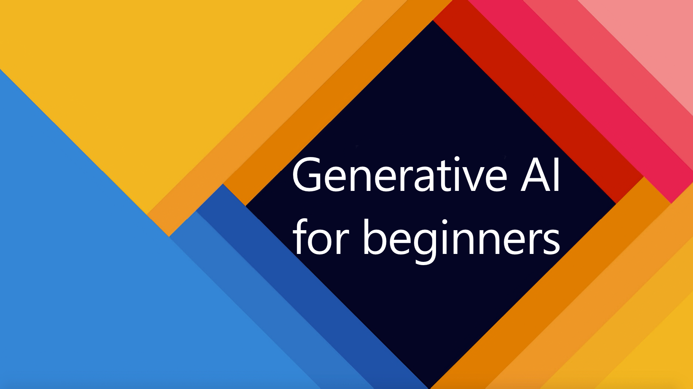
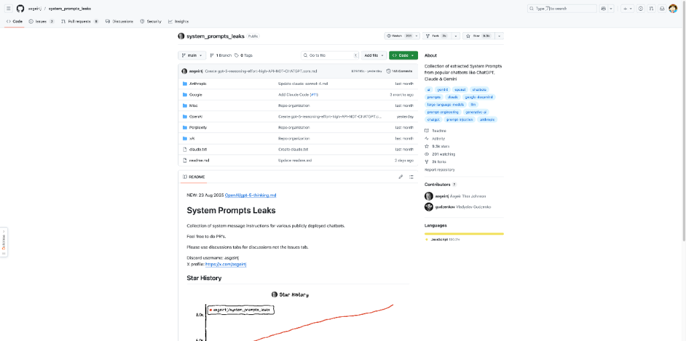
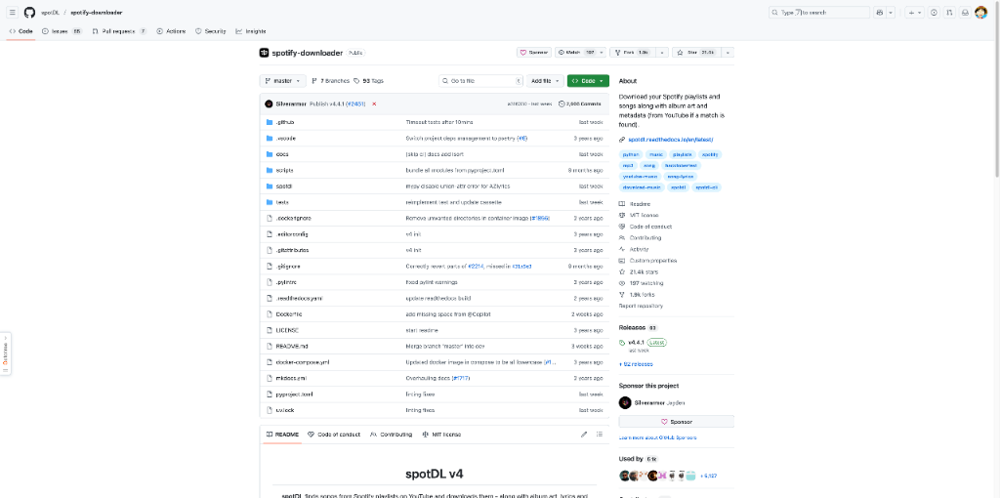
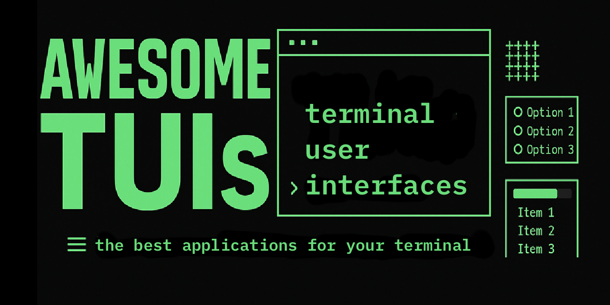
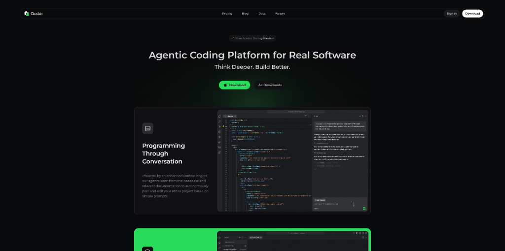
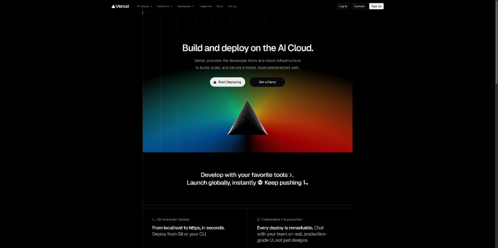
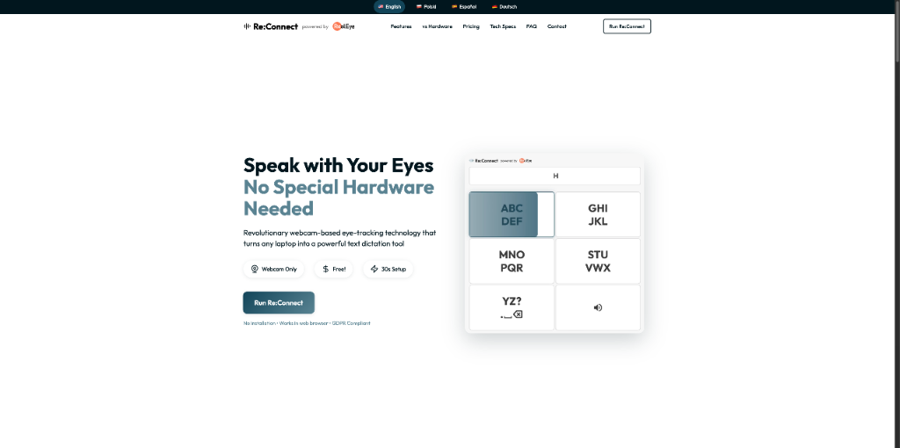
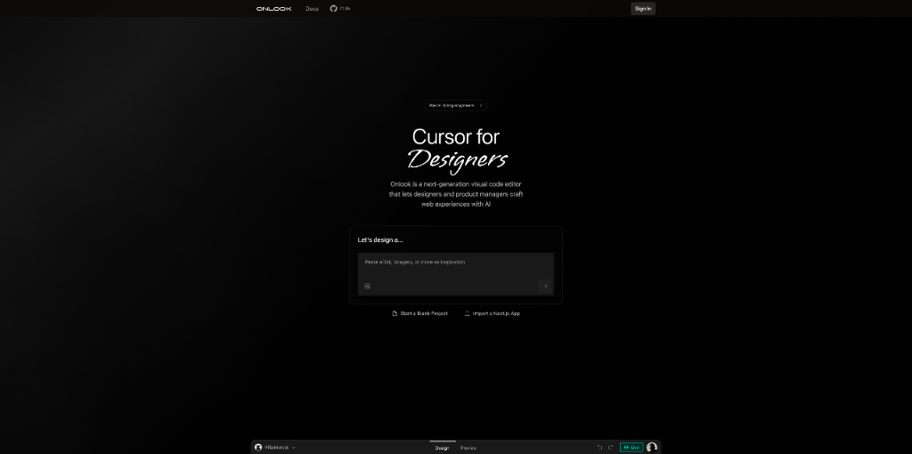

# HelloDev.io 开发者日报 - 第 10 期 | 2025 年 08 月 26 日

👋 Hi，这里是 HelloDev.io 开发者日报，今天是第 10 期，即将为你介绍今天的精彩发现：

📊 **本期内容**：
- 🚀 开源趋势：8 条
- 🛠️ 产品观察：6 条  
- 📰 行业动态：3 条
- 💡 经验讨论：1 条
- 📸 每日一图：1 条

---

## 🚀 开源趋势

### 🔥 Andrej Karpathy 的神经网络入门神课：karpathy / nn-zero-to-hero

Andrej Karpathy 的 "Neural Networks: Zero to Hero" 是一套从零开始学习神经网络的完整课程。这套课程由一系列 YouTube 视频和配套的 Jupyter 笔记本组成，循序渐进地引导学习者从基础概念到构建 GPT 模型。内容涵盖了反向传播、语言建模、多层感知机、激活函数、梯度、批量归一化等核心概念，并最终实现基于 Transformer 的 GPT 模型和分词器。每个讲座都包含实践练习和补充材料，是动手学习的绝佳资源。

这套课程非常适合希望深入理解深度学习原理的开发者，尤其是对 PyTorch 有一定了解的朋友。通过动手实践，可以更好地掌握神经网络的内部机制和现代大语言模型的核心组件。

> 🔗 **项目链接**
> 
> https://github.com/karpathy/nn-zero-to-hero

---

### 🌟 微软出品的生成式 AI 入门课：microsoft / generative-ai-for-beginners

微软云倡导者团队开发的这套 21 节课程，专为初学者设计，帮助大家学习和构建生成式 AI 应用。课程内容涵盖提示工程、大语言模型、RAG、AI 代理等核心概念，并提供 Python 和 TypeScript 的实际代码示例。它支持多语言，并包含 Azure OpenAI 和 OpenAI API 的代码示例。

这套课程强调动手实践，适合有一定编程基础的开发者快速上手生成式 AI。无论是构建聊天机器人、搜索应用还是图像生成器，这套课程都能提供实用的指导。

> 🔗 **项目链接**
> 
> https://github.com/microsoft/generative-ai-for-beginners

---

### 🛠️ 用于训练 LLM 代理的强化学习库：willccbb / verifiers

Verifiers 是一个模块化组件库，用于创建强化学习 (RL) 环境并训练大型语言模型 (LLM) 代理。它包含一个基于 transformers Trainer 的异步 GRPO 实现，并由 prime-rl 支持大规模 FSDP 训练。该库可以集成到任何暴露 OpenAI 兼容推理客户端的 RL 框架中，也可用于构建 LLM 评估、合成数据管道和代理框架。

如果你正在研究 LLM 的强化学习应用，这个库提供了灵活的环境创建和可扩展的训练支持，特别适合需要在可验证环境中进行训练的场景。

> 🔗 **项目链接**
> 
> https://github.com/willccbb/verifiers

---

### 📊 展示 GitHub 活动统计的工具：anuraghazra / github-readme-stats

GitHub Readme Stats 是一个动态生成 GitHub 统计信息的工具，可以将你的 GitHub 活动数据（如提交、拉取请求、问题和语言使用情况）直接展示在你的个人 README 上。它支持多种主题和自定义选项，并可以集成 WakaTime 来跟踪编码活动。

对于希望在个人资料中展示技术活跃度的开发者来说，这是一个简单易用且高度可定制的解决方案。

> 🔗 **项目链接**
> 
> https://github.com/anuraghazra/github-readme-stats

---

### 🔍 各大 AI 模型系统提示词泄露合集：asgeirtj / system_prompts_leaks

这个仓库收集了来自 ChatGPT、Claude 和 Gemini 等热门聊天机器人的系统提示词。通过研究这些提示词，可以深入了解这些 AI 模型背后的指令和约束机制。项目积极维护，鼓励社区贡献。

对于 AI 研究者和开发者来说，这是一个宝贵的资源，有助于理解不同 AI 提供商的系统指令差异，并促进社区在提示工程方面的协作。

> 🔗 **项目链接**
> 
> https://github.com/asgeirtj/system_prompts_leaks

---

### 📚 高质量开源技术教程集合：GitHubDaily / GitHubDaily

GitHubDaily 是一个长期维护的项目，致力于分享高质量、有趣实用的开源技术教程、开发者工具、编程网站和技术资讯。自 2015 年以来，已累积分享超过 8000 个开源项目，并在多个社交媒体平台传播优质内容。

如果你希望快速了解最新的开源项目和技术动态，这个仓库是一个不可多得的信息宝库。

> 🔗 **项目链接**
> 
> https://github.com/GitHubDaily/GitHubDaily

---

### 🎵 从 YouTube 下载 Spotify 音乐：spotDL / spotify-downloader

spotDL 是一个命令行工具，可以从 YouTube 下载 Spotify 播放列表和歌曲，并附带专辑封面和元数据。它设计快速、易用且准确，需要 Python 和 FFmpeg 才能运行。

对于音乐爱好者来说，这是一个方便的工具，但请务必遵守相关法律法规和版权要求。

> 🔗 **项目链接**
> 
> https://github.com/spotDL/spotify-downloader

---

### 🖥️ 终端用户界面 (TUI) 项目精选：rothgar / awesome-tuis

awesome-tuis 是一个精心策划的终端用户界面 (TUI) 项目列表，涵盖了仪表盘、开发工具、文件管理器、游戏等各种用途。它帮助用户发现完全在终端中运行的功能丰富的替代 GUI 应用程序。

对于喜欢在终端中工作的开发者来说，这个列表是一个寻找高效工具的好去处。

> 🔗 **项目链接**
> 
> https://github.com/rothgar/awesome-tuis

---

## 🛠️ 产品观察

### 🤖 人类与 AI 协作的工作流自动化平台：Trace

Trace 是一个专为人类-AI团队设计的工作流自动化平台。它通过与 Slack、Jira 和 Notion 等工具集成，将任务路由到合适的人类或AI代理。平台分析现有工作流，识别自动化机会，并将重复性任务分配给AI代理，从而在不干扰团队运营的情况下协调工作。

对于希望提高团队协作效率并引入AI自动化的企业来说，Trace 提供了一个上下文丰富的解决方案。

> 🔗 **产品链接**
> 
> https://www.producthunt.com/products/trace

---

### 🧠 理解完整代码架构的AI开发环境：Qoder

Qoder 是一个面向真实软件开发的代理型IDE，旨在改变AI理解和交互复杂代码库的方式。与传统AI编码工具不同，Qoder 能够掌握整个软件架构，包括依赖关系、模式和历史。它支持自然对话进行多文件编辑或委托任务给AI代理。

对于希望借助AI提升开发效率的团队，Qoder 提供了上下文感知的编码体验和自主任务执行能力。

> 🔗 **产品链接**
> 
> https://www.producthunt.com/products/qoder

---

### 🔍 AI原生的可观测性调试工具：TraceRoot.AI

TraceRoot.AI 是一个开源、AI原生的可观测性工具，通过连接日志、追踪、指标、代码和团队讨论，帮助开发者更快地修复错误。它不仅能总结问题，还能通过在开发者友好的工作流中创建GitHub问题和拉取请求来主动协助解决问题。

对于需要处理分布式系统和企业级调试的开发者来说，TraceRoot.AI 提供了集中化的调试平台和AI辅助分析能力。

> 🔗 **产品链接**
> 
> https://www.producthunt.com/products/traceroot-ai

---

### 🌍 将新标签页变成迷你假期的浏览器扩展：Tab With a View 2.0

Tab With a View 2.0 是一个免费的浏览器扩展，将每个新标签页变成来自世界各地的迷人风景的迷你假期体验。除了视觉享受，它还集成了AI助手、实时航班价格、当地天气信息、旅行见解和番茄钟专注计时器。

对于希望在日常工作中获得片刻放松和灵感的用户来说，这是一个兼具美观和实用功能的工具。

> 🔗 **产品链接**
> 
> https://www.producthunt.com/products/tab-with-a-view

---

### 👁️ 用眼睛打字的辅助沟通工具：Re:Connect

Re:Connect 是一款基于网络摄像头的眼动追踪技术，可将任何笔记本电脑变成强大的文本听写工具，无需特殊硬件。它允许用户仅通过眼睛进行交流，为行动不便或言语障碍的人士提供了一种独立表达的途径。产品还支持语音克隆功能。

对于有辅助沟通需求的用户来说，Re:Connect 提供了一种低成本、高可用的解决方案。

> 🔗 **产品链接**
> 
> https://www.producthunt.com/products/re-connect

---

### 🥾 将每日步数转化为虚拟旅行的健身应用：Walk the World

Walk the World 是一款iPhone应用，将你的每日步数转化为穿越标志性世界地图的引人入胜的虚拟旅程。通过将步行活动转化为里程碑，应用通过可收集的纪念品和地图成就来游戏化健身。

对于希望培养健康步行习惯的用户来说，这款应用通过游戏化的方式提供了视觉奖励和长期参与的动力。

> 🔗 **产品链接**
> 
> https://www.producthunt.com/products/walk-the-world

---

## 📰 行业动态

### 🧩 Vercel 推出的 AI 原生 React 组件库：AI Elements by Vercel

AI Elements 是 Vercel 推出的开源 React 组件库，专为使用 Vercel AI SDK 构建界面而设计。它基于流行的 shadcn/ui 构建，提供了对消息线程、输入框、推理面板和响应操作等 UI 原语的完全控制。这个组件库帮助开发者通过预构建、可定制的 UI 元素快速构建 AI 原生应用程序。

对于正在构建 AI 应用的前端开发者来说，这个库大大简化了聊天界面等常见 UI 元素的开发工作。

> 🔗 **相关链接**
> 
> https://www.producthunt.com/products/vercel

---

### 🎨 面向设计师的开源光标工具：Onlook for Web

Onlook for Web 是一个面向设计师的开源光标工具，现已在网络平台上提供。它专注于为设计师提供定制化的光标功能，可能包括设计工具中的光标增强和个性化选项。

对于追求个性化设计体验的设计师来说，这个开源工具提供了更多的自定义可能性。

> 🔗 **相关链接**
> 
> https://www.producthunt.com/products/onlook-2

---

### 🤖 帮助 Reddit 用户避免帖子被删除的 AI 工具：Why I Built RedChecker.io

RedChecker.io 的创始人分享了创建这个工具的故事，旨在帮助 Reddit 用户避免帖子被删除和封禁。这个工具使用 AI 分析帖子是否符合 subreddit 规则，并提供智能建议来防止违规。它具有 AI 驱动的规则分析、subreddit 特定意识和与 Reddit 界面的无缝集成。

对于活跃在 Reddit 上的内容创作者来说，这是一个实用的工具，可以帮助他们更自信地发布内容。

> 🔗 **相关链接**
> 
> https://www.indiehackers.com/product/redchecker?post=F5mRu4GBHN0JtameFuCE

---

## 💡 经验讨论

### 💼 从 0 到 6 位数 ARR 的 AI 创业经验：Dubverse 创始人分享

Dubverse 创始人 Anuja Dhawan 分享了她如何在 AI 热潮之前构建 AI 驱动的配音平台，并利用先发优势实现了 6 位数的年经常性收入 (ARR)。她强调了早期启动、针对专业消费者、通过专有 AI 模型构建技术护城河以及从第一天开始收费的重要性。她还发布了 DubX，一个专为配音构建的突破性 AI 模型。

对于希望在 AI 领域创业的开发者来说，这篇分享提供了宝贵的实战经验和策略指导。

> 🔗 **参考资料**
> 
> https://www.indiehackers.com/post/tech/hitting-a-high-6-figure-arr-thanks-to-first-mover-advantage-and-an-ai-tech-moat-v3lMstbEzxkheKuLf7cH

---

## 📸 每日一图

---

## 📝 结语

明天见。Bye 👋

---

## 🍦 写在最后

🐣 **帮助我们成长**:

HelloDev.io 开发者日报立志成为面向开发者最持久最有价值的日报，帮助大家以 **「更少时间更舒适」** 的了解所有最前沿最有想法的产品与技术及观点。

你的 **「转发、喜欢、点赞、评论」** 都能让更多人了解认识我们，帮助我们更好的成长，并且走得更远。感谢 🙏

📱 **多平台发布**：微信公众号 | 掘金 | 知乎 | GitHub