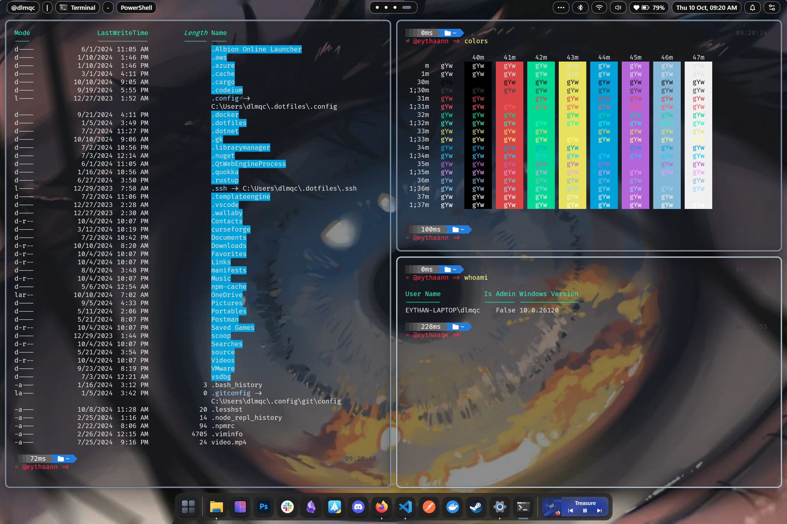

# HelloDev.io 开发者日报 - 第 11 期 | 2025 年 08 月 27 日

👋 Hi，这里是 HelloDev.io 开发者日报，今天是第 11 期，即将为你介绍今天的精彩发现：

📊 **本期内容**：
- 🚀 开源趋势：8 条
- 🛠️ 产品观察：6 条  
- 📰 行业动态：3 条
- 💡 经验讨论：1 条
- 📸 每日一图：1 条

---

## 🚀 开源趋势

### 🧠 让AI研究更自由：MODSetter / SurfSense

SurfSense 是一个开源的 AI 研究助手，可以看作是 NotebookLM 和 Perplexity 的替代品。它最大的亮点在于高度可定制化，能够连接到各种外部工具，包括搜索引擎、生产力工具（如 Slack、Linear、Jira、Notion）、通讯平台（如 Gmail、Discord）以及内容平台（如 YouTube、GitHub）。这使得它成为一个强大的信息整合和分析工具。它支持上传 50 多种文件格式，让你轻松构建个人知识库。此外，SurfSense 还支持本地 LLM（如 Ollama）和自托管，保护你的隐私。它还提供了一个独特的播客生成功能，可以将聊天记录转换为音频内容。对于需要深度研究和信息整理的开发者来说，这是一个非常值得尝试的工具。

> 🔗 **项目链接**
> 
> https://github.com/MODSetter/SurfSense

---

### 📚 从入门到精通：Hands-On Large Language Models

这个 GitHub 仓库是 O'Reilly 出版的《Hands-On Large Language Models》一书的官方代码库，这本书也被称为 "The Illustrated LLM Book"，以其近 300 张自定义插图而闻名。这本书和代码库为理解 LLM 提供了视觉化的教育方法。仓库包含了每个章节的 Jupyter Notebook 示例，涵盖了从语言模型介绍、Token 和嵌入、文本分类、提示工程、语义搜索、多模态模型到微调生成模型等主题。它还包含了关于 Mamba、量化、Stable Diffusion、专家混合和推理 LLM 等高级主题的附加内容。这些示例主要设计为在 Google Colab 上运行，非常适合想要动手学习 LLM 的开发者。

> 🔗 **项目链接**
> 
> https://github.com/HandsOnLLM/Hands-On-Large-Language-Models

---

### 🔧 为LLM应用打造统一入口：IBM / mcp-context-forge

MCP Context Forge 是 IBM 开发的 Model Context Protocol (MCP) 网关和注册中心。它为 MCP 兼容的 LLM 应用程序提供了一个集中管理工具、资源和提示的中心点。该网关通过联邦、虚拟服务器、重试、安全性和可选的管理 UI，统一了 REST、MCP 和 Agent-to-Agent (A2A) 服务。它支持 REST API 到 MCP 的转换、虚拟 MCP 服务器组合（增加安全性和可观察性）、stdio、SSE 和 Streamable HTTP 之间的协议转换，并支持通过 Docker 或 PyPI 进行可扩展部署，使用 Redis 支持的联邦。对于需要管理多个 LLM 应用和服务的开发者来说，这是一个非常有价值的工具。

> 🔗 **项目链接**
> 
> https://github.com/IBM/mcp-context-forge

---

### 🖥️ 为Windows量身定制：eythaann / Seelen-UI

Seelen UI 是一个为 Windows 10/11 设计的完全可定制的桌面环境，旨在通过定制化和生产力功能来增强桌面体验。它提供了平铺式窗口管理器、可定制的小部件、受 Rofi 启发的应用启动器和媒体模块集成等功能。该项目支持 70 多种语言，并提供多种安装方式，包括 Microsoft Store、Winget 和直接安装程序。它利用 Tauri 的 Web 技术构建，并拥有一个活跃的社区，在 GitHub 上获得了超过 10,000 颗星。对于希望个性化 Windows 桌面的用户来说，这是一个非常不错的选择。

> 🔗 **项目链接**
> 
> https://github.com/eythaann/Seelen-UI

---

### ⚡ 轻量级桌面应用新选择：tw93 / Pake

Pake 是一个使用 Rust 将任何网页转换为轻量级桌面应用程序的工具，支持 Mac、Windows 和 Linux 平台。与传统的基于 Electron 的包相比，Pake 通过利用 Rust 和 Tauri 提供了显著更小的体积（约 5M）和增强的性能。它提供了快捷键直通、沉浸式窗口和极简定制等功能。用户可以使用预构建的流行包，或通过命令行打包或 GitHub Actions 创建自定义应用程序。Pake 还支持样式重写、广告移除、JS 注入和自定义快捷键等高级用法。对于希望创建轻量级替代品的开发者来说，这是一个非常值得尝试的工具。

> 🔗 **项目链接**
> 
> https://github.com/tw93/Pake

---

### 📊 项目管理新选择：opf / openproject

OpenProject 是领先的开源项目管理软件。它是一个基于 Web 的平台，允许用户管理项目、任务和目标，支持项目规划、产品路线图、任务管理、敏捷和 Scrum 方法、时间跟踪、错误跟踪、维基、论坛和会议管理等功能。该软件通过工作包实现团队协作，并与 GitHub 集成。它提供社区版（免费、自托管）、企业版（带支持和附加组件）和免费试用版。OpenProject 由公司和个人组成的社区开发和支持，项目欢迎贡献。对于需要一个功能齐全的开源项目管理工具的团队来说，这是一个非常不错的选择。

> 🔗 **项目链接**
> 
> https://github.com/opf/openproject

---

### 🎨 为设计师而生的AI工具：onlook-dev / onlook

Onlook 是一个开源的 AI 优先设计工具，被称为 "设计师的 Cursor"。它允许用户通过 AI 可视化地构建、设计和编辑 React 应用程序。对于希望利用 AI 提高设计效率的开发者和设计师来说，这是一个值得关注的工具。

> 🔗 **项目链接**
> 
> https://github.com/onlook-dev/onlook

---

### 🎓 求职者的福音：vanshb03 / Summer2026-Internships

Summer2026-Internships 是一个由 Vansh 和 Ouckah 创建的协作性、社区驱动的仓库，收集了 2026 年夏季在美国、加拿大和远程职位的科技实习机会。它提供了一个组织良好的机会列表，包含角色、地点和申请链接等关键信息，并由贡献者定期更新。该仓库还包含一个图例来解释符号，并鼓励用户通过专门的 Discord 服务器进行贡献和保持更新。对于正在寻找实习机会的学生来说，这是一个非常有价值的资源。

> 🔗 **项目链接**
> 
> https://github.com/vanshb03/Summer2026-Internships

---

## 🛠️ 产品观察

### 🎓 提升学生成功的AI平台：Risely AI

Risely AI 是一个专为高等教育设计的 AI 平台，旨在提升学生的成功和留存率。它通过主动识别有风险的学生、生成个性化的外展活动和创建定制的干预计划来自动化关键工作流程。该系统与现有的校园技术（如 SIS、LMS、ERP 和 CRM）集成，提供统一的学生数据视图。Risely AI 帮助机构高效地扩展学生支持，让顾问能够专注于有意义的互动，而不是行政任务。它强调数据安全，并符合 FERPA 和 HECVAT 等标准。对于希望提高学生留存率的教育机构来说，这是一个非常有价值的工具。

> 🔗 **产品链接**
> 
> https://www.producthunt.com/products/risely-ai

---

### 🔧 快速构建AI代理后端：MCP Builder by AG2

AG2 的 MCP Builder 是一个工具，允许用户从任何 API 规范即时创建和部署 Model Communication Protocol (MCP) 服务器。它允许开发者通过单击将 OpenAPI 规范转换为生产就绪的 MCP 服务器，从而无需编写代码即可快速开发 AI 代理后端。该平台支持与各种大型语言模型集成，并提供多代理对话模式、人在回路工作流和工具使用支持等功能。这个开源解决方案旨在通过提供一个易于访问的框架来构建协作 AI 代理，从而简化代理 AI 的开发和研究。对于希望快速构建 AI 代理的开发者来说，这是一个非常值得尝试的工具。

> 🔗 **产品链接**
> 
> https://mcp.ag2.ai/?ref=producthunt

---

### 🌍 为Framer设计的3D地球插件：Globe Map for Framer

Globe Map for Framer 是一款用于 Framer 的交互式 3D 地球插件，允许用户通过拖放方式轻松地将可定制的 3D 地球添加到他们的项目中。该插件无需编码，支持完全自定义标记和样式，并能直接嵌入到 Framer 项目中。它特别适合需要在网站或应用中展示地理位置信息的设计师和开发者。对于希望在 Framer 项目中添加 3D 地图的设计师来说，这是一个非常不错的选择。

> 🔗 **产品链接**
> 
> https://www.producthunt.com/products/globe-map-for-framer

---

### 📱 移动端视觉模型新高度：MiniCPM-V 4.5

MiniCPM-V 4.5 是一个在手机端实现 GPT-4o 级别视觉模型能力的产品。它旨在提供强大的视觉理解功能，使移动设备能够高效处理复杂的视觉任务。对于希望在移动设备上运行强大视觉模型的开发者来说，这是一个值得关注的产品。

> 🔗 **产品链接**
> 
> https://www.producthunt.com/products/minicpm-4-0

---

### 📄 快速生成文档网站：Doksy

Doksy 是一个帮助开发者将 GitHub README 文件快速转换为美观、专业的文档网站的工具。它旨在解决开源项目和独立开发者在文档展示方面的痛点，提供简单、快速且无需复杂配置的解决方案。用户只需连接 GitHub 并发布，即可将 README 文件转换为多页面文档站点。该项目特别适合小型开源项目和想要快速建立专业文档而无需额外设置时间的开发者。对于希望快速生成文档网站的开发者来说，这是一个非常不错的选择。

> 🔗 **产品链接**
> 
> https://www.producthunt.com/products/doksy

---

### 🔗 LinkedIn自动化新方案：LinkedIn MCP

LinkedIn MCP 是一个服务器，允许 Claude、Cursor 和 VS Code 等 AI 助手控制你的 LinkedIn 账户。它允许用户通过自然语言命令自动化搜索潜在客户、发送消息和分析个人资料等任务。该工具通过安全的云浏览器连接到 LinkedIn，确保交互模仿正常用户行为以避免被检测。它专为销售团队、招聘人员和任何希望减少 LinkedIn 手动工作的人设计。该服务强调安全性，并提供关于导航 LinkedIn 使用限制的指导。对于希望自动化 LinkedIn 任务的用户来说，这是一个非常有价值的工具。

> 🔗 **产品链接**
> 
> https://www.producthunt.com/products/linkedin-mcp

---

## 📰 行业动态

### 🚀 用自然语言构建应用：Cosmic AI Platform

Cosmic AI Platform 是一个以 AI 为先的应用开发、部署和内容管理平台。它革新了从概念到生产的过程，使用户能够通过自然语言在几分钟内构建和部署任何可以想象的应用。主要功能包括 AI 内容工作室（从自然语言描述生成完整的内容模型和内容）、AI 驱动的开发（使用 Next.js、React、Astro 和 Vue.js 构建应用）以及完整的部署管道（GitHub 集成、Vercel 部署、环境管理和域名服务）。该平台现在向所有 Cosmic 账户开放，并且免费层级已提升到 30 万 tokens（原为 1 万）。对于希望利用 AI 快速构建应用的开发者来说，这是一个值得关注的平台。

> 🔗 **相关链接**
> 
> https://www.producthunt.com/products/cosmic

---

### 📄 文档提取新方案：NinjaDoc Ai

NinjaDoc AI 是一个文档提取 API，允许开发者对文档提出自然语言问题并接收带有确切坐标的结构化数据作为证据。它消除了复杂 OCR 设置、模板维护和不可靠的通用 AI API 的需要。用户可以通过提出诸如 "What's the total?" 之类的问题来定义提取模式，然后使用 REST API 从文档中提取数据。该平台提供具有坐标精度、上下文理解和开发者友好 API 的可验证提取结果。对于需要从文档中提取结构化数据的开发者来说，这是一个非常有价值的工具。

> 🔗 **相关链接**
> 
> https://ninjadoc.ai/?ref=producthunt

---

### 💌 邮件营销指南：Flight - Email Marketing Tool: The Agency Guide to Bulk Email in 2025

这篇 Indie Hackers 的文章是为营销机构编写的全面指南，旨在利用 Flight 邮件营销工具进行 2025 年的大规模活动。它涵盖了电子邮件送达率的最佳实践、自动化策略和优化投资回报率 (ROI) 的方法等基本主题。该指南旨在帮助机构有效地应对批量电子邮件营销的复杂性。对于希望优化邮件营销策略的营销人员来说，这是一个非常有价值的资源。

> 🔗 **相关链接**
> 
> https://www.indiehackers.com/product/flight-email-marketing-tool?post=ID49LoVx3VEEfJkXLiaf

---

## 💡 经验讨论

### 🎬 AI视频生成平台大比拼：Textideo Veo3 vs. OpenAI Sora

这篇详细的文章对比了 Textideo Veo3 和 OpenAI 的 Sora，这两个 2025 年领先的 AI 视频生成平台。它分析了它们的功能、局限性和内容创作者及企业的理想用例。Veo3 以其集成音频和 4K 电影质量脱颖而出，适合高端制作，而 Sora 在灵活性和创意叙事方面表现出色，更适合社交媒体和快速原型制作。文章还涵盖了功能亮点、定价模式和商业应用，以帮助用户选择合适的工具。对于希望了解 AI 视频生成平台的创作者来说，这是一个非常有价值的参考。

> 🔗 **参考资料**
> 
> https://www.indiehackers.com/post/textideo-veo3-vs-openai-sora-2025-side-by-side-comparison-7f5d17d69a

---

## 📸 每日一图

---

## 📝 结语

明天见。Bye 👋

---

## 🍦 写在最后

🐣 **帮助我们成长**:

HelloDev.io 开发者日报立志成为面向开发者最持久最有价值的日报，帮助大家以 **「更少时间更舒适」** 的了解所有最前沿最有想法的产品与技术及观点。

你的 **「转发、喜欢、点赞、评论」** 都能让更多人了解认识我们，帮助我们更好的成长，并且走得更远。感谢 🙏

📱 **多平台发布**：微信公众号 | 掘金 | 知乎 | GitHub