# HelloDev.io 开发者日报 - 第 12 期 | 2025 年 08 月 28 日

👋 Hi，这里是 HelloDev.io 开发者日报，今天是第 12 期，即将为你介绍今天的精彩发现：

📊 **本期内容**：
- 🚀 开源趋势：8 条
- 🛠️ 产品观察：6 条  
- 📰 行业动态：3 条
- 💡 经验讨论：1 条
- 📸 每日一图：1 条

---

## 🚀 开源趋势

### 让终端体验更现代：Windows Terminal
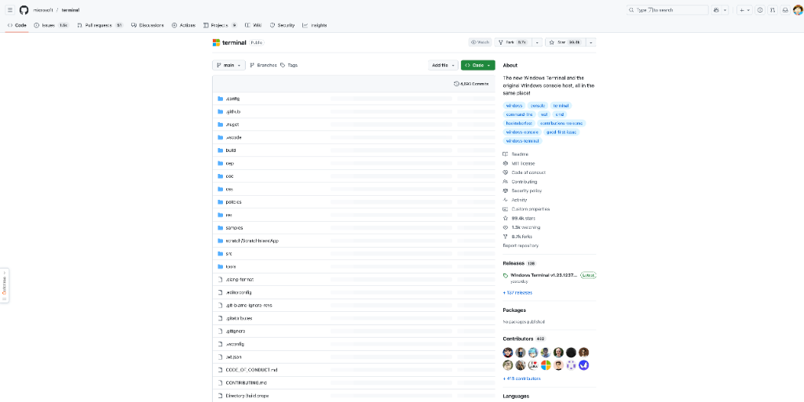

Windows Terminal 是微软为 Windows 用户打造的现代化终端应用程序。它不仅支持多标签页、丰富的文本格式、Unicode 和 Emoji，还具备全球化、可配置性、主题和样式定制等功能。对于经常在 Windows 上进行命令行操作的开发者来说，它提供了比传统命令提示符更流畅、更强大的体验。它的背景透明、行选择和对 ANSI / 虚拟终端序列及 24 位色彩的支持，让终端操作更加直观和高效。

如果你是一个 Windows 用户，且经常使用 WSL、CMD 或 PowerShell，Windows Terminal 会让你的开发效率显著提升。它甚至可以作为一个可重用的 UI 控件集成到其他应用中。

> 🔗 **项目链接**
> 
> https://github.com/microsoft/terminal

---

### 轻量级虚拟化新选择：Firecracker
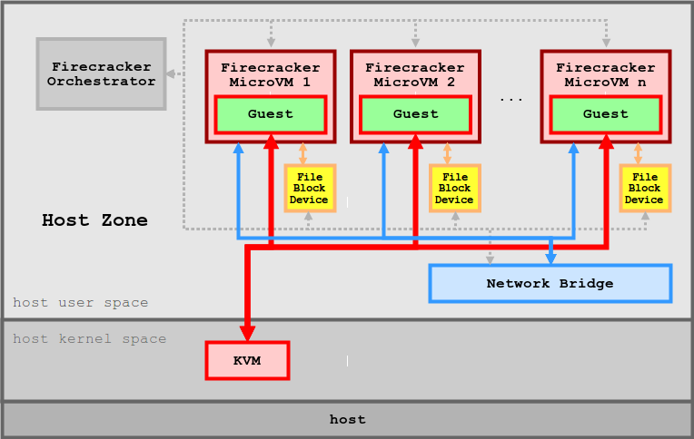

Firecracker 是一个开源的虚拟化技术，专为创建和管理安全、多租户的容器和基于函数的服务而设计。它运行在轻量级虚拟机（microVMs）中，结合了硬件虚拟化的安全性和容器的速度与灵活性。由 AWS 开发并用于 Lambda 和 Fargate 服务，Firecracker 在性能和安全性方面表现出色。

对于需要高安全性和快速启动的 Serverless 应用场景，Firecracker 是一个理想的选择。它通过最小化设计减少了内存占用和攻击面，支持按需分页和 CPU 超分，并且可以与 Kata Containers 和 Flintlock 等容器运行时集成。

> 🔗 **项目链接**
> 
> https://github.com/firecracker-microvm/firecracker

---

### 零奖励工程：Agent Reinforcement Trainer (ART)
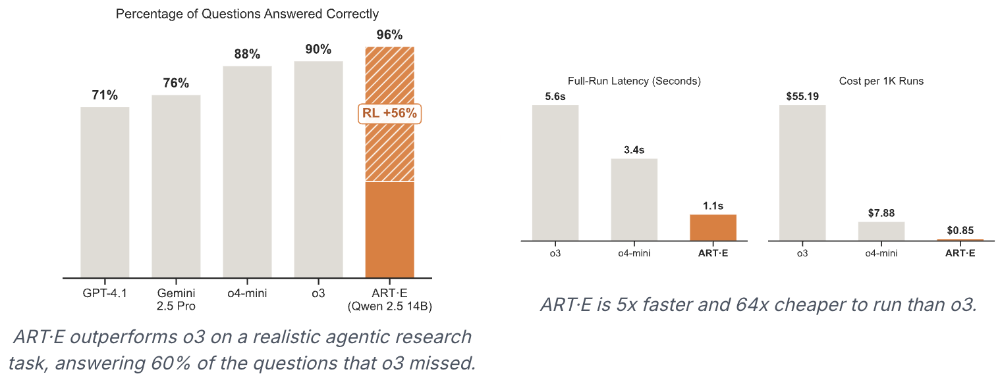

ART 是一个开源的强化学习框架，专为训练多步骤的智能体（Agent）而设计，支持 Qwen2.5、Qwen3、Llama 等模型。它的核心亮点是 RULER（相对通用的 LLM 引导奖励机制），这是一种零奖励函数机制，通过 LLM-as-judge 自动评分智能体的轨迹，彻底告别手动设计奖励函数的繁琐过程。

如果你正在开发需要智能体不断学习和优化的应用，ART 可以显著加快你的开发速度。它支持本地或云端训练，并提供与 W&B、Langfuse 等平台的集成，方便进行可观测性分析。

> 🔗 **项目链接**
> 
> https://github.com/OpenPipe/ART

---

### 前端开发的基石：Bootstrap
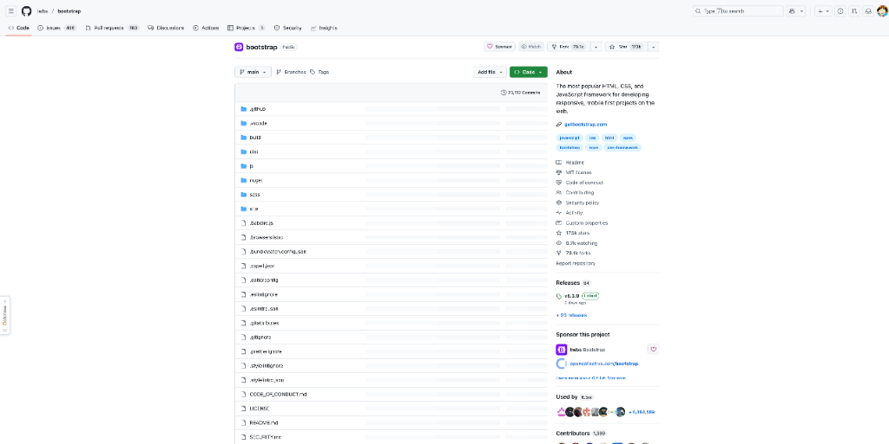

Bootstrap 是最流行的 HTML、CSS 和 JavaScript 框架，专为响应式、移动端优先的 Web 项目而设计。它提供了一套全面的预设组件和工具，让开发者能够快速构建现代化的网站和应用。无论是按钮、表单还是导航栏，Bootstrap 都能提供开箱即用的解决方案。

如果你是一个前端开发者，或者需要快速搭建一个响应式网站，Bootstrap 无疑是你的首选工具。它的社区庞大，文档详尽，兼容性极佳，是 Web 开发的必备框架。

> 🔗 **项目链接**
> 
> https://github.com/twbs/bootstrap

---

### 实时语音转文字：WhisperLiveKit
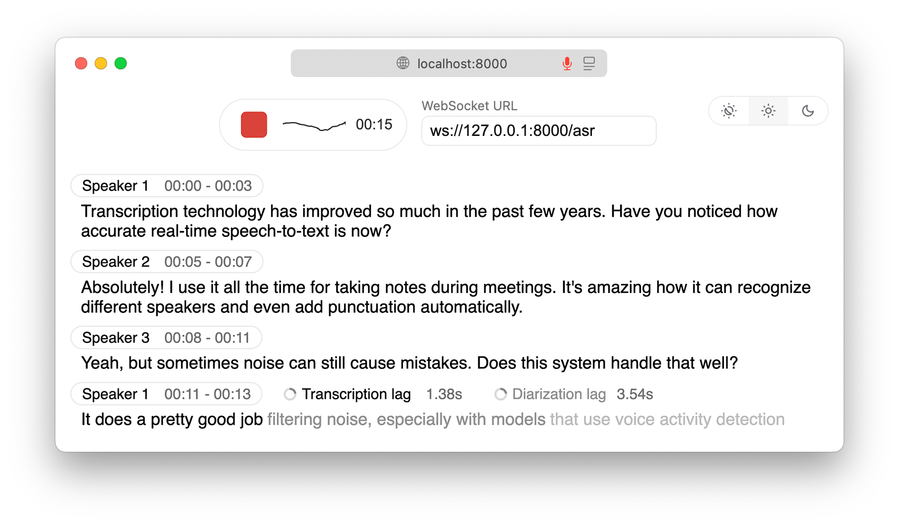

WhisperLiveKit 是一个 Python 包，专为实时、本地的语音转文字和说话人识别而设计。它内置 FastAPI 服务器和 Web 界面，支持在浏览器中直接进行实时转录。基于 SimulStreaming 和 WhisperStreaming 等前沿研究模型，它能够实现低延迟处理，并通过 Streaming Sortformer 和 Diart 提供高级的说话人识别功能。

如果你需要在本地环境中进行高质量的实时语音处理，WhisperLiveKit 是一个非常可靠的选择。它支持 Docker 部署，确保了数据隐私和处理效率。

> 🔗 **项目链接**
> 
> https://github.com/QuentinFuxa/WhisperLiveKit

---

### 电子书转有声书：Audiblez
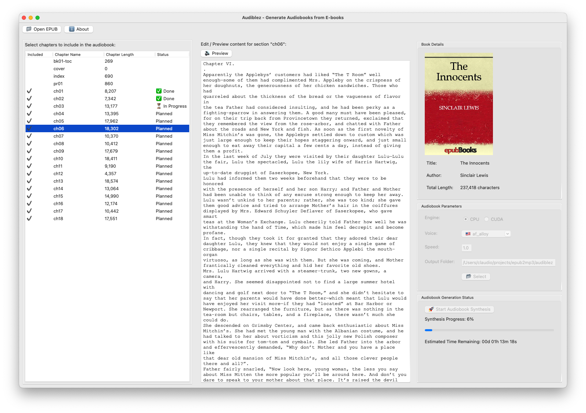

Audiblez 是一个开源工具，能够将 EPUB 电子书转换为高质量的有声书。它使用 Kokoro-82M 文本转语音模型，支持多种语言和声音，并提供命令行和图形界面两种操作方式。通过 CUDA 加速，它可以在 GPU 上实现更快的处理速度。

如果你是一个内容创作者或需要将大量电子书转换为音频，Audiblez 能够为你节省大量时间和精力。它的输出格式兼容主流播放器，使用起来非常方便。

> 🔗 **项目链接**
> 
> https://github.com/santinic/audiblez

---

### 数据库工具简化器：MCP Toolbox for Databases
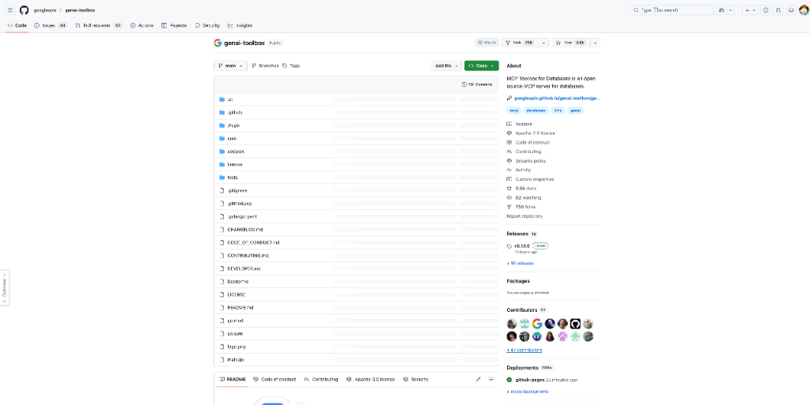

MCP Toolbox for Databases 是 Google 推出的开源 MCP 服务器，旨在简化与数据库交互的 Gen AI 工具开发。它抽象了连接池和认证等复杂性，让开发者能够更高效地创建、部署和管理数据库工具。支持动态工具注册、OpenTelemetry 可观测性以及安全的数据访问。

如果你正在开发与数据库相关的 AI 工具，这个工具箱能够显著减少你的开发复杂度。它目前处于 Beta 阶段，未来可能会有更多功能和改进。

> 🔗 **项目链接**
> 
> https://github.com/googleapis/genai-toolbox

---

### Go 语言 CLI 开发利器：Cobra

Cobra 是一个强大的 Go 语言库，用于创建现代的命令行应用程序。它提供了简单的接口来构建类似 git 和 go 工具的 CLI 界面，支持子命令、POSIX 兼容标志、智能建议、自动生成帮助文档和 Shell 自动补全等功能。被 Kubernetes、Hugo 和 GitHub CLI 等知名项目广泛使用。

如果你是一个 Go 语言开发者，并且需要构建复杂的 CLI 工具，Cobra 是一个不可或缺的库。它的成熟度和广泛的应用场景使其成为 CLI 开发的首选。

> 🔗 **项目链接**
> 
> https://github.com/spf13/cobra

---

## 🛠️ 产品观察

### 数据分析的 AI 伙伴：Hex Notebook Agent
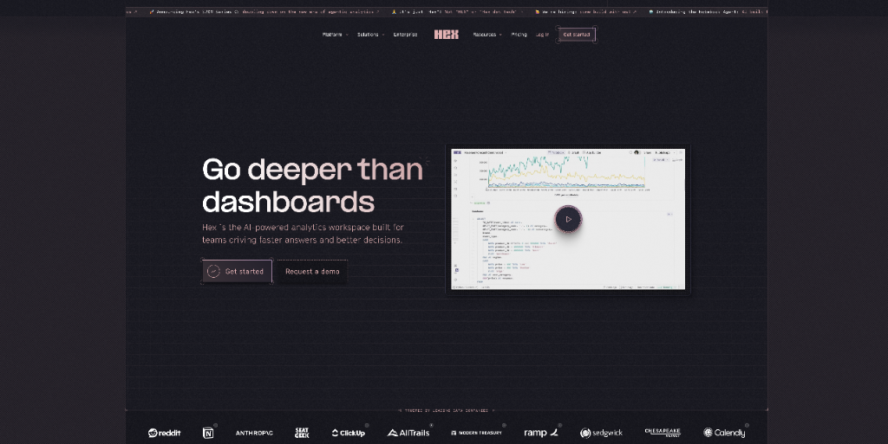

Hex Notebook Agent 是 Hex 平台推出的 AI 代理笔记本，专为数据分析设计。它利用 Claude Sonnet 4 的强大功能，帮助数据团队自动化处理繁琐的数据工作，让用户专注于创新和复杂的分析任务。用户可以通过简单的提问快速获得分析草案，并完全控制代理的编辑过程。

如果你是一个数据分析师或数据科学家，Hex Notebook Agent 能够显著提升你的工作效率。它能够生成 SQL、Python 代码、可视化图表和 Markdown 摘要，是一个全能的数据分析助手。

> 🔗 **产品链接**
> 
> https://www.producthunt.com/products/hex

---

### 多模态里程碑：Gemini 2.5 Flash Image
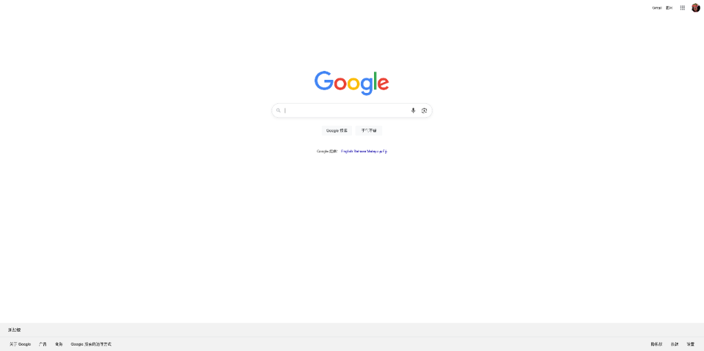

Gemini 2.5 Flash Image（又名 "nano-banana"）是 Google 推出的最新图像模型，在字符一致性、多图像融合和自然语言精确编辑方面表现出色。它在 LMArena 上引起了广泛关注，被认为是多模态模型发展的一个重要里程碑。

如果你是一个内容创作者或需要进行高质量的图像编辑，Gemini 2.5 Flash Image 能够为你提供前所未有的编辑体验。它能够完美保持原始细节，避免常见的伪影问题。

> 🔗 **产品链接**
> 
> https://www.producthunt.com/products/google

---

### AI 编码代理的桥梁：Webvizio
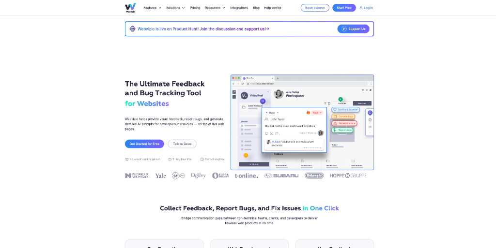

Webvizio 是一个旨在加速 Web 开发的工具，它能够将非技术性的反馈和错误报告转换为现成的代码。通过与 Cursor 或 Windsurf 等 AI 编码工具集成，它能够自动收集技术数据，帮助团队快速解决开发任务。

如果你是一个开发者，并且经常需要处理来自非技术人员的反馈，Webvizio 能够显著减少你的沟通成本和开发时间。它通过 MCP 协议与 AI 助手直接通信，确保任务的快速解决。

> 🔗 **产品链接**
> 
> https://www.producthunt.com/products/webvizio

---

### AI 的通用控制器：Rube
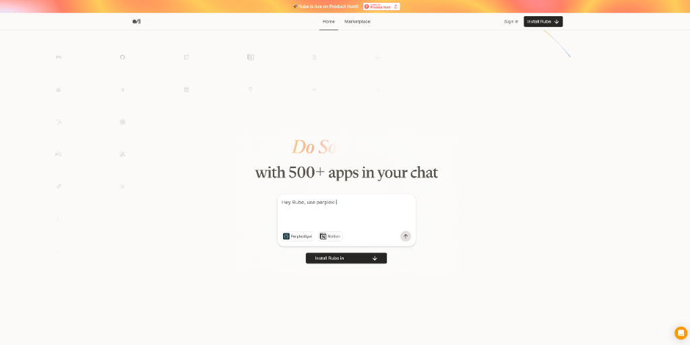

Rube 是一个通用的 Model Control Protocol (MCP)，允许用户通过 AI 聊天界面直接在 500 多个应用程序中执行操作。它能够无缝处理认证和工具选择，让 AI 不仅能提供建议，还能执行实际任务。

如果你希望 AI 能够真正成为你的生产力伙伴，Rube 是一个非常值得尝试的工具。它支持零配置设置、并行任务执行和智能记忆，能够显著提升你的工作效率。

> 🔗 **产品链接**
> 
> https://www.producthunt.com/products/rube

---

### 语音代理的测试专家：Roark
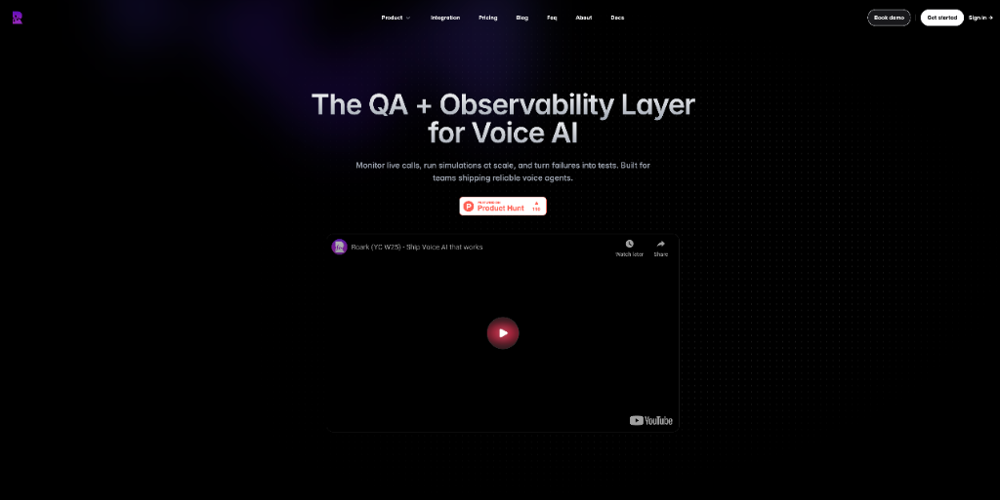

Roark 是一个专为测试、监控和改进语音代理而设计的平台。它提供了跟踪通话指标、运行评估和压力测试的功能，帮助开发者识别故障并将其转化为可重复的测试用例。

如果你是一个语音 AI 开发者，Roark 能够帮助你提升语音代理的可靠性和性能。它支持多种语言和口音的模拟测试，并提供了丰富的集成选项。

> 🔗 **产品链接**
> 
> https://www.producthunt.com/products/roark-yc-w25

---

### 远程办公的新体验：SoWork
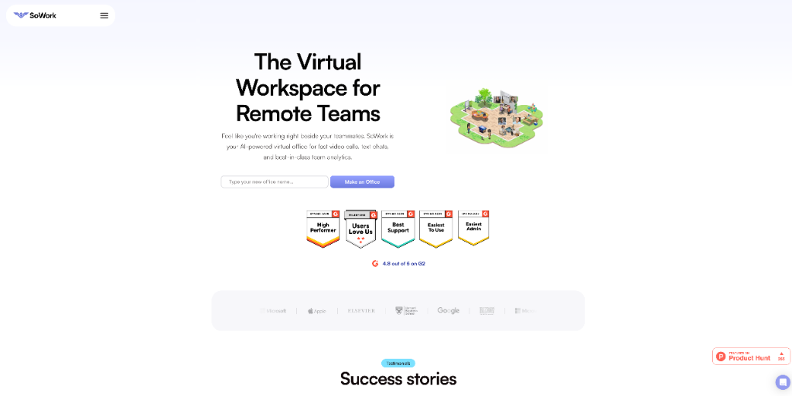

SoWork 是一个为高效远程团队设计的虚拟总部。它提供了空间视频通话、Slack 替代聊天、AI 会议摘要、录音和转录等功能，旨在将 Slack、Zoom 和日历等工具整合到一个更自然、更愉快的远程工作体验中。

如果你是一个远程团队的管理者或成员，SoWork 能够为你提供一个更加沉浸和高效的协作环境。它的 "Glow-Up Edition" 带来了显著的性能提升和用户体验改进。

> 🔗 **产品链接**
> 
> https://www.producthunt.com/products/sowork

---

## 📰 行业动态

### 极简文本编辑器的升级：Tot 2.0
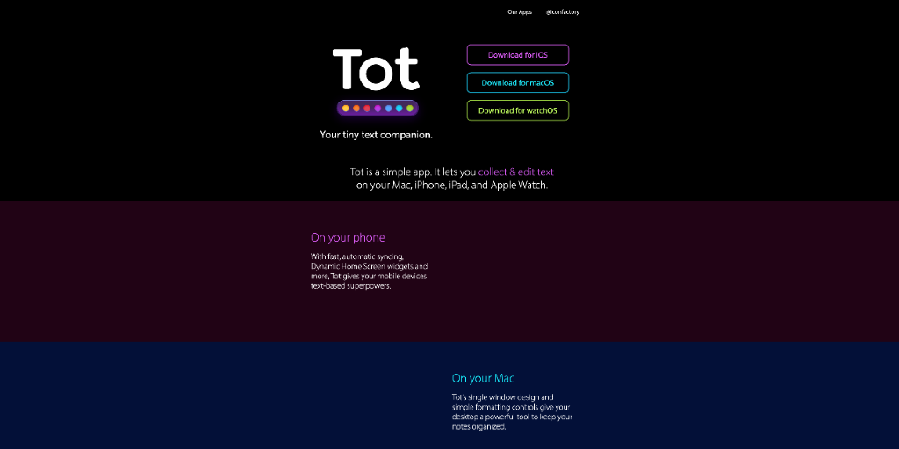

Tot 2.0 是一款优雅、简单的文本收集和编辑工具，适用于 Mac、iPhone 和 iPad。新版本引入了可定制的智能项目符号、文本分隔符、自动缩进、无缝 iCloud 同步、Markdown 支持、自适应图标和 iOS 自动备份等功能。

如果你喜欢极简主义的文本编辑工具，Tot 2.0 能够为你提供一个干净、优雅且功能丰富的使用体验。它的跨设备同步功能让你在任何设备上都能轻松访问你的文本。

> 🔗 **相关链接**
> 
> https://www.producthunt.com/products/tot

---

### Mac 刘海中的生产力工具：NotchFlow
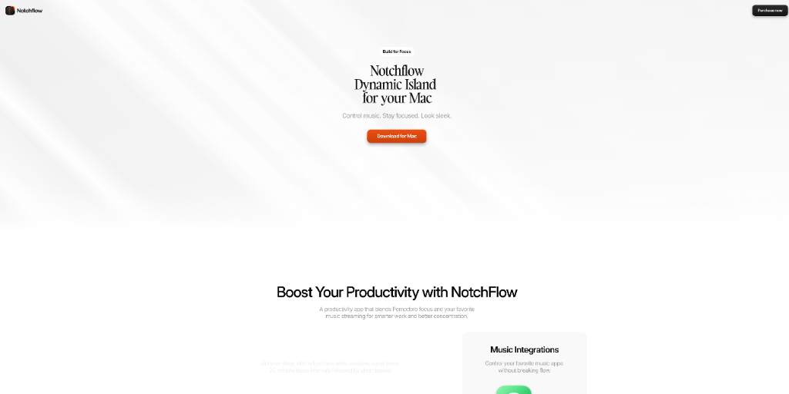

NotchFlow 是一款 Mac 生产力应用，它将番茄钟计时器和音乐控制直接集成到 Mac 的刘海区域。它旨在帮助用户在不离开当前工作流程的情况下管理时间间隔和控制音乐播放。

如果你是一个 Mac 用户，并且希望利用刘海区域提升生产力，NotchFlow 是一个非常有趣的选择。它支持 Apple Music 和 Spotify，并提供了咖啡休息提醒功能。

> 🔗 **相关链接**
> 
> https://www.producthunt.com/products/notchflow

---

### 图像编辑的一致性引擎：Nano Banana
Nano Banana 是 Google Gemini 和 Textideo 中集成的 AI 模型，专为在编辑图像时保持视觉一致性而设计。它能够在修改图像时保持原始主体的身份，避免了其他图像 AI 常见的“陌生人效应”。

如果你是一个内容创作者，需要快速迭代广告、电商视觉或社交媒体内容，Nano Banana 能够显著减少重复工作。它支持分层编辑提示，让你可以叠加修改而不丢失原始外观。

> 🔗 **相关链接**
> 
> https://www.indiehackers.com/post/nano-banana-isn-t-just-a-fun-name-it-s-the-consistency-engine-we-ve-been-waiting-for-e78bef02ea

---

## 💡 经验讨论

### 从风投到独立开发：18 个月实现 $1M 年收入
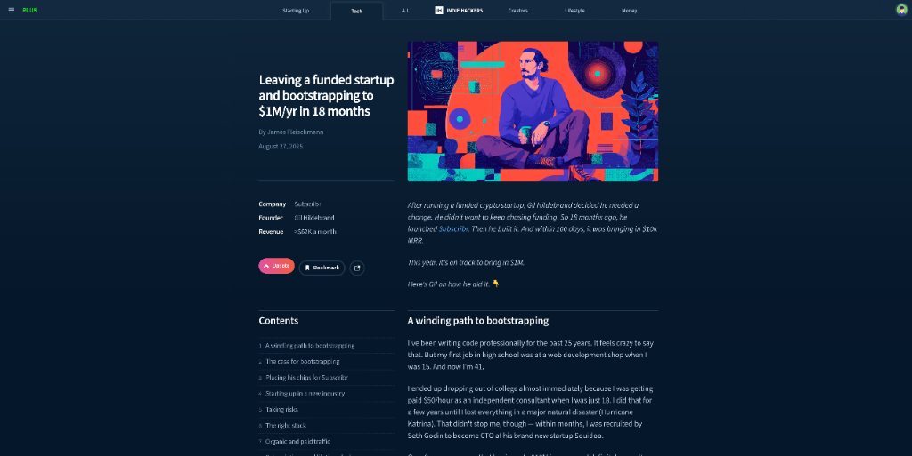

这篇 Indie Hackers 的文章讲述了 Gil Hildebrand 的创业历程。他从一家风投支持的加密初创公司离职，转而独立开发 Subscribr，一个为 YouTube 创作者设计的 AI 工具。通过预售验证想法、利用 SEO 和 AppSumo 等营销策略，他在 18 个月内实现了 $1M 的年收入。

对于想要独立创业的开发者来说，Gil 的经验非常值得借鉴。他强调了选择正确市场、降低风险和寻找心流状态的重要性。通过预售获得早期收入、利用 SEO 获取有机流量，以及后期引入具备互补技能的联合创始人，都是他成功的关键因素。

> 🔗 **参考资料**
> 
> https://www.indiehackers.com/post/tech/leaving-a-funded-startup-and-bootstrapping-to-1m-yr-in-18-months-kPBpdxsTeQitOWOOVs2g

---

## 📸 每日一图

---

## 📝 结语

明天见。Bye 👋

---

## 🍦 写在最后

🐣 **帮助我们成长**:

HelloDev.io 开发者日报立志成为面向开发者最持久最有价值的日报，帮助大家以 **「更少时间更舒适」** 的了解所有最前沿最有想法的产品与技术及观点。

你的 **「转发、喜欢、点赞、评论」** 都能让更多人了解认识我们，帮助我们更好的成长，并且走得更远。感谢 🙏

📱 **多平台发布**：微信公众号 | 掘金 | 知乎 | GitHub