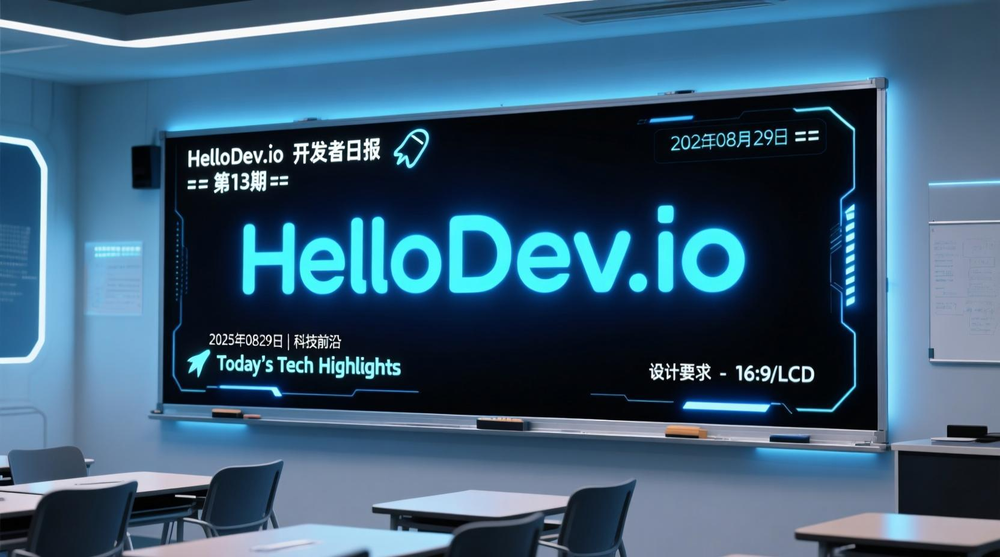
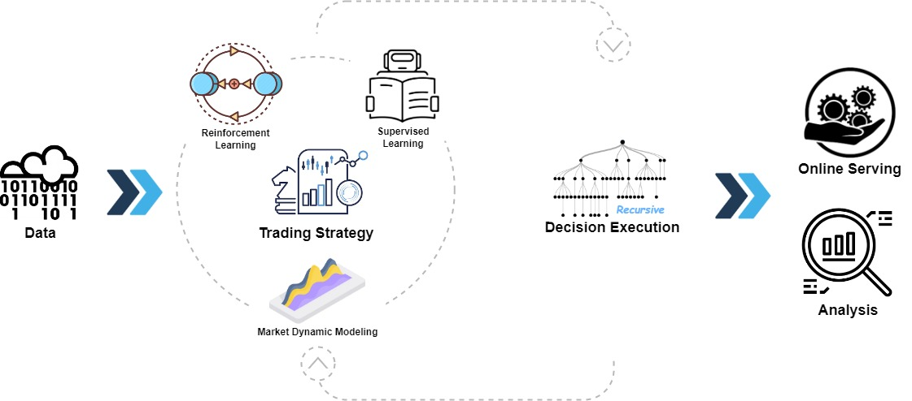
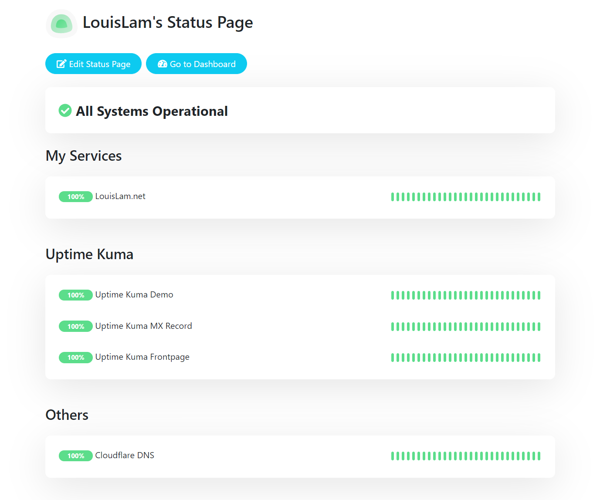
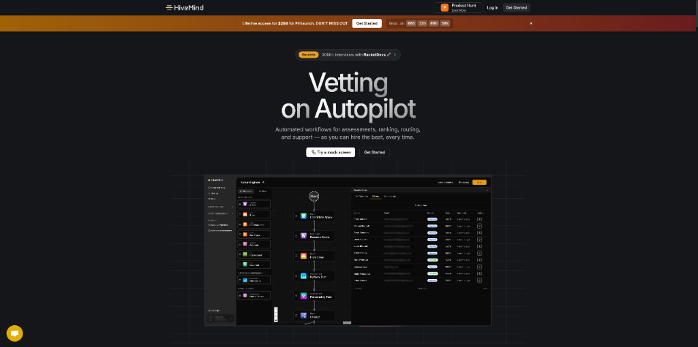
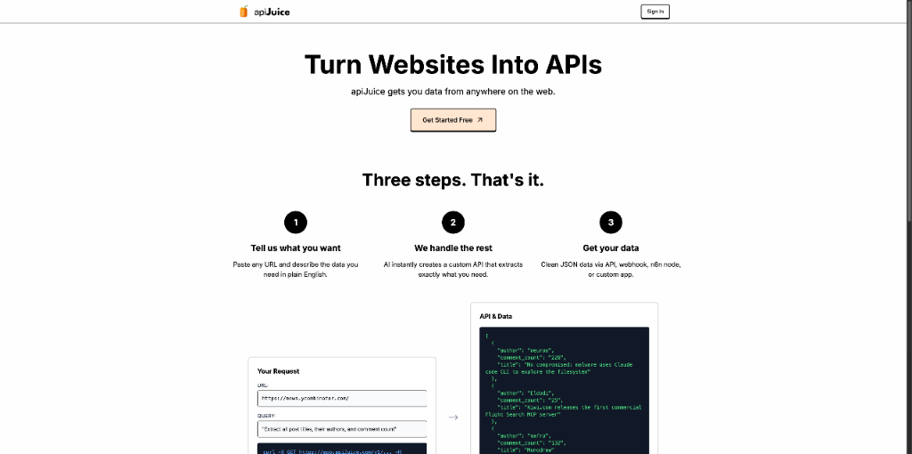
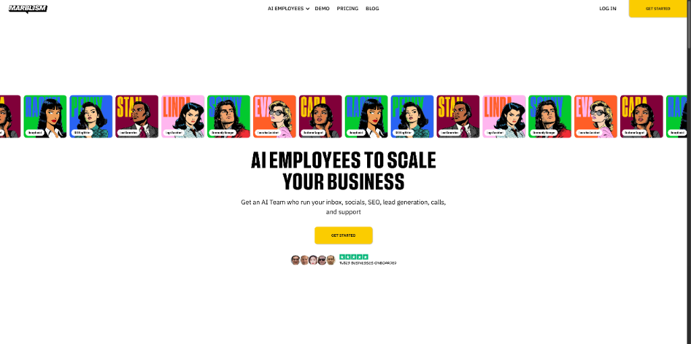
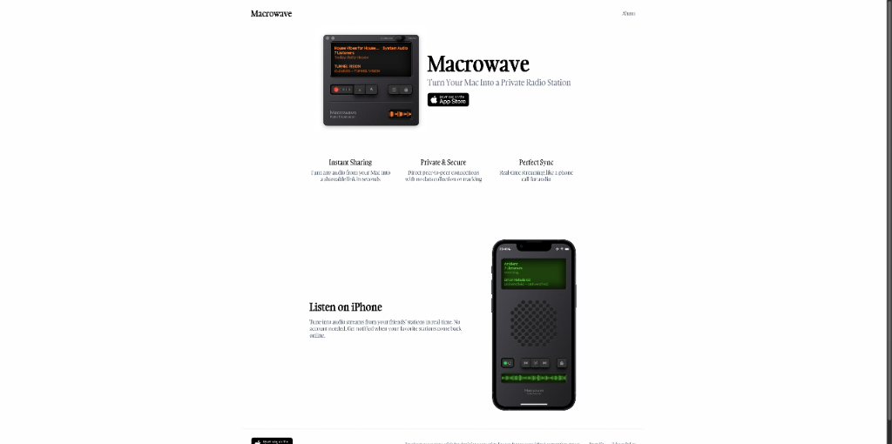
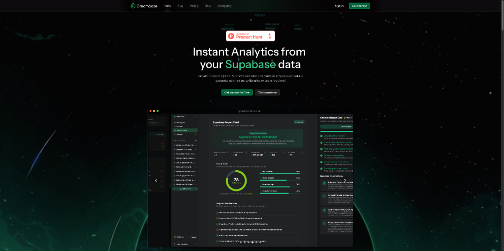
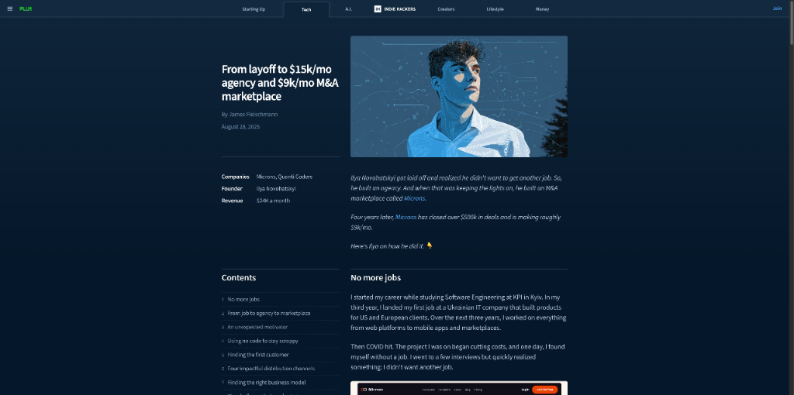

# HelloDev.io 开发者日报 - 第 13 期 | 2025 年 08 月 29 日

👋 Hi，这里是 HelloDev.io 开发者日报，今天是第 13 期，即将为你介绍今天的精彩发现：

📊 **本期内容**：
- 🚀 开源趋势：8 条
- 🛠️ 产品观察：6 条  
- 📰 行业动态：3 条
- 💡 经验讨论：1 条
- 📸 每日一图：1 条

---

## 🚀 开源趋势

### 让基础设施管理更安全高效：hashicorp / terraform

Terraform 是一个安全高效地构建、变更和版本化基础设施的工具。它允许使用高级配置语法描述基础设施，从而实现版本控制、共享和重用。其核心特性包括基础设施即代码、执行计划（显示将要进行的更改）、资源图（用于高效构建和洞察依赖关系）以及变更自动化（以最少的人工交互应用复杂的变更集）。Terraform 可以管理现有的热门服务提供商和自定义内部解决方案，为基础设施管理提供了极大的灵活性。

对于需要管理复杂基础设施的团队，Terraform 的执行计划和变更自动化功能特别有用，可以显著减少人为错误。它特别适合 DevOps 团队和云架构师，帮助他们实现基础设施的标准化和自动化管理。

> 🔗 **项目链接**
> 
> https://github.com/hashicorp/terraform

---

### 微软开源的 AI 量化投资平台：microsoft / qlib

Qlib 是微软开发的开源、面向 AI 的量化投资平台，旨在通过人工智能赋能量化研究。它支持多种机器学习范式，包括监督学习、市场动态建模和强化学习，并涵盖了从数据处理到模型训练、回测的完整机器学习流程，覆盖了量化投资的整个链条：Alpha 寻找、风险建模、投资组合优化和订单执行。该平台现已与 RD-Agent 集成，用于自动化研发流程，已被众多研究人员和从业者用于数据驱动的金融研究。

对于希望利用 AI 进行量化投资的研究人员和从业者，Qlib 提供了一个全面的框架，支持从数据处理到投资组合优化的全流程。它特别适合金融工程师和量化分析师，帮助他们构建和测试复杂的量化模型。

> 🔗 **项目链接**
> 
> https://github.com/microsoft/qlib

---

### 让数据库查询变得简单：Canner / WrenAI

Wren AI 是一个开源的生成式商业智能（GenBI）代理，允许用户使用自然语言查询任何数据库。它能在几秒钟内生成准确的 SQL（文本到 SQL）、图表（文本到图表）和 AI 驱动的洞察。其核心功能包括自然语言查询、AI 生成的摘要和报告、语义层以确保 LLM 输出的准确性，以及可通过 API 嵌入自定义应用。该工具支持多种数据源，如 BigQuery、PostgreSQL、MySQL，以及多种 LLM，包括 OpenAI、Anthropic 和 Google 模型。

对于非技术用户来说，Wren AI 极大地降低了数据库查询的门槛，使他们能够通过自然语言与数据进行交互。它特别适合数据分析师和业务用户，帮助他们快速获取数据洞察，而无需掌握复杂的 SQL 语法。

> 🔗 **项目链接**
> 
> https://github.com/Canner/WrenAI

---

### 为 AI 应用构建记忆：chroma-core / chroma

Chroma 是一个专为 AI 应用设计的开源嵌入数据库，特别适用于构建具有记忆功能的 Python 或 JavaScript LLM 应用。它提供了一个简单的 API，用于添加和查询带有嵌入的文档，支持与 LangChain 和 LlamaIndex 等工具的集成。Chroma 支持多种嵌入函数，并允许从开发到生产的可扩展部署。它采用 Apache 2.0 许可证，并拥有活跃的社区支持。

对于构建需要记忆功能的 LLM 应用的开发者来说，Chroma 提供了一个高效的文档检索解决方案。它特别适合需要处理大量文本数据的 AI 应用，帮助开发者快速构建和部署智能应用。

> 🔗 **项目链接**
> 
> https://github.com/chroma-core/chroma

---

### 自托管的监控利器：louislam / uptime-kuma

Uptime Kuma 是一个自托管的监控工具，允许你监控各种服务的正常运行时间和状态。它支持 HTTP(s)、TCP、DNS 记录等多种监控类型，并提供了响应迅速且用户友好的界面。其主要功能包括通过多种服务进行通知、多语言支持、多个状态页面以及 2FA 支持。它可以通过 Docker 或手动使用 Node.js 轻松安装。

对于需要监控多个服务的开发者和运维人员来说，Uptime Kuma 提供了一个简单易用的解决方案。它特别适合小型团队和独立开发者，帮助他们快速搭建自己的监控系统，而无需依赖第三方服务。

> 🔗 **项目链接**
> 
> https://github.com/louislam/uptime-kuma

---

## 🛠️ 产品观察

### AI 招聘新范式：HiveMind

HiveMind 是一个 AI 驱动的招聘平台，它通过代理工作流自动筛选简历、进行技能评估并根据候选人与职位的匹配度进行排名。该平台旨在通过提供可定制的、以工作流为先的方法来减少招聘中的人工操作。它提供了自动安排、面试共同驾驶和集中候选人报告卡等功能。HiveMind 特别适合在没有专职招聘人员的情况下进行扩展的创始人、处理高申请量的全球公司，以及希望超越基于简历的猜测的任何人。该工具支持 1200 多个职位的基于技能的招聘，并配有专家设计的评估。

对于初创公司和 HR 团队来说，HiveMind 可以显著提高招聘效率，减少筛选简历的时间。它特别适合需要快速扩展团队的公司，帮助他们找到最合适的候选人。

> 🔗 **产品链接**
> 
> https://www.producthunt.com/products/hivemind-ai

---

### 无需登录的去中心化 AI：Eternal AI

Eternal AI 是一个点对点、无审查的 AI 应用程序，提供各种 AI 代理，能够执行网站原型设计、编码和图像生成等任务。值得注意的是，它完全免费使用，无需登录，且在没有中央控制或企业看门人的情况下运行。其点对点技术确保了低成本计算和抗审查能力，使其成为用户可访问且强大的工具。

对于希望自由探索 AI 能力的用户来说，Eternal AI 提供了一个无门槛的平台。它特别适合开发者和创意工作者，帮助他们快速生成原型和创意内容。

> 🔗 **产品链接**
> 
> https://www.producthunt.com/products/nobullshit-exe

---

### 快速生成 API：apiJuice

apiJuice 是一个工具，允许用户在几秒钟内为任何网站创建 API。通过简单地粘贴 URL 并用简单的英语描述所需的数据，用户可以利用 AI 立即生成一个自定义 API，提取所需的确切信息。此解决方案消除了手动抓取的需要，并通过 API、webhook、n8n 节点或自定义应用程序提供干净的 JSON 数据。它专为速度和可靠性而设计，具有智能提取、即时 API 部署和计划更新等功能。

对于需要快速获取网站数据的开发者来说，apiJuice 提供了一个高效的解决方案。它特别适合需要集成第三方数据的应用，帮助开发者节省时间和精力。

> 🔗 **产品链接**
> 
> https://www.producthunt.com/products/apijuice

---

### 阿里巴巴的推理新星：QWQ-Max

QWQ-Max 是阿里巴巴 Qwen 团队开发的新型大语言模型（LLM），在推理、数学、编码和代理任务方面表现出色。其关键特性是专为解决复杂问题而设计的“思考模式”。该模型以其强大的性能而著称，预计很快将开源。它建立在先前 Qwen 模型功能的基础上，包括高级多模态功能，如图像问答、图像数学问题解决、视频理解、对象定位和文档解析。

对于需要处理复杂推理任务的开发者来说，QWQ-Max 提供了一个强大的工具。它特别适合需要进行数学计算和代码生成的应用，帮助开发者提高工作效率。

> 🔗 **产品链接**
> 
> https://www.producthunt.com/products/qwq-max

---

### AI 员工助力业务增长：Marblism

Marblism 是一个 AI 驱动的平台，提供虚拟员工来帮助企业家和企业高效扩展。这些 AI 员工可以处理各种角色，如行政助理、社交媒体管理、销售和客户支持，让创始人专注于战略增长。该平台旨在以人类助理成本的一小部分复制其专业知识，使早期初创公司能够负担得起。Marblism 与现有工作流程无缝集成，承诺为用户节省大量时间，同时保持高质量的输出，符合公司的语气和风格。

对于需要扩展业务的创始人来说，Marblism 提供了一个成本效益高的解决方案。它特别适合资源有限的初创公司，帮助他们快速扩展业务。

> 🔗 **产品链接**
> 
> https://www.producthunt.com/products/marblism-2

---

### 视频风格转换神器：KomikoAI Video to Video

KomikoAI Video to Video 是一个工具，可以将视频转换为各种艺术风格，如动漫、赛博朋克和火焰效果。它提供了超过 80 个创意模板，并允许通过提示进行自定义。该产品旨在帮助用户轻松创建引人入胜的社交媒体内容。

对于需要制作吸引人的视频内容的创作者来说，KomikoAI Video to Video 提供了一个简单易用的解决方案。它特别适合社交媒体营销人员，帮助他们快速制作高质量的视频内容。

> 🔗 **产品链接**
> 
> https://www.producthunt.com/products/framepack-ai-video-generator

---

## 📰 行业动态

### 私人电台新体验：Macrowave

Macrowave 是一款 macOS 和 iOS 应用程序，允许用户将 Mac 音频转换为私人实时流。它支持点对点广播，延迟最小且同步完美，非常适合与朋友、关注者或同事分享音乐、共同工作会话或其他音频体验。该应用具有复古设计，为用户提供了独特而有趣的体验。听众可以通过 iPhone、Mac 或网络收听，无需安装应用程序。

对于希望与他人分享音乐或音频内容的用户来说，Macrowave 提供了一个简单而高效的解决方案。它特别适合音乐爱好者和远程工作者，帮助他们创建共享的音频体验。

> 🔗 **相关链接**
> 
> https://www.producthunt.com/products/macrowave

---

### 开发者数据分析新选择：Dreambase.ai

Dreambase.ai 是一个与 Supabase 深度集成的分析平台，为开发者提供全面的数据分析功能。它允许用户直接从 Supabase 数据库中获取洞察，支持实时数据监控和可视化，帮助开发者更好地理解其应用的使用情况和性能表现。该平台免费使用，适合希望快速上手数据分析的开发团队。

对于需要快速了解应用性能的开发者来说，Dreambase.ai 提供了一个简单易用的分析工具。它特别适合小型开发团队，帮助他们快速获取应用数据并进行分析。

> 🔗 **相关链接**
> 
> https://www.producthunt.com/products/dreambase-ai

---

### AI 视频创作的革命：Transform Your Content Game with AI-Powered Video

这篇 Indie Hackers 文章探讨了 AI 视频工具如何彻底改变内容创作，使其更快、更易获取且更具创造性。它强调了像 Veo3 这样的 AI 视频生成器的优势，使创作者能够高效地制作专业视频，而无需大型团队或昂贵的设备。主要优势包括速度、成本效益、创作自由、大规模个性化和提升的覆盖范围。文章还提供了最大化 AI 视频效果的最佳实践，并得出结论：在现代数字环境中，拥抱这些工具对于保持竞争力至关重要。

对于内容创作者来说，AI 视频工具提供了一个高效且经济的解决方案。它特别适合需要快速制作高质量视频的创作者，帮助他们提升内容质量和覆盖范围。

> 🔗 **相关链接**
> 
> https://www.indiehackers.com/post/transform-your-content-game-with-ai-powered-video-f955098888

---

## 💡 经验讨论

### 从裁员到月入 2.4 万美元：Ilya Novohatskyi 的创业之路

Ilya Novohatskyi 分享了他从疫情期间被裁员到建立成功的代理机构（Quanti Coders），每月收入 1.5 万美元，以及并购市场（Microns），每月收入 9000 美元的经历。故事详细描述了他的动机、挑战（包括乌克兰战争）、无代码工具的使用、有效的分发渠道（内容、公开建设、电子邮件、社区）以及他的混合商业模式。它突出了韧性、适应性和战略增长。

对于希望从零开始建立业务的创业者来说，Ilya 的经历提供了宝贵的经验。它特别适合面临挑战的创始人，帮助他们找到克服困难的方法并实现业务增长。

> 🔗 **参考资料**
> 
> https://www.indiehackers.com/post/tech/from-layoff-to-15k-mo-agency-and-9k-mo-m-a-marketplace-BV26fA9JVyGXuYbP5vJB

---

## 📸 每日一图

---

## 📝 结语

明天见。Bye 👋

---

## 🍦 写在最后

🐣 **帮助我们成长**:

HelloDev.io 开发者日报立志成为面向开发者最持久最有价值的日报，帮助大家以 **「更少时间更舒适」** 的了解所有最前沿最有想法的产品与技术及观点。

你的 **「转发、喜欢、点赞、评论」** 都能让更多人了解认识我们，帮助我们更好的成长，并且走得更远。感谢 🙏

📱 **多平台发布**：微信公众号 | 掘金 | 知乎 | GitHub
