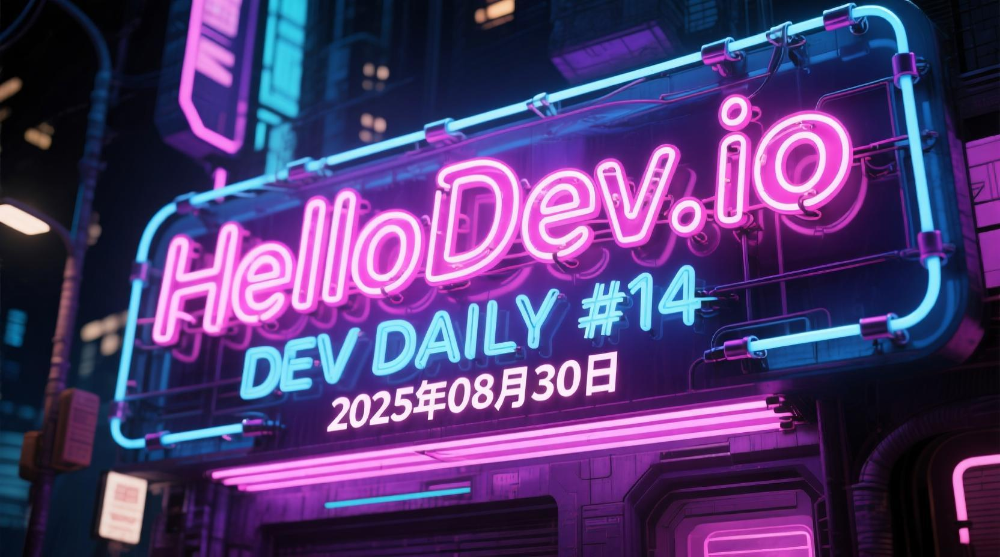
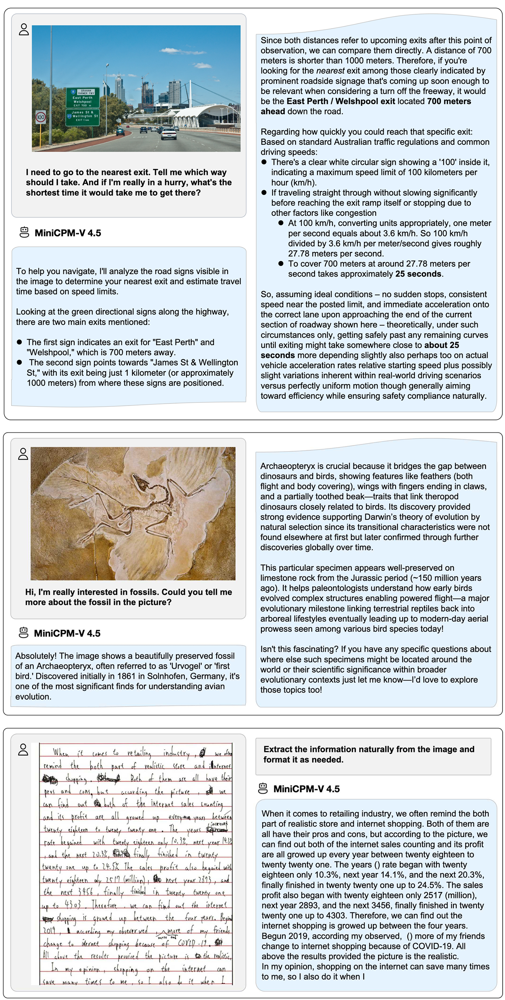
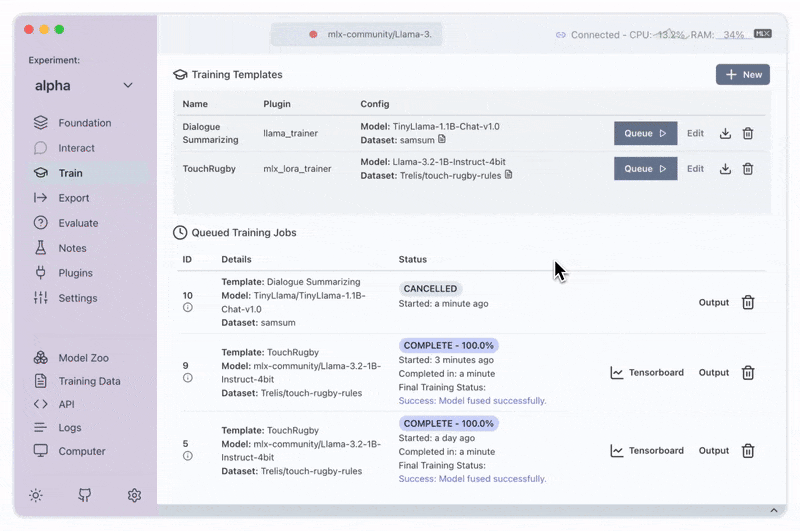
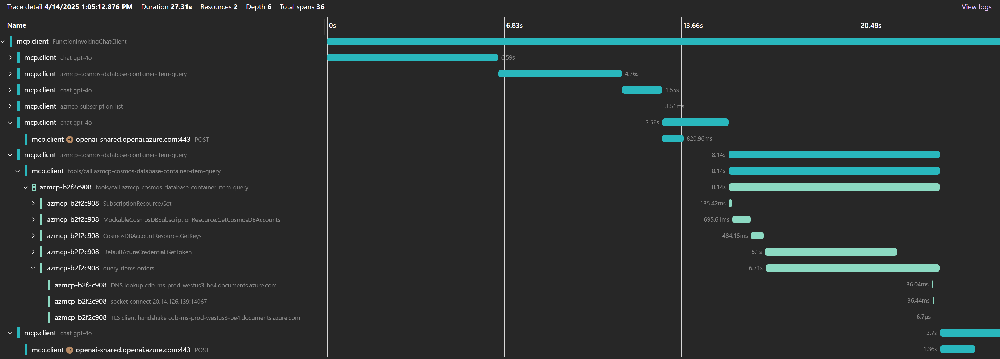
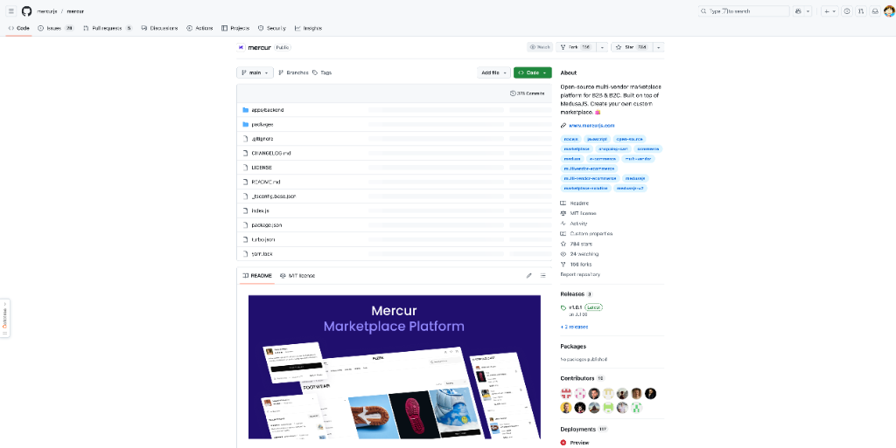
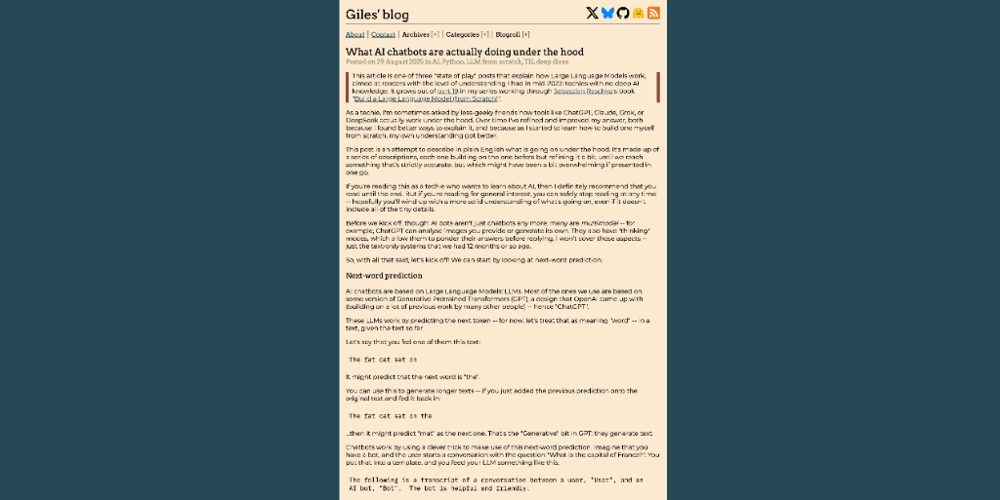
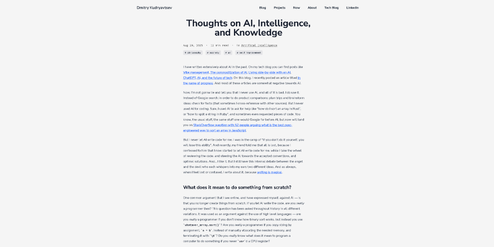
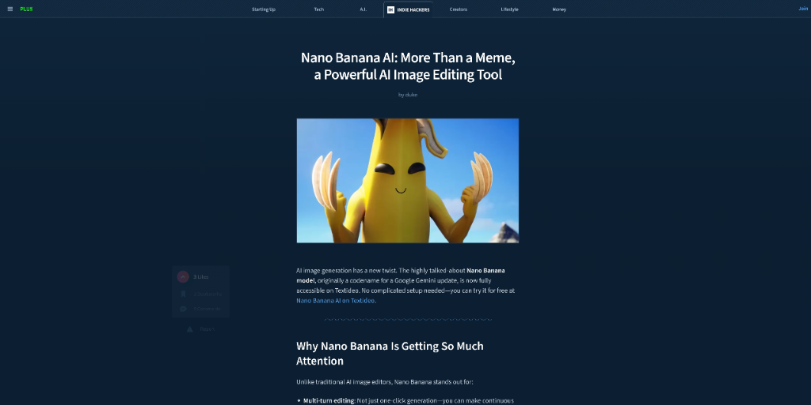

# HelloDev.io 开发者日报 - 第 14 期 | 2025 年 08 月 30 日

👋 Hi，这里是 HelloDev.io 开发者日报，今天是第 14 期，即将为你介绍今天的精彩发现：

📊 **本期内容**：
- 🚀 开源趋势：8 条
- 🛠️ 产品观察：0 条  
- 📰 行业动态：3 条
- 💡 经验讨论：1 条
- 📸 每日一图：1 条

---

## 🚀 开源趋势

### 性能媲美 GPT-4o 的移动端多模态模型：MiniCPM-V 4.5

MiniCPM-V 4.5 是一个面向移动端的高效多模态大语言模型，支持单图像、多图像和视频理解，性能上已经超越了 GPT-4o-latest、Gemini-2.0 Pro 和 Qwen2.5-VL 72B。它具备高效的视频理解能力，支持高刷新率和长视频理解，还拥有可控的快/深思考模式。OCR 和文档解析能力也非常强大，支持多语言。更值得一提的是，它支持在 iPad 等端侧设备上运行，让多模态能力触手可及。同时推出的 MiniCPM-o 2.6 还支持语音输入和端到端语音输出，具备视觉、语音和多模态直播能力，达到 GPT-4o-202405 的水平。

对于需要在移动端实现多模态能力的开发者，这是一个非常值得关注的项目。它支持多种部署方式，包括 llama.cpp、Ollama、vLLM 等，提供了丰富的部署和微调方案。

> 🔗 **项目链接**
> 
> https://github.com/OpenBMB/MiniCPM-V

---

### 让 LLM 工程变得简单的桌面应用：Transformer Lab

Transformer Lab 是一个开源的桌面应用程序，旨在让高级 LLM 和扩散模型工程变得简单。它支持在个人电脑上直接与、训练、微调和评估大型语言模型，无需复杂的云端配置。软件支持一键下载热门模型、跨不同硬件平台的微调、RLHF 和偏好优化，还兼容 Windows、MacOS 和 Linux 等多种操作系统。对于希望在本地进行模型实验和开发的开发者来说，它提供了一个用户友好的 GUI 界面，简化了复杂的任务。

从我的使用体验来看，它集成了 HuggingFace 等流行框架，支持多种推理引擎，非常适合想要快速上手 LLM 工程的开发者。

> 🔗 **项目链接**
> 
> https://github.com/transformerlab/transformerlab-app

---

### 微软推出的 AI 上下文协议：MCP Servers

Microsoft Model Context Protocol (MCP) 是一个开放标准，旨在促进 AI 应用与外部数据源和工具之间的无缝集成。这个仓库收录了微软为 Azure DevOps、Azure、Microsoft Clarity、Dataverse 等服务提供的官方 MCP 服务器实现。通过 MCP，AI 模型可以更有效地获取执行任务所需的上下文信息，从而提升其能力。该协议支持云和本地数据源，为 AI 代理与复杂系统交互提供了便利。

对于正在构建需要与多种工具和数据源交互的 AI 应用的开发者，MCP 提供了一个标准化的解决方案。

> 🔗 **项目链接**
> 
> https://github.com/microsoft/mcp

---

### 学习算法的宝藏库：TheAlgorithms / Python

TheAlgorithms / Python 是 GitHub 上一个非常受欢迎的项目，提供了大量使用 Python 实现的算法集合，主要用于教育目的。从基础数据结构到高级机器学习算法，这个项目几乎涵盖了所有常见的算法实现。所有代码都以教学为目的编写，虽然可能不如标准库那样高效，但非常适合学习和理解算法的核心思想。项目拥有活跃的社区和详细的贡献指南，鼓励社区参与。

对于准备技术面试或希望提升编程技能的人来说，这是一个不可多得的资源库。

> 🔗 **项目链接**
> 
> https://github.com/TheAlgorithms/Python

---

### 为 AI 代理添加人类监督的框架：HumanLayer

HumanLayer 是一个框架，允许 AI 代理在基于工具和异步的工作流中与人类进行沟通。它确保对高风险函数调用的人类监督，通过 Slack 和电子邮件等平台的审批工作流来实现。这使得开发者可以安全地将 LLM 集成到现实世界的工具和系统中，促进带有人类监督的代理工作流。项目支持 TypeScript 和 Go 等多种语言，并提供了在执行敏感操作前要求人类批准的机制。

对于正在开发涉及真实世界操作的 AI 代理的开发者，这是一个确保安全性和可靠性的优秀工具。

> 🔗 **项目链接**
> 
> https://github.com/humanlayer/humanlayer

---

### 免费的多供应商电商平台：Mercur

Mercur 是一个开源的多供应商电商平台，支持 B2B 和 B2C 业务模式。它基于 MedusaJS 构建，让企业能够创建拥有完全所有权的自定义市场，避免交易费用和供应商锁定。平台提供了现成的功能，包括可定制的 B2B 和 B2C 前端商店、市场管理后台和供应商管理面板。它还集成了 Stripe 进行支付处理，以及 Resend 进行通信。1.0 版本已正式发布，生产就绪，特别适合 B2C 市场，并支持自托管以完全控制基础设施和数据。

对于希望构建自有电商平台的企业，Mercur 提供了一个灵活且开源的解决方案。

> 🔗 **项目链接**
> 
> https://github.com/mercurjs/mercur

---

### 高性能的开源支付网关：Hyperswitch

Hyperswitch 是一个用 Rust 编写的开源支付网关，旨在让支付变得快速、可靠且经济实惠。它提供了一个模块化、灵活的基础设施，允许企业只集成他们需要的组件，避免供应商锁定。主要功能包括支持全球支付方式、智能路由和重试逻辑，以及控制中心中的可视化工作流构建器。项目强调性能、安全性和开发者体验，由 Juspay 构建和维护，并得到了全球社区的贡献。

对于需要构建高性能支付系统的开发者，Hyperswitch 提供了一个可靠且可扩展的开源选择。

> 🔗 **项目链接**
> 
> https://github.com/juspay/hyperswitch

---

### CNCF 毕业的高性能消息系统：NATS

NATS 是一个简单、安全且高性能的消息系统，专为云和边缘计算环境设计。它是云原生计算基金会 (CNCF) 的一部分，支持超过 40 种客户端语言。NATS 服务器可以部署在本地、云端或边缘设备上，包括树莓派。它通过提供服务间安全高效的通信，简化了现代分布式系统的设计和运营。项目开源，采用 Apache 2.0 许可证，并拥有强大的社区支持。

对于构建分布式系统的开发者，NATS 是一个值得信赖的消息传递解决方案。

> 🔗 **项目链接**
> 
> https://github.com/nats-io/nats-server

---

## 📰 行业动态

### 自动化截图工具提升 97% 效率：PeekShot

PeekShot 是一款自动化网站截图工具，旨在解决开发者和营销人员频繁需要网站截图的痛点。创始人报告称，该工具节省了 97% 的时间，显著提高了之前需要手动截图流程的任务效率。产品通过提供自动化解决方案来简化工作流程，生成网站截图。

从我的使用体验来看，这类自动化工具能够极大地提升生产力，是典型的解决具体问题的独立开发者项目。

> 🔗 **相关链接**
> 
> https://www.indiehackers.com/product/peekshot?post=eznUAy0X9P6r3TLqcB0x

---

### 深入解析 AI 聊天机器人内部机制

这篇文章解释了 AI 聊天机器人内部的工作原理，深入剖析了大型语言模型 (LLM) 的机制。它描述了这些模型如何使用 Transformer 等深度神经网络预测文本序列中的下一个 token。过程涉及在大量数据上进行训练以优化参数，使模型能够通过预测后续 token 来生成文本。文章进一步探讨了 LLM 使用的分词、logits 和概率分布等概念，以确定下一个最可能的词或短语。它为具有基本技术知识的读者简化了复杂的 AI 过程，旨在清晰地解释 AI 聊天机器人如何生成类人的响应。

对于想要理解 AI 聊天机器人工作原理的技术爱好者，这是一篇很好的入门文章。

> 🔗 **相关链接**
> 
> https://www.gilesthomas.com/2025/08/what-ai-chatbots-are-doing-under-the-hood

---

### 关于 AI、智能和知识的思考

这篇文章反思了人工智能与人类智能之间不断发展的关系，质疑在 AI 时代创造、知道和智能的真正含义。作者探讨了使用 AI 进行编码的争论、从“零开始”构建的概念，以及依赖 AI 是否会削弱人类智能，还是仅仅是另一种利用积累知识的形式。它还讨论了随着抽象层次的增加，低级技术知识可能的流失，但最终认为变化是永恒的，对某些技能的守门可能是徒劳的。文章鼓励在保持个人智力成长的同时拥抱 AI。

从我的角度来看，这篇文章提供了一个哲学层面的思考，对于如何看待 AI 与人类智能的关系很有启发性。

> 🔗 **相关链接**
> 
> https://kudmitry.com/articles/thoughts-on-ai-intelligence-and-knowledge/

---

## 💡 经验讨论

### 不只是个梗：强大的 AI 图像编辑工具 Nano Banana AI

Nano Banana AI 是一个先进的 AI 图像编辑工具，提供多轮编辑、一致性以及无限的创造力。它最初是 Google Gemini 更新的代号，现在可以在 Textideo 上使用。该工具的亮点在于能够在编辑过程中保持角色一致性，同时允许持续调整以达到所需的视觉效果。关键功能包括文本到图像和图像到图像功能，使用户能够从描述中生成详细视觉效果或修改现有图像。平台支持多轮编辑，允许用户在保持角色特征和场景连贯性的同时进行迭代更改。Nano Banana AI 在细节渲染和角色一致性方面表现出色，明显优于其他软件。该工具特别适用于创建一致的角色编辑、无缝场景融合和多图像上下文支持的内容创建工作流。Textideo 为新用户提供 100 个免费积分来试用 Nano Banana AI，使其可以用于个人和商业用途，并为业务提供 API 访问和许可灵活性。

对于需要进行高质量图像编辑的创作者，Nano Banana AI 提供了一个强大且易用的解决方案。

> 🔗 **参考资料**
> 
> https://www.indiehackers.com/post/nano-banana-ai-more-than-a-meme-a-powerful-ai-image-editing-tool-979b232d3b

---

## 📸 每日一图

---

## 📝 结语

明天见。Bye 👋

---

## 🍦 写在最后

🐣 **帮助我们成长**:

HelloDev.io 开发者日报立志成为面向开发者最持久最有价值的日报，帮助大家以 **「更少时间更舒适」** 的了解所有最前沿最有想法的产品与技术及观点。

你的 **「转发、喜欢、点赞、评论」** 都能让更多人了解认识我们，帮助我们更好的成长，并且走得更远。感谢 🙏

📱 **多平台发布**：微信公众号 | 掘金 | 知乎 | GitHub