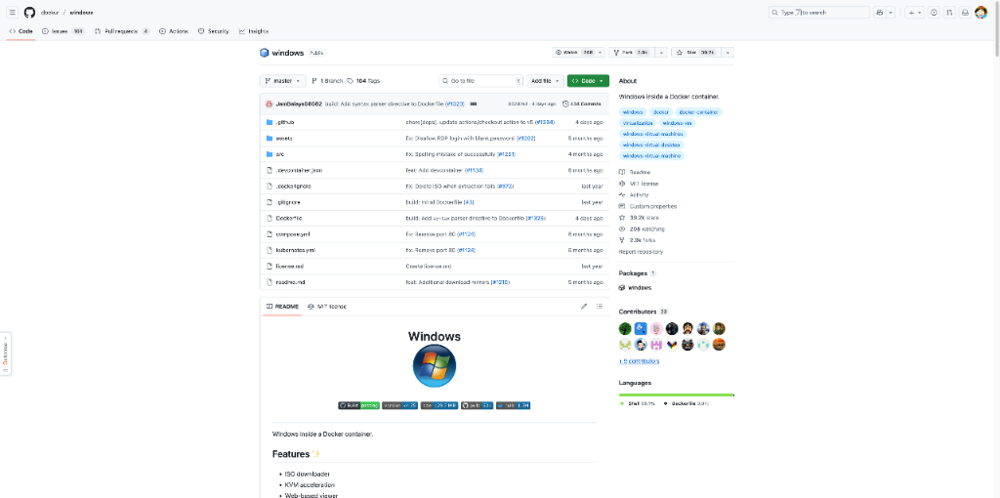
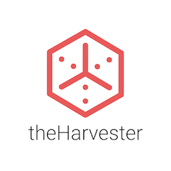
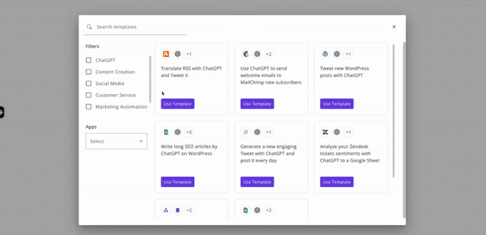
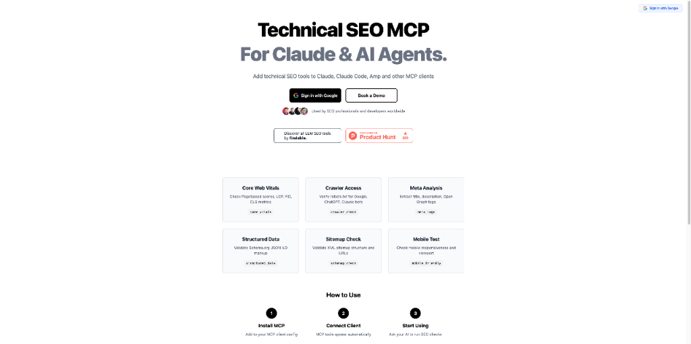
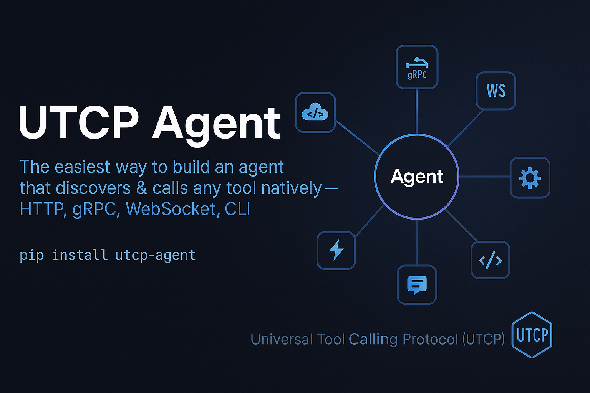

# HelloDev.io 开发者日报 - 第 15 期 | 2025 年 09 月 01 日

👋 Hi，这里是 HelloDev.io 开发者日报，今天是第 15 期，即将为你介绍今天的精彩发现：

📊 **本期内容**：
- 🚀 开源趋势：8 条
- 🛠️ 产品观察：6 条  
- 📰 行业动态：3 条
- 💡 经验讨论：1 条
- 📸 每日一图：1 条

---

## 🚀 开源趋势

### JetBrains 出品的 Kotlin AI 框架：Koog

Koog 是 JetBrains 官方推出的 Kotlin 框架，专为构建和运行跨平台、可扩展的 AI 代理而设计。它支持从后端服务到 Android、iOS、JVM，甚至浏览器环境的部署。Koog 提供了处理复杂 LLM 和 AI 问题的成熟解决方案，让开发者可以用纯 Kotlin 创建能与工具交互、处理复杂工作流并与用户沟通的智能代理。该项目集成了主流 LLM 服务（如 OpenAI、Anthropic、Ollama），并具备自定义工具、持久化记忆、智能历史压缩等特性，非常适合构建生产级 AI 应用。

如果你正在用 Kotlin 构建 AI 项目，Koog 可能是你最值得尝试的框架之一，尤其适合需要跨平台部署的团队。

> 🔗 **项目链接**
> 
> https://github.com/JetBrains/koog

---

### 社区驱动的文档管理系统：paperless-ngx

paperless-ngx 是一个开源文档管理系统，可将纸质文档转化为可搜索的在线档案。它支持超过 100 种语言的 OCR，将文档以 PDF/A 格式长期保存，并利用机器学习进行自动分类和标签。该系统提供了现代化的 Web 界面、全文搜索、邮件处理、多用户权限和工作流控制等功能，强调本地存储以保障隐私，支持 PDF、图片和 Office 文档等多种格式。

对于需要数字化管理大量文档的个人或团队，paperless-ngx 是一个强大且免费的选择，尤其适合追求数据主权的用户。

> 🔗 **项目链接**
> 
> https://github.com/paperless-ngx/paperless-ngx

---

### 在 Docker 中运行 Windows：dockur/windows

dockur/windows 是一个在 Docker 容器中运行 Windows 系统的开源项目，支持 Windows 11、10、Server 等多个版本，并提供自动安装、KVM 加速和 Web 界面访问。用户可通过 Docker Compose 或 Kubernetes 部署，支持自定义磁盘大小、CPU/内存分配、语言设置等，还能通过 RDP 连接获得更好的图形体验。

对于需要快速启动 Windows 环境进行测试或开发的开发者，这个项目大大简化了虚拟机的管理流程。

> 🔗 **项目链接**
> 
> https://github.com/dockur/windows

---

### 渗透测试信息收集利器：theHarvester

theHarvester 是一款强大的开源情报（OSINT）收集工具，广泛用于渗透测试和红队评估的侦察阶段。它可以从搜索引擎、证书透明度日志、Shodan 等公开资源中收集电子邮件、子域名、IP 和 URL。支持被动和主动两种模式，部分模块需要 API 密钥以解锁更多功能。项目基于 Python 3.12+ 开发，支持 Docker 部署。

对于安全研究人员和渗透测试人员，theHarvester 是信息收集阶段不可或缺的工具。

> 🔗 **项目链接**
> 
> https://github.com/laramies/theHarvester

---

### Java 性能极限挑战：1BRC

One Billion Row Challenge (1BRC) 是一个 Java 编程挑战，目标是从包含 10 亿行数据的文本文件中快速聚合天气站的温度信息（最小值、平均值、最大值）。参与者可通过并行处理、内存映射、GraalVM 等技术优化性能。项目包含基准实现和评估脚本，结果在专用服务器上测试。

对于 Java 开发者而言，这是一个绝佳的性能优化实践机会，也能深入了解现代 JVM 的极限。

> 🔗 **项目链接**
> 
> https://github.com/gunnarmorling/1brc

---

### 开源自动化平台：Activepieces

Activepieces 是一个开源的 AI 自动化平台，可替代 Zapier。它提供类型安全的 TypeScript 框架，支持 200 多种服务集成（如 Google Sheets、OpenAI、Discord），并具备 AI 优先功能和 MCP 协议支持。平台提供无代码构建器、人工干预工作流、多语言支持和企业级自托管选项，社区贡献了 60% 的集成组件。

对于需要构建复杂自动化流程的团队，Activepieces 提供了灵活性与安全性兼具的解决方案。

> 🔗 **项目链接**
> 
> https://github.com/activepieces/activepieces

---

### Elixir 官方语言服务器：Expert

Expert 是 Elixir 官方语言服务器，支持通过 LSP 协议在各种编辑器和 IDE 中提供代码补全、跳转、诊断等功能。用户可从发布页下载预编译版本，或使用 nightly 构建获取最新功能。项目采用 Apache 2.0 许可证，支持从源码构建。

如果你是 Elixir 开发者，Expert 将显著提升你的开发体验。

> 🔗 **项目链接**
> 
> https://github.com/elixir-lang/expert

---

### 数据驱动的游戏引擎：Bevy

Bevy 是一个用 Rust 编写的开源游戏引擎，采用数据驱动的 ECS 架构，支持 2D 和 3D 开发。它以模块化、高性能和易用性为目标，适合新手和资深开发者。项目仍在快速迭代中，每三个月发布一次新版本，依赖最新的 Rust 特性。

对于希望探索现代游戏开发技术的开发者，Bevy 是一个值得关注的项目。

> 🔗 **项目链接**
> 
> https://github.com/bevyengine/bevy

---

## 🛠️ 产品观察

### 技术 SEO 自动化工具：Technical SEO MCP

Technical SEO MCP 通过 Model Context Protocol (MCP) 将技术 SEO 功能集成到 Claude、LM Studio 等 AI 代理中。用户可一键运行 Core Web Vitals、爬虫访问、结构化数据等检查，支持批量处理多个网站并生成摘要报告。该工具特别适合 SEO 专业人员和开发者，能显著减少重复性工作。

对于需要频繁进行技术 SEO 审计的团队，这是一个高效的自动化解决方案。

> 🔗 **产品链接**
> 
> https://www.producthunt.com/products/technical-seo-mcp

---

### AI 编码代理的记忆层系统：Byterover 2.0

Byterover 2.0 是一个为开发团队设计的 AI 编码代理记忆层系统，灵感来源于 Git 的版本控制机制。它引入了“上下文编写器”工具，支持从多种来源组合任务上下文，并通过 Git 式管理机制实现记忆版本控制。该产品适用于处理代理错位问题的关键任务团队，支持协作、回滚和分叉功能。

对于依赖 AI 编码代理的团队，Byterover 2.0 提供了可靠的上下文管理方案。

> 🔗 **产品链接**
> 
> https://www.producthunt.com/products/byterover

---

### 更精准的图像生成工具：Google Whisk 3.0

Google Whisk 3.0 推出了 Precise Mode，用户可通过上传参考图像生成更精准的角色、风格和场景。该模式基于 veo3 和 Imagen 4 技术，支持上传最多 3 张上下文图像和 1 张风格图像，并内置安全机制防止生成不当内容。

对于需要高质量图像生成的设计师和创作者，Precise Mode 提供了更强的控制力。

> 🔗 **产品链接**
> 
> https://www.producthunt.com/products/google-labs

---

### 轻量级工具调用框架：UTCP Agent

UTCP Agent 是一个 Python 库，允许开发者用 4 行代码构建具备智能工具调用能力的 AI 代理。作为 UTCP 生态的一部分，它通过直接调用原生端点减少延迟，兼容 OpenAI 和 Anthropic 等主流 LLM，支持 LangGraph 工作流、流式输出和对话记忆。

对于希望快速构建 AI 代理的开发者，UTCP Agent 是一个高效的选择。

> 🔗 **产品链接**
> 
> https://github.com/universal-tool-calling-protocol/utcp-agent

---

### 个性化新闻代理：A01

A01 是一个 AI 驱动的个性化新闻代理，用户只需告诉它关注的主题，A01 便会从数千个可信来源中筛选并推送相关新闻。它支持技术、金融、学术等领域的定制化订阅，帮助用户高效获取信息。

对于信息过载严重的用户，A01 是一个值得尝试的新闻聚合工具。

> 🔗 **产品链接**
> 
> https://www.producthunt.com/products/a01

---

## 📰 行业动态

### AI 驱动的表单构建工具：Nuraform

Nuraform 是一款 AI 表单构建工具，用户只需描述需求，即可自动生成结构、问题和逻辑。它支持 WebGL 背景、交互式布局和 AI 摘要功能，完全免费且无功能墙。该工具特别适合需要快速创建高质量表单的专业人士。

对于需要频繁制作表单的团队，Nuraform 提供了高效且美观的解决方案。

> 🔗 **相关链接**
> 
> https://www.producthunt.com/products/nuraform

---

### 一键生成 affiliate 网站：UseArticle

UseArticle 是一个 AI 驱动的 affiliate 营销平台，用户只需粘贴产品链接，即可自动生成完整的网站内容、设计和 SEO 优化。该平台无需技术背景，支持免费试用，旨在简化 affiliate 营销流程。

对于希望快速启动 affiliate 项目的用户，UseArticle 是一个便捷的选择。

> 🔗 **相关链接**
> 
> https://www.producthunt.com/products/usearticle-urls-to-affiliate-website

---

### 更易用的 Git 替代品：Jujutsu

Jujutsu 是一个 Git 兼容的版本控制系统，结合了 Git 和 Mercurial 的优点，并提供了更友好的用户体验。它支持自动提交、操作日志、撤销功能和自动变基，采用 Rust 编写，已在 GitHub 上获得超过 19,000 星标。该项目特别适合初学者，无需 Git 经验即可上手。

对于希望简化版本控制流程的开发者，Jujutsu 是一个值得尝试的替代方案。

> 🔗 **相关链接**
> 
> https://jj-for-everyone.github.io/

---

## 💡 经验讨论

### ChatGPT 推荐了我的产品给陌生人

在 Indie Hackers 社区中，一位开发者分享了 ChatGPT 向陌生人推荐其产品 HustleAdvisor 的经历。这一事件引发了关于 AI 在营销和产品发现中的角色讨论，探讨了 AI 如何意外地影响创业者和独立开发者的产品曝光。

对于正在探索 AI 营销潜力的创业者，这一案例提供了有趣的思考角度。

> 🔗 **参考资料**
> 
> https://www.indiehackers.com/product/hustleadvisor?post=j4NOiwK0oGVQSf5GV0XA

---

## 📸 每日一图

---

## 📝 结语

明天见。Bye 👋

---

## 🍦 写在最后

🐣 **帮助我们成长**:

HelloDev.io 开发者日报立志成为面向开发者最持久最有价值的日报，帮助大家以 **「更少时间更舒适」** 的了解所有最前沿最有想法的产品与技术及观点。

你的 **「转发、喜欢、点赞、评论」** 都能让更多人了解认识我们，帮助我们更好的成长，并且走得更远。感谢 🙏

📱 **多平台发布**：微信公众号 | 掘金 | 知乎 | GitHub