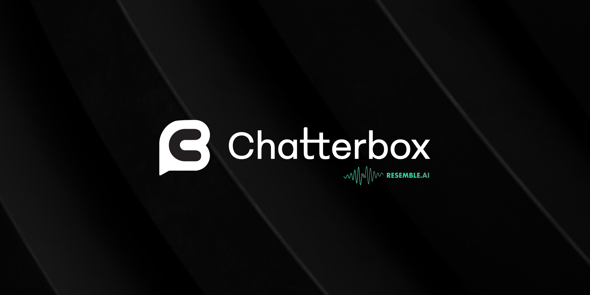
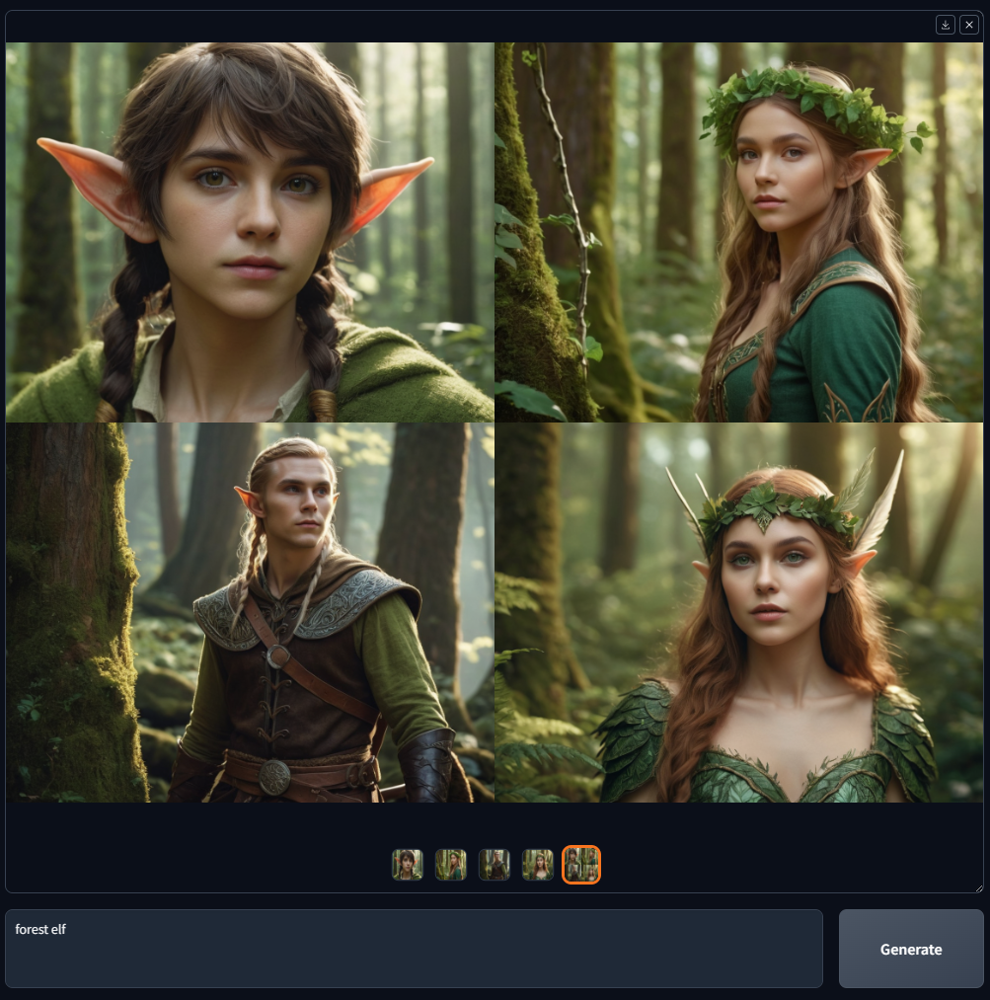
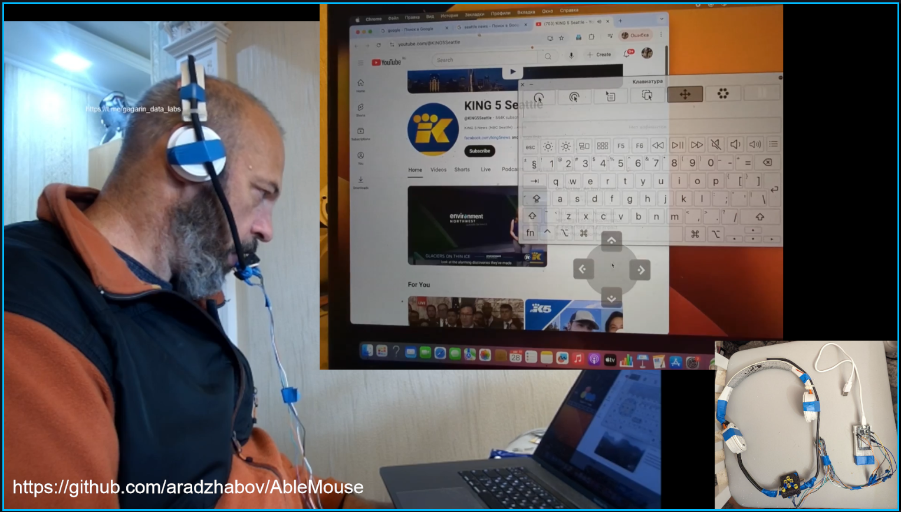
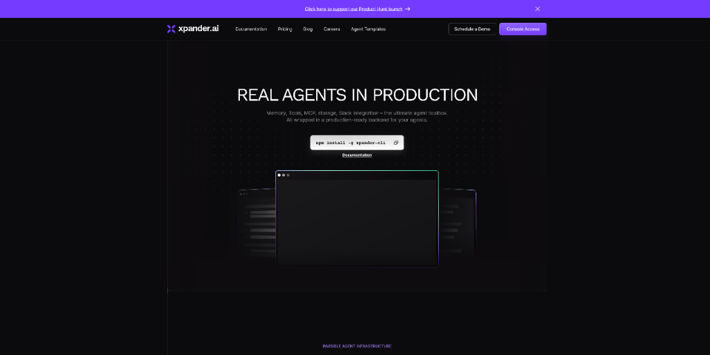
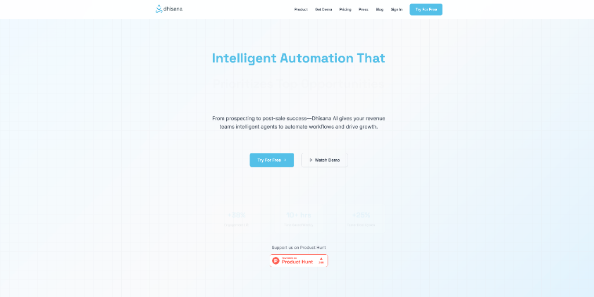
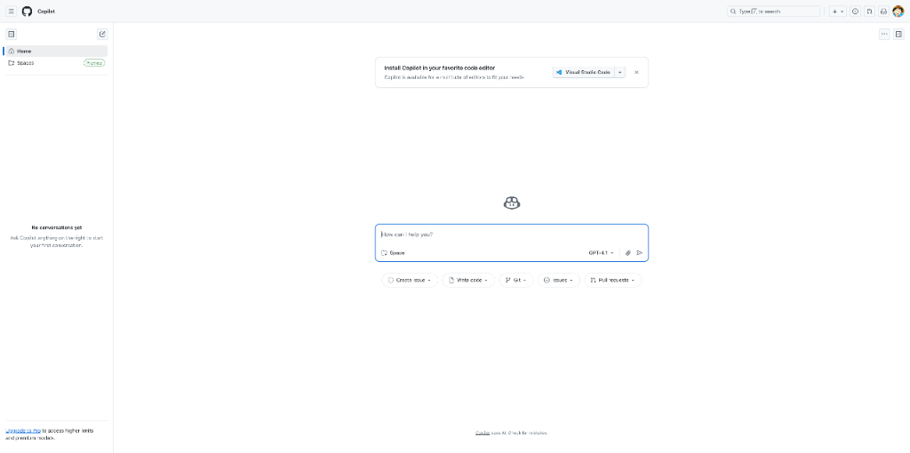
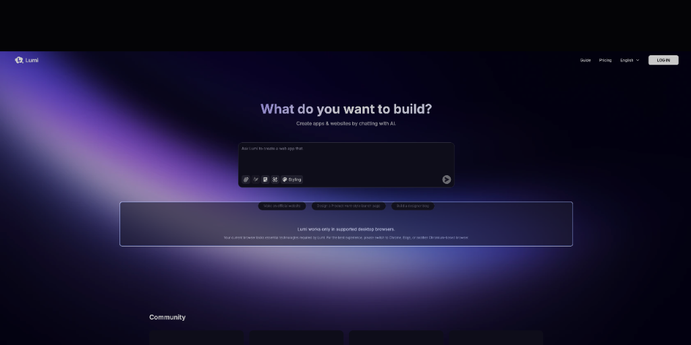
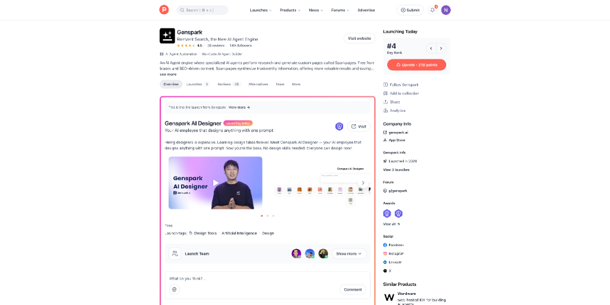
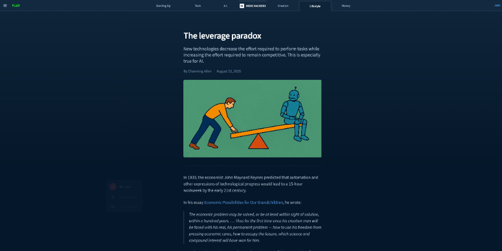
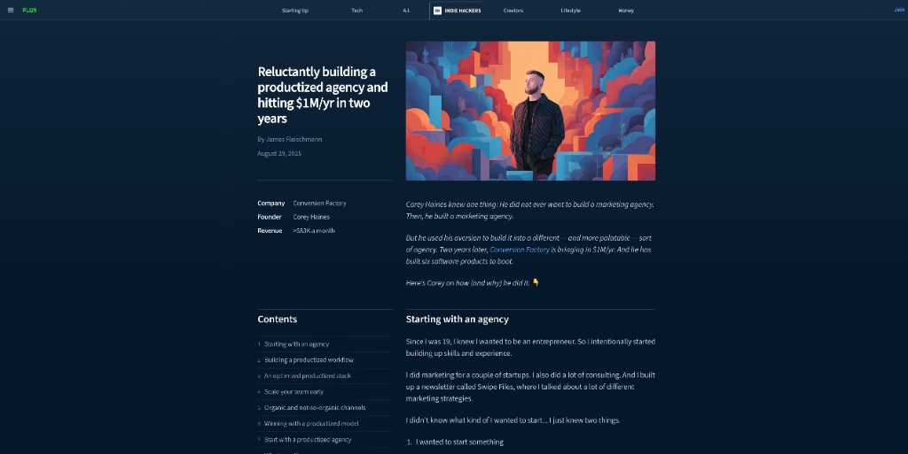

# HelloDev.io 开发者日报 - 第 16 期 | 2025 年 09 月 02 日

👋 Hi，这里是 HelloDev.io 开发者日报，今天是第 16 期，即将为你介绍今天的精彩发现：

📊 **本期内容**：
- 🚀 开源趋势：5 条
- 🛠️ 产品观察：6 条  
- 📰 行业动态：3 条
- 💡 经验讨论：1 条
- 📸 每日一图：1 条

---

## 🚀 开源趋势

### 让 TTS 生成质量媲美商业方案的开源项目：Chatterbox

Chatterbox 是由 Resemble AI 开发的一个开源、前沿的文本到语音（TTS）模型，采用 MIT 许可证，专为生产环境设计。它在基准测试中表现优异，甚至优于 ElevenLabs 等闭源系统。该项目的独特之处在于其情感夸张控制功能，可以生成更具表现力的声音。它基于 0.5B Llama 架构，训练数据量高达 0.5M 小时，并内置 PerTh 水印技术，确保 AI 使用的合规性。Chatterbox 支持英语，安装简单，还具备语音转换能力，非常适合需要高质量语音输出的应用场景。

如果你在开发需要语音合成功能的产品，比如 AI 助手、有声读物或游戏角色配音，Chatterbox 会是一个非常值得尝试的选择。它不仅质量高，而且开源免费，能够有效降低开发成本。

> 🔗 **项目链接**
> 
> https://github.com/resemble-ai/chatterbox

---

### 简化图像生成流程的 AI 工具：Fooocus

Fooocus 是一个基于 Stable Diffusion XL 架构的开源图像生成软件，最大的特点是简化了图像生成过程，用户几乎不需要进行提示词工程或参数调整。它支持高质量的文生图、图像变体生成、图像放大、修复和外绘等功能。Fooocus 提供了多种预设配置（通用、动漫、写实），并支持多种硬件平台，包括 Nvidia 和 AMD GPU，甚至可以在 CPU 上运行。对于想要快速生成高质量图像但又不想深入研究复杂参数的用户来说，Fooocus 是一个非常友好的选择。

特别适合内容创作者、设计师以及任何需要快速生成视觉素材的人。它的离线功能也确保了在没有网络连接时依然可以使用。

> 🔗 **项目链接**
> 
> https://github.com/lllyasviel/Fooocus

---

### 涵盖 500 个 AI Agent 应用案例的资源库：500-AI-Agents-Projects

这个仓库收集了 500 个 AI Agent 在各行业的实际应用案例，覆盖医疗、金融、教育、零售等多个领域。每个案例都配有详细的说明和开源项目的链接，方便开发者学习和复现。它按照 CrewAI、AutoGen、Agno 和 Langgraph 等框架进行了分类，是寻找 AI Agent 灵感和学习实现方式的绝佳资源。

无论你是 AI Agent 的初学者还是经验丰富的开发者，这个仓库都能为你提供丰富的参考和实用的代码示例。

> 🔗 **项目链接**
> 
> https://github.com/ashishpatel26/500-AI-Agents-Projects

---

### 将文本快速转换为有声读物的工具：Abogen

Abogen 是一个强大的文本转语音工具，可以将 ePub、PDF 或文本文件快速转换为高质量的音频，并同步生成字幕。它支持多种输出格式，包括带章节的 M4B 文件，并提供语音混合、队列处理和章节控制等功能。Abogen 基于 Kokoro-82M TTS 引擎，提供了图形界面和命令行两种操作方式，非常适合内容创作者制作有声读物或为视频添加配音。

对于需要批量处理文本内容并生成音频的用户，Abogen 的队列模式和多语言支持将大大提高工作效率。

> 🔗 **项目链接**
> 
> https://github.com/denizsafak/abogen

---

### 提升代码可读性的认知负荷指南：Cognitive Load

这个仓库提供了一份关于认知负荷的全面指南，帮助开发者编写更易理解和维护的代码。它区分了内在认知负荷和外在认知负荷，并提供了减少外在认知负荷的实用策略。文档涵盖了复杂条件语句、嵌套结构、继承问题以及设计原则误用等常见问题，倡导编写简单直观的代码。

对于团队开发和长期维护的项目，遵循这份指南可以显著提升代码质量，降低协作成本。

> 🔗 **项目链接**
> 
> https://github.com/zakirullin/cognitive-load

---

## 🛠️ 产品观察

### 用舌头控制电脑鼠标的开源方案：AbleMouse

AbleMouse 是一款开源、低成本的辅助技术产品，专为行动不便的用户设计，让他们可以通过舌头动作或脚踏板来控制电脑鼠标。它的组件成本不到 10 美元，支持蓝牙无线连接，并兼容 Windows、macOS 和 Android 系统。AbleMouse 无需专业知识即可组装，提供了即插即用的便利性，是 MouthPad、眼动仪或 Neuralink 等昂贵设备的经济替代方案。

对于有运动障碍的用户或相关公益组织，AbleMouse 提供了一个切实可行的技术解决方案，让科技真正服务于人。

> 🔗 **产品链接**
> 
> https://www.producthunt.com/products/ablemouse-control-with-tongue-or-touch

---

### 为 AI 工程师打造的全栈开发平台：xpander.ai

xpander.ai 是一个专为 AI 工程师设计的全栈开发平台，旨在简化 AI Agent 的构建和运行。它提供了一套完整的工具，包括 MCP 连接器、状态数据库、AI 网关、测试环境和运行时托管。平台支持云部署和自托管，并提供可视化的工作台，开发者可以先通过图形界面快速构建和测试，再深入代码开发。xpander.ai 解决了现有 AI 开发工具要么过于复杂、要么功能不足的问题，为开发者提供了从原型到生产的一站式解决方案。

如果你正在开发复杂的 AI Agent 应用，xpander.ai 可以显著缩短开发周期，让你更专注于核心逻辑的实现。

> 🔗 **产品链接**
> 
> https://www.producthunt.com/products/xpander-ai

---

### 赋予 AI 头像真实情感表现力的工具：JoggAI AvatarX
JoggAI AvatarX 是一款先进的 AI 头像生成工具，能够创建具有真实情感表达的超现实 AI 头像。它超越了传统静态头像的局限，通过精细的表情变化和唇形同步技术，让头像看起来栩栩如生。无论是真实人物还是虚构角色，AvatarX 都能赋予其生动的表现力，非常适合内容创作者、营销人员和视频制作者快速生成高质量的视频内容。

对于需要打造虚拟形象或进行个性化内容创作的用户，AvatarX 提供了强大的技术支持。

> 🔗 **产品链接**
> 
> https://www.producthunt.com/products/jogg-ai

---

### 为销售团队打造的 AI 生产力平台：Dhisana AI

Dhisana AI 是一个销售生产力平台，利用 AI Agent 自动化处理销售流程中的重复性任务，如线索研究、客户触达、会议准备和 CRM 更新。用户只需用自然语言描述工作流程，平台就会自动执行，帮助销售团队提高 10 倍效率。它集成了主流 CRM 系统，提供个性化多渠道序列、对话智能和交易加速等功能，让销售人员能专注于与客户的沟通。

对于希望提升销售效率、减少行政负担的团队，Dhisana AI 是一个值得尝试的智能助手。

> 🔗 **产品链接**
> 
> https://www.producthunt.com/products/dhisana-ai

---

### Raycast 与 GitHub Copilot 的完美结合：GitHub Copilot for Raycast

GitHub Copilot for Raycast 将 GitHub 的 AI 编程助手与 Raycast 快速启动器无缝集成，让开发者可以直接在 Raycast 中委派编码任务并跟踪进度。这一集成显著提升了开发效率，用户不再需要记忆复杂的语法，AI 会提供实时的代码建议。许多开发者反馈，这种配对编程的方式彻底改变了他们的编码习惯，让产品开发速度大幅提升。

如果你是 Raycast 的用户，这个集成为你的开发工作流带来了极大的便利。

> 🔗 **产品链接**
> 
> https://www.producthunt.com/products/github-copilot

---

### 用对话构建全功能 Web 应用的平台：Lumi.new

Lumi.new 是一个通过自然语言对话就能构建网站和轻量级应用的一体化平台。它内置了数据库、用户认证、文件存储和分析功能，无需编写代码或进行复杂集成。Lumi.new 的核心优势在于将前端设计与后端逻辑结合，让用户不仅能创建美观的界面，还能构建具备完整功能的 Web 应用。对于非技术背景的创作者来说，这是一个快速实现创意的利器。

如果你有一个想法想要快速验证或上线 MVP 产品，Lumi.new 可以帮你轻松实现。

> 🔗 **产品链接**
> 
> https://www.producthunt.com/products/lumi-new-2

---

## 📰 行业动态

### 用 AI 打造完整品牌视觉的利器：Genspark AI Designer

Genspark AI Designer 是一款 AI 驱动的设计工具，用户只需输入一个提示，就能在几分钟内生成完整的品牌视觉系统，包括 Logo、包装、网站、广告甚至店铺布局。它将自己定位为可以替代多个设计师和 agencies 的 AI 员工，极大地缩短了设计周期。对于没有设计背景的创业者或小团队来说，这是一个快速获得专业设计的捷径。

随着 AI 设计工具的普及，传统设计工作流正在被重新定义。Genspark AI Designer 的出现，让非设计师也能轻松打造出具有竞争力的品牌形象。

> 🔗 **相关链接**
> 
> https://www.producthunt.com/products/genspark

---

### 为数字极简主义者设计的习惯追踪器：fwt. axis

fwt. axis 是一款专为使用 Apple Watch 的数字极简主义者设计的习惯追踪应用。它基于一套经过 2.5 年打磨的核心习惯框架（Rise, Move, Frog, Play, Bond, Next），帮助用户实现生活平衡。应用支持与 Apple Health 集成，提供正念训练和情绪追踪等深度洞察。它强调简单有效，专注于健康、生产力、人际关系和个人成长等关键生活领域。

对于追求简约生活方式的用户，fwt. axis 提供了一种不被数据淹没、又能有效追踪习惯的解决方案。

> 🔗 **相关链接**
> 
> https://www.producthunt.com/products/fwt-axis

---

### AI 时代的“杠杆悖论”：为何工具越强，竞争越激烈？

这篇文章探讨了 AI 时代的一个有趣现象：新技术虽然降低了完成任务的难度，但同时也提高了保持竞争力所需的 effort。作者用“楼梯变扶梯”的比喻说明，AI 让我们更容易“爬升”，但因为所有人都有了同样的工具，成功的门槛反而更高了。文章指出，AI 工具的普及导致了大量低质量内容（“AI slop”）的泛滥，只有那些深入理解这一悖论、并致力于精雕细琢的“工匠”，才能在竞争中脱颖而出。

这篇文章提醒我们，在享受 AI 带来的便利时，更要注重作品的独特性和深度，才能避免被同质化浪潮淹没。

> 🔗 **相关链接**
> 
> https://www.indiehackers.com/post/lifestyle/the-leverage-paradox-ksRiX6y6W7NzfBE57dzt

---

## 💡 经验讨论

### 从零打造产品化 agency 并实现年入百万的实战分享

这篇文章详细复盘了一个成功的产品化 agency（Conversion Factory）如何在两年内实现年收入 100 万美元。作者 Corey Haines 分享了 agency 的运营模式：完全异步工作，没有会议、邮件和 Slack，客户按月付费（6,000 至 20,000 美元）。同时，他还开发了 6 个软件产品作为补充收入。文章强调了利用现有咨询需求、社交媒体受众和 newsletter 来启动业务的重要性，并建议采用“阶梯式”创业方法。

对于想要建立稳定收入来源并同时发展产品的开发者来说，这个案例提供了宝贵的经验和可复制的策略。

> 🔗 **参考资料**
> 
> https://www.indiehackers.com/post/services/reluctantly-building-a-productized-agency-and-hitting-1m-yr-in-two-years-jyU3Rf1v7Bkvl69p9iCv

---

## 📸 每日一图

---

## 📝 结语

明天见。Bye 👋

---

## 🍦 写在最后

🐣 **帮助我们成长**:

HelloDev.io 开发者日报立志成为面向开发者最持久最有价值的日报，帮助大家以 **「更少时间更舒适」** 的了解所有最前沿最有想法的产品与技术及观点。

你的 **「转发、喜欢、点赞、评论」** 都能让更多人了解认识我们，帮助我们更好的成长，并且走得更远。感谢 🙏

📱 **多平台发布**：微信公众号 | 掘金 | 知乎 | GitHub