# HelloDev.io 开发者日报 - 第 17 期 | 2025 年 09 月 03 日

👋 Hi，这里是 HelloDev.io 开发者日报，今天是第 17 期，即将为你介绍今天的精彩发现：

📊 **本期内容**：
- 🚀 开源趋势：7 条
- 🛠️ 产品观察：6 条  
- 📰 行业动态：3 条
- 💡 经验讨论：1 条
- 📸 每日一图：1 条

---

## 🚀 开源趋势

### 18k+ stars 的 WhatsApp Web 自动化利器：whatsapp-web.js

whatsapp-web.js 是一个基于 NodeJS 的 WhatsApp 客户端库，它通过连接 WhatsApp Web 浏览器应用程序，让开发者能够以编程方式与 WhatsApp Web 交互。借助 Puppeteer 控制无头浏览器实例，这个库可以访问 WhatsApp Web 的大部分功能，包括发送/接收消息和媒体、群组管理、联系人管理，甚至创建投票和频道等高级功能。项目拥有庞大的社区、详尽的文档和活跃的开发支持，是进行 WhatsApp 自动化任务的首选工具。

对于需要与 WhatsApp 集成的开发者来说，whatsapp-web.js 提供了几乎完整的功能覆盖，从基础的消息收发到复杂的群组操作都能胜任。不过需要注意的是，由于 WhatsApp 的服务条款限制，使用该库时需谨慎处理潜在的账号封禁风险。

> 🔗 **项目链接**
> 
> https://github.com/pedroslopez/whatsapp-web.js

---

### 独立于 LangChain 的 AI Agent 编排框架：crewAI
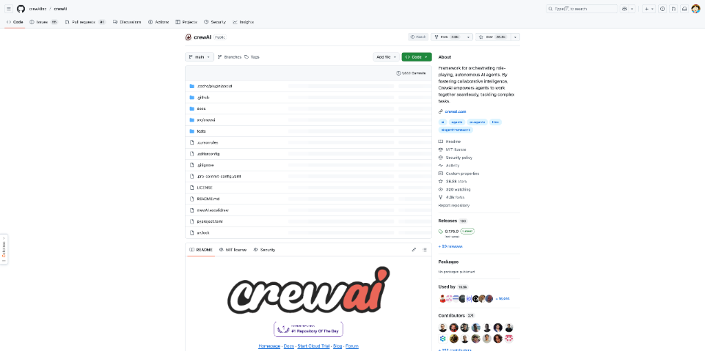

crewAI 是一个完全独立开发的 Python 框架，专为编排角色扮演、自主 AI Agent 而设计。它允许开发者创建协作式多 Agent 系统，这些 Agent 可以无缝协作以解决复杂任务。框架既提供高层的简洁性，也支持底层的精确控制，适用于从简单自动化到企业级解决方案的各种场景。crewAI 支持多种语言模型，包括本地模型，并提供 Crews（自主 Agent 协作）和 Flows（精确事件驱动控制）两种核心功能。

如果你正在寻找一个灵活且强大的 AI Agent 编排工具，crewAI 是一个不错的选择。它不仅独立于其他框架，还拥有活跃的社区支持和丰富的文档，能够帮助你快速上手并构建复杂的 AI 工作流。

> 🔗 **项目链接**
> 
> https://github.com/crewAIInc/crewAI

---

### Google 开源的演绎数据库语言：Mangle
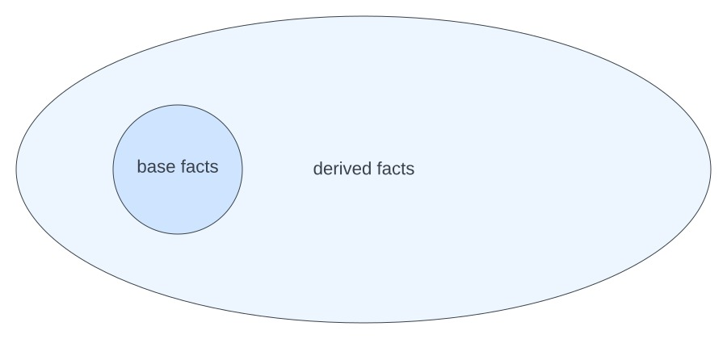

Mangle 是 Google 开发的一种演绎数据库编程语言，它扩展了 Datalog，增加了聚合、函数调用和可选类型检查等功能。该语言旨在为开发者提供一种实用且易于访问的方式来处理演绎数据库，支持统一表示和查询来自多个来源的数据。Mangle 支持递归规则，并可以作为 Go 库嵌入到应用程序中，项目还提供了示例和文档以方便实验和使用。

对于需要处理复杂数据关系和逻辑查询的开发者来说，Mangle 提供了一个强大的工具集。它不仅增强了传统 Datalog 的功能，还通过 Go 库的形式提供了良好的可集成性，非常适合需要构建复杂数据模型的应用场景。

> 🔗 **项目链接**
> 
> https://github.com/google/mangle

---

### 31k+ stars 的 Rust 学习课程：comprehensive-rust

这是 Google Android 团队内部使用的 Rust 课程，旨在帮助有 C++ 或 Java 背景的软件工程师快速掌握 Rust。课程内容涵盖了从基础语法到泛型和错误处理的所有方面，并深入探讨了 Android、Chromium、裸机和并发等主题。课程专为课堂教学设计，同时也在不断改进以支持自学，包括提供讲者笔记和视频发布。该课程使用 mdbook 等工具构建，并欢迎社区贡献。

如果你是一名经验丰富的开发者，想要系统学习 Rust，这个由 Google 内部开发的课程是一个绝佳的选择。它不仅内容全面，还特别注重实践应用，能够帮助你快速上手并掌握 Rust 的核心概念。

> 🔗 **项目链接**
> 
> https://github.com/google/comprehensive-rust

---

### 自主开源的远程桌面解决方案：RustDesk
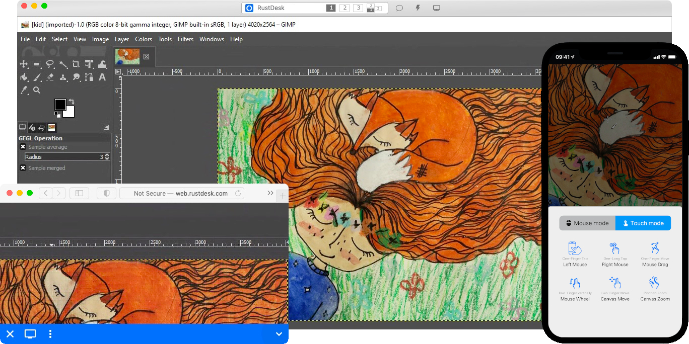

RustDesk 是一个开源的远程桌面应用程序，被设计为 TeamViewer 的自托管替代品。它让用户能够完全控制自己的数据，无需担心安全问题。软件开箱即用，无需配置，支持 Windows、macOS、Linux、Android 和 iOS 等多个平台。RustDesk 采用客户端-服务器架构，用户可以使用提供的 rendezvous/relay 服务器，也可以设置自己的服务器或开发自定义解决方案。项目主要使用 Rust 和 Dart 构建，并欢迎社区贡献。

对于需要安全、可控远程桌面解决方案的用户来说，RustDesk 提供了一个强大的选择。它不仅功能齐全，还支持跨平台使用，能够满足个人和企业用户的多样化需求。

> 🔗 **项目链接**
> 
> https://github.com/rustdesk/rustdesk

---

### 11k+ 模板的安全漏洞扫描器：nuclei-templates

Nuclei Templates 是一个由社区策划的 Nuclei 引擎模板列表，旨在发现应用程序中的安全漏洞。它包含了数千个模板，涵盖 CVE、面板、暴露等多个类别。这些模板是 Nuclei 扫描器的核心，Nuclei 是一个快速且可定制的漏洞扫描器。该仓库由社区和 Project Discovery 团队积极维护，并提供了详尽的文档和贡献指南。

如果你是一名安全研究人员或开发人员，需要快速识别应用程序中的潜在安全问题，nuclei-templates 提供了丰富的模板资源。它支持多种协议和技术，能够帮助你高效地进行安全测试和漏洞评估。

> 🔗 **项目链接**
> 
> https://github.com/projectdiscovery/nuclei-templates

---

### 免费的自托管服务器管理平台：Termix
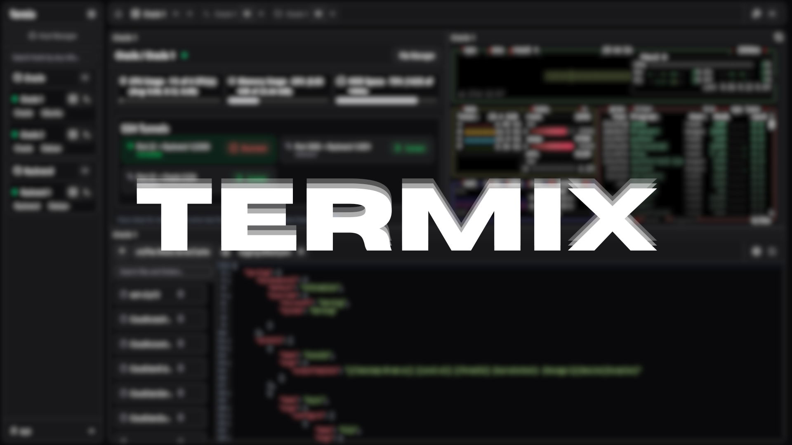

Termix 是一个开源、永久免费、自托管的一体化服务器管理平台。它通过一个直观的 Web 界面，为管理服务器和基础设施提供了解决方案。Termix 提供 SSH 终端访问、SSH 隧道功能、远程文件编辑等功能。平台使用 React、TypeScript 和 Tailwind CSS 等现代技术构建，并支持用户认证、管理员控制、OIDC 和 2FA (TOTP)。它还包括服务器状态监控、SSH 主机管理以及简洁现代的用户界面。

对于需要集中管理多台服务器的开发者和系统管理员来说，Termix 提供了一个功能齐全且易于使用的解决方案。它不仅免费且自托管，还支持多种现代认证方式，能够满足企业级的安全和管理需求。

> 🔗 **项目链接**
> 
> https://github.com/LukeGus/Termix

---

## 🛠️ 产品观察

### 自动化记账新体验：Receiptor AI 2.0
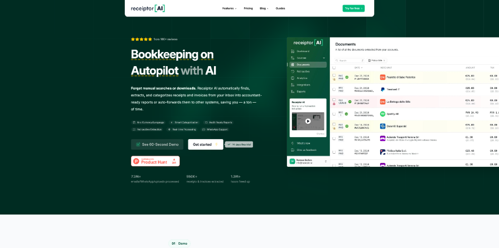

Receiptor AI 2.0 是一款基于人工智能的自动化记账工具，专为微型企业家、自由职业者、CEO 和会计师设计，旨在自动处理繁琐的记账工作。它能够从邮箱中查找并提取过去和现在的所有收据和发票，通过 AI 理解文档内容，自动分类支出，并与 Xero 和 QuickBooks 等会计软件同步。新版本引入了团队协作、多实体管理、自定义规则、AI 财务洞察等新功能，进一步提升了用户体验和效率。

对于需要处理大量收据和发票的用户来说，Receiptor AI 2.0 能够显著节省时间，让用户专注于核心业务。它的 AI 技术能够准确理解文档内容，自动提取关键数据并分类支出，帮助用户最大化税务抵扣。

> 🔗 **产品链接**
> 
> https://www.producthunt.com/products/receiptor-ai

---

### AI 驱动的图表生成工具：Bhava
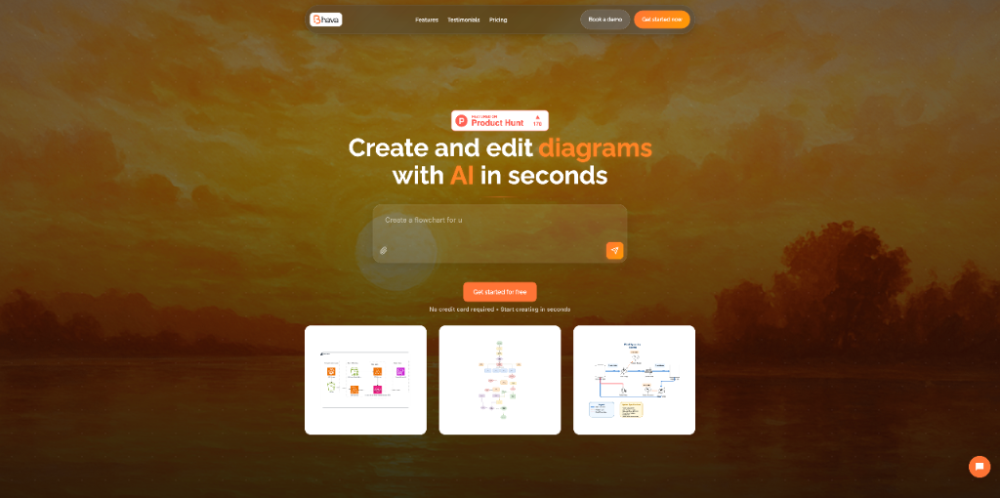

Bhava 是一款由 AI 驱动的图表工具，允许用户即时创建和编辑各种类型的图表。它支持流程图、带有 AWS/Azure/GCP 图标的云架构图、UML、ERD 等。主要功能包括从文本提示生成图表、将草图或白板照片转换为整洁的图表、AI 驱动的协作优化图表，以及在图表中直接与 AI 交互（使用 @bhava）。该工具专为产品经理、工程师、创始人以及任何需要快速创建流程图或详细架构图的人设计。

对于需要频繁创建技术图表的团队来说，Bhava 提供了一个高效的解决方案。它不仅支持多种图表类型，还集成了 AI 协作功能，能够帮助用户快速迭代和优化图表设计。

> 🔗 **产品链接**
> 
> https://www.producthunt.com/products/bhava

---

### 无代码移动应用开发平台：CatDoes
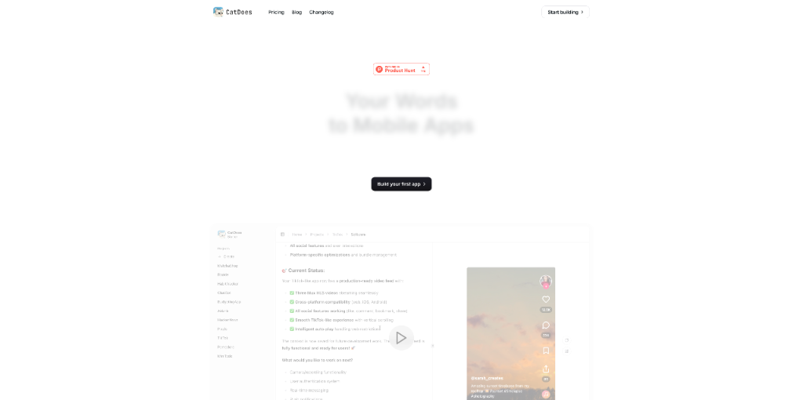

CatDoes 是一个由 AI Agent 驱动的平台，使用户无需任何编码经验即可构建移动应用程序。用户只需描述他们想要什么，AI Agent 就会处理需求、设计、编码，甚至将应用程序发布到 App Store 和 Google Play。该服务特别适合希望快速开发和维护移动应用的小型企业、创始人、设计师和非技术创作者。通过迭代开发、通过实例进行安全实验以及内置的 Supabase 集成等功能，CatDoes 简化了应用开发流程。

对于没有技术背景但希望快速构建移动应用的用户来说，CatDoes 提供了一个低门槛的解决方案。它不仅支持无代码开发，还集成了现代开发工具，能够帮助用户高效地完成应用开发和发布。

> 🔗 **产品链接**
> 
> https://www.producthunt.com/products/catdoes-2

---

### 专为 Next.js 设计的 AI 质量保证工程师：Bugster
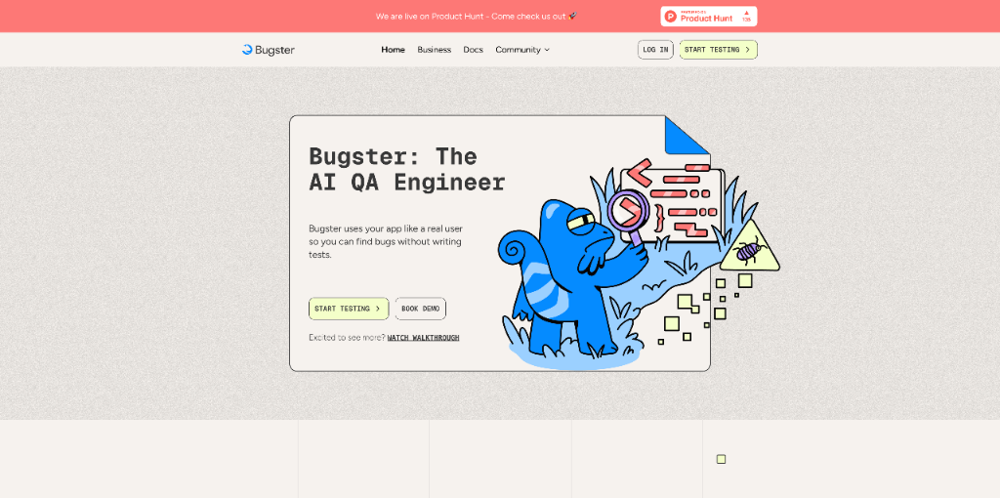

Bugster 是一个专为 Next.js 应用程序设计的 AI 驱动的 QA 工程师。它在每个 Pull Request 上的真实浏览器中运行端到端测试，无需维护，提供即时设置。该工具旨在通过模拟不可预测的用户行为并主动尝试破坏最近更改的应用程序部分，来发现传统测试方法可能遗漏的错误。Bugster 会自动为关键流程生成和更新 YAML 格式的测试，并提供两种类型的代理：用于标准测试的 E2E Agent 和用于激进测试的 Destructive Agent。它与 GitHub 集成，并支持 Vercel 和 Railway 等部署平台。该服务可免费试用，付费计划提供更多功能和更高的使用限制。

对于使用 Next.js 开发应用的团队来说，Bugster 提供了一个高效的自动化测试解决方案。它不仅能够模拟真实用户行为，还支持与主流开发工具集成，能够帮助团队快速发现和修复潜在问题。

> 🔗 **产品链接**
> 
> https://www.producthunt.com/products/bugster

---

### 为 AI Agent 提供文件访问能力的工具：fileAI MCP
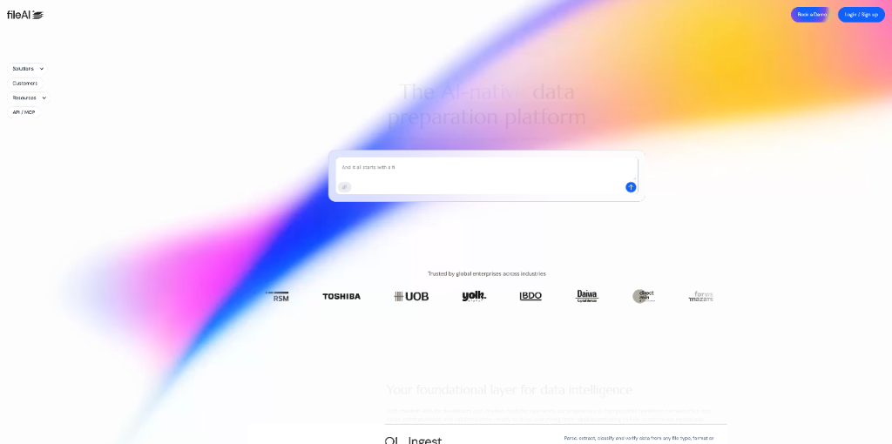

fileAI MCP 是一个通过 Model Context Protocol (MCP) 为 AI Agent 提供安全、实时文件访问的产品。它利用 AI OCR、分类和基于模式的提取技术，将非结构化文件转换为结构化、可用的数据，用于下游自动化。该产品支持合规检查、理赔分类和研究辅助等用例，允许用户通过简单的自然语言提示自动化复杂任务。

对于需要处理大量文件数据的 AI 应用来说，fileAI MCP 提供了一个高效的解决方案。它不仅支持多种文件处理功能，还通过 MCP 协议简化了与 AI Agent 的集成，能够帮助开发者快速构建智能文件处理应用。

> 🔗 **产品链接**
> 
> https://www.producthunt.com/products/fileai-ai-ocr

---

### 微软推出的免费音频表达工具：Copilot Audio Expressions

Copilot Audio Expressions 是微软推出的一款免费工具，可将文本转换为富有表现力的音频。它提供两种模式：情感模式（Emotive Mode）用于自定义音调和节奏，故事模式（Story Mode）用于 AI 生成的叙述。所有音频输出都可以下载为 MP3 文件，使其成为创意和专业用途的多功能工具。

对于需要生成高质量音频内容的创作者来说，Copilot Audio Expressions 提供了一个简单易用的解决方案。它不仅支持多种音频生成模式，还允许用户下载音频文件，能够满足各种创意和商业需求。

> 🔗 **产品链接**
> 
> https://www.producthunt.com/products/the-new-microsoft-copilot

---

## 📰 行业动态

### 功能投票与产品反馈工具：Upvoted
Upvoted 是一个功能投票和产品反馈工具，旨在帮助团队根据用户输入优先开发。它允许用户提出功能建议、进行投票并在社区环境中讨论。该工具支持公共或私人看板，与 Slack 和 Zapier 集成，并提供简单的路线图来跟踪功能开发。Upvoted 专注于速度、清晰度和易设置，旨在简化收集和分析客户反馈以指导产品决策的过程。

对于希望更好地了解用户需求并优化产品开发流程的团队来说，Upvoted 提供了一个高效的解决方案。它不仅支持多种反馈收集方式，还提供了清晰的路线图功能，能够帮助团队更好地规划和执行产品开发。

> 🔗 **相关链接**
> 
> https://www.producthunt.com/products/upvoted-3

---

### 像素艺术构建的科幻世界：Floor796

Floor796 是一个在 Product Hunt 上展示的项目，被描述为一个由像素艺术构成的生动、动画化的科幻世界。该项目似乎是一个创意性的数字体验，结合了复古像素艺术风格和现代动画技术，为用户呈现一个独特的科幻环境。由于无法直接访问详细页面，更多具体的功能和价值点尚不明确，但其核心吸引力在于其独特的艺术风格和沉浸式的科幻世界构建。

对于喜欢像素艺术和科幻题材的用户来说，Floor796 提供了一个独特的数字体验。它不仅拥有精美的视觉效果，还通过动画技术增强了用户的沉浸感，能够带来全新的娱乐体验。

> 🔗 **相关链接**
> 
> https://www.producthunt.com/products/floor796

---

### AI 视频生成的两种路径：wan2-2 与 Veo3
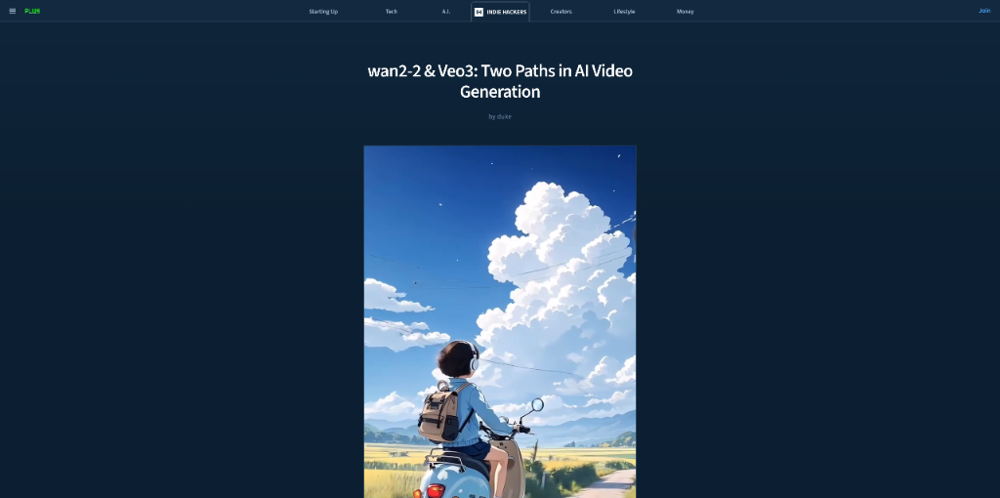

这篇文章比较了两个领先的 AI 视频生成模型：wan2-2 和 Veo3。它突出了它们各自的优势和理想使用场景。Veo3 在电影级质量输出、叙事重点和作为云端解决方案的易用性方面表现出色。相比之下，wan2-2 在音频驱动运动、角色一致性、多模态输入（图像+文本+音频）方面脱颖而出，并且是开源的，供开发者实验。文章将这些工具定位为互补的，Veo3 适用于精美的制作，而 wan2-2 更适合创意实验。两者都代表了 AI 视频生成向真实创意和电影制作工作流程的演进。

对于希望利用 AI 进行视频创作的用户来说，了解 wan2-2 和 Veo3 的特点能够帮助选择合适的工具。Veo3 适合需要高质量输出的专业制作，而 wan2-2 则更适合实验性和创意性的项目。

> 🔗 **相关链接**
> 
> https://www.indiehackers.com/post/wan2-2-veo3-two-paths-in-ai-video-generation-f8861625ef

---

## 💡 经验讨论

### 构建从脚本到电影的 AI 流水线：Textideo
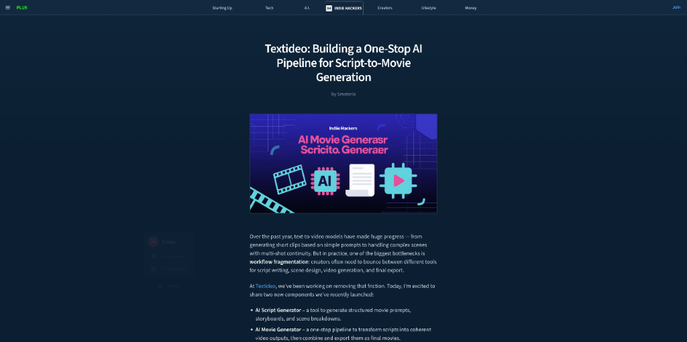

Textideo 介绍了一个集成的 AI 流水线，旨在简化从脚本到电影的生成过程。它包含两个主要组件：用于结构化叙事的 AI 脚本生成器和用于将脚本转换为连贯视频输出的 AI 电影生成器。该平台通过为创作者、电影制作人和独立开发者提供一个统一的环境来解决当前 AI 视频工具中的工作流碎片化问题，从而高效地制作视频内容。

对于希望利用 AI 快速生成视频内容的创作者来说，Textideo 提供了一个高效的解决方案。它不仅支持从脚本到视频的完整流程，还通过结构化输出和并行渲染等功能提高了制作效率。

> 🔗 **参考资料**
> 
> https://www.indiehackers.com/post/textideo-building-a-one-stop-ai-pipeline-for-script-to-movie-generation-e1631005d5

---

## 📸 每日一图

---

## 📝 结语

明天见。Bye 👋

---

## 🍦 写在最后

🐣 **帮助我们成长**:

HelloDev.io 开发者日报立志成为面向开发者最持久最有价值的日报，帮助大家以 **「更少时间更舒适」** 的了解所有最前沿最有想法的产品与技术及观点。

你的 **「转发、喜欢、点赞、评论」** 都能让更多人了解认识我们，帮助我们更好的成长，并且走得更远。感谢 🙏

📱 **多平台发布**：微信公众号 | 掘金 | 知乎 | GitHub